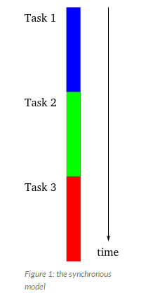
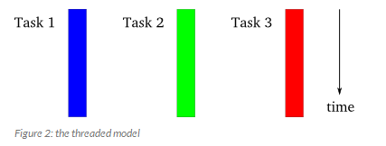
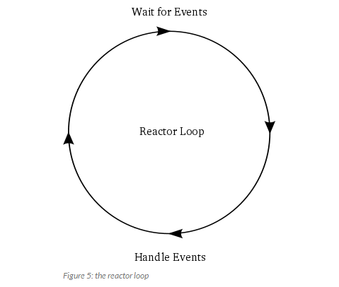

# An Introduction To Asynchronous Programming and Twisted

## Part 1

* Synchronous model
	</img>
* Threaded model:
	</img>
* Async model
	</img>

* Condition under which asynchronous model is faster - when particular task is waiting for a resource (ie blocking).
* Fundamental idea behind asynchronous model: "when faced with a task that would normally block...(it) will instead execute some other task that can still make progress"
* Async works best when:
    * Large number of tasks, so one should always be making progress
    * Tasks do heaps of I/O, causing sync program to block when it could otherwise be serving requests
    * Tasks are largely independant from each other (so little need for inter-task communication)

## Part 2

* Blocking client basically just waits until socket no 1 has finished sending data, then goes to no 2 and so on.
* Async client moves to the next socket each time there's a block, using:

```
try:
		new_data = sock.recv(1024)
except socket.error, e:
		if e.args[0] == errno.EWOULDBLOCK:
				# this error code means we would have
				# blocked if the socket was blocking.
				# instead we skip to the next socket
				break # Move to next socket
```

* Contrast with Go's model:
    * Non-blocking isn't really needed. It has "multiple threads of execution" so you can leave a thread blocked and do work in another
* The use of a loop that waits for events to happen then acts on them called a "Reactor Pattern".
</img>
    * Called "reactor" because it waits for and reacts to events
    * Twisted is basically an implementation of the Reactor Pattern with extras.

## Part 3

* Reactor loop doesn't start until told to. You start by calling ```reactor.run()```
* Reactor loop runs in same thread as started in.
* Once loop starts, it doesn't stop until killed
* Reactor isn't created - just imported
    * Reactor is a singleton
* Twisted contains multiple reactors. You need to install them before using them.
```
from twisted.reactor import pollreactor
pollreactor.install() # Need to 'install' reactors before using them

from twisted.internet import reactor
reactor.run()
```
* Properties of callbacks:
    * Callback code runs in same thread as Twisted loop
    * When callbacks are running, Twisted loop isn't
    * Vice versa
    * Reactor loop resumes when callbacks are done 
* Avoid making block calls in call backs.
    * Network I/O blocking is handled by Twisted out the box
    * Use Twisted API for stuff like ```os.system``` which is non-blocking
* Example of callLater(<call_time_in_seconds>, <method>)
```
class Countdown(object):
    counter = 5

    def count(self):
        if self.counter == 0:
            reactor.stop()
        else:
            print self.counter, '....'
            self.counter -= 1
            reactor.callLater(0.1, self.count)

reactor.callWhenRunning(Countdown().count)

print 'Start'
reactor.run()
print 'Stop!'
```
* Exceptions raised in a call back won't cause the app to die. It'll report it and continue.

### Exercises

* [3 independent counters example](./part_3_ex_1.py)
* [LoopingClass example](./part_3_ex_2.py)

## Part 4

* ```reactor.addReader(self)``` takes an object that much conform to an [interface](http://twistedmatrix.com/trac/browser/tags/releases/twisted-8.2.0/twisted/internet/interfaces.py).
* The ```addReader``` method should take an an ```IReadDescriptor``` provider

### Exercises

* The first exercise basically just requires the prevention of the task calling ```reactor.addReader(self)``` when the socket connection fails eg: ```try / except socket.error```
* [Use callLater to make the client timeout](./part_4_ex_2.py) 
