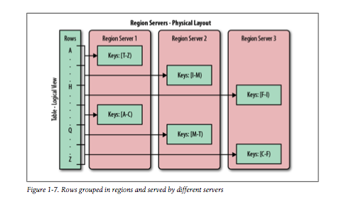

# Chapter 1: Introduction

## The Dawn of Big Data

* Systems like Hadoop let companies process petabytes of data.
* Hadoop let's you store data in arbitrary, semi or even unstructured format, since you interpret the data at analysis time.
* Hadoop complemenents existing database systems of any kind.
* Limitless pool to sink data
* Optimised for large file storage, batch-oriented and streaming access.
* Let's you access data using random access - like indexes in traditional system
* Alternatives
  * Traditional databases
    * Harder to scale
    * Sharding difficult
  * NoSQL
    * Diffent in schema 
    * Throw out features that are hard to scale like secondary indexes etc
* Consistency Models
  * Strict
      * Changes are atomic and take effect instantly
      * Highest level of consistency
  * Sequential
    * Clients see changes in order applied
  * Causal
    * Clients see causally related changes in order applied (eg replies to a Twitter post)
  * Weak
    * No guarantee
    * Changes may appear out of order
* NoSQL Dimensions
  * Data model
    * How data is stored: key/values stores, semistructured, column-oriented, document-oriented
  * Storage model
    * In-memory or persistent?
  * Consistenct model
    * Strict or eventually consisteny?
  * Physical model
    * Distributed or single machine?
  * Read/write performance
    * Design to match application's access patterns
      * Read often, written occassionally?
      * Equal load between reads and writes?
      * Lot of writes, few reads?
      * Range scans or random reads?
  * Secondary indexes
    * Allow you to sort and access tables on different fields and sorting orders
  * Failure handling
    * How does data store handle server failures?
  * Compression
    * Can you compress data?
    * What compression schemes are available?
  * Load balancing
    * Does it auto balance the load as it shifts over time
  * Atomic read-modify-write
    * Can be hard to implement in distributed systems
  * Locking, waits and deadlocks
    * What kind of locking model does the system support?
    * Can it prevents dead locks etc?
* Database (De-)Normalization
  * Designing schema as per *Denomalization, Deuplication and Intelligent Keys (DDI)*.
  * Duplicating datas across tables to prevent aggregation at read time.
* Hbase Building blocks
  * Backdrop
    * Google published "The Google File System" in 2003.
      * Handled replication between nodes, so losing a storage would have no effect on data availability.
      * Optimized for streaming reads
    * Then published "MapReduce: Simplified Data Processing on Large Clusters:
      * Providing a system for utilising CPUs across multiple nodes
    * GFS could for few very, very large files. Not so good for lots of tiny because data is retained in memory.
      * Wrote "Bigtable: A Distributed Storage System for Structured Data"
        * System would take care to aggregate small records into very large storage files
        * Offer indexing to retrieve data with min number of disk seeks
  * Table, Rows, Columns and Cells
    * Most basic unit is a **column**.
    * One or more columns form a **row**.
    * Number of rows form a **table**.
    * Each columns can have multiple versions, stored in **cells**.
    * Rows
      * **rows** stored lexicographically by their row key.
      * Rows are composed of *columns*, which are grouped into *column families*.
      * Support for secondary indexes is available.
      * Access is *atomic*: "concurrent reader and writer can make safe assumptions about state of a row."
    * Column familes
      * Defined when table is created
      * Shouldn't be changed too often
      * Columns in column family are stored together in a *Hfile*
    * Columns
      * Referenced as ``family:qualifier`` with *qualifier* being an arbitrary array of bytes.
      * Each cell can be timestamped, implicitly by system or explicitly by the user.
      * Cells can exist in multiple versions, with the most recent being available by timestamp.
    * Can express access to data like: ``(Table, RowKey, Family, Column, Timestamp) -> Value``
  * Auto-Sharding
    * Basic unit of scalability and load balancing: *region*.
      * Contiguous rows of columns stored together.
      * Starts with 1 region, splits in middle when becomes too large (at middle key)
      * Each region is served by *one region server*

      </img>

      * Region per server is roughly 10 to 1000, each between 1 and 2GB in size.

  * Storage API
    * Offers operations to create and delete tables and column families.
    * **scan** API lets you iterate over ranges of rows and limit which columns are returned.
 
## Implementation

* Data is stored in *HFiles*: persistent and ordered immutable maps from keys to values.
  * Default block size is 64KB but can be changed.
  * Each HFile has a block index, so lookups can be performed with a single disk seek.

* Data is first written to a *write-ahead log* (WAL), then stored in in-memory *memstore*
* Once data in memory reaches max threshold, it's flushed as a HFile to disk.
* Requests made are to a merged data of Hfiles and *memstore* (not WALs).

* Keys should be made to store related data close to each other.
  * Eg, ``com.wikipedia.www```, means all pages from Wikipedia will be stored near each other (``com.wikipedia.blog`` for example)

### Compaction

* Housekeeping process that merges small HFiles into larger ones.

* Two types of compaction:
  1. Minor compaction
    * Rewrite small files into fewer larger ones (n-way merge).
    * Fast merge: only bound by disk IO.
  2. Major compaction
    * Rewrites all files within a column family for a region into a single new one.
    * Scan all key/values pairs and can drop deleted entries including their deletion marker.

## Architecture

</img>

### ZooKeeper 

* Each region server creates a node in ZooKeeper
* Master uses ZooKeeper to figure out what Regionservers are available.
* ZooKeeper ensures 1 master is running.

### Master server

* Handles load balancing of regions across region servers.
* Doesn't provide any data services, so is light on resources.
* Takes care of schema changes.
* Takes care of metadata operations (creating tables and column families).

### Region servers

* Handle read and write requests for all regions they serve.
* Split regions that exceed the configured region size thresholds.
* Clients take to them directly for data-related operations.
