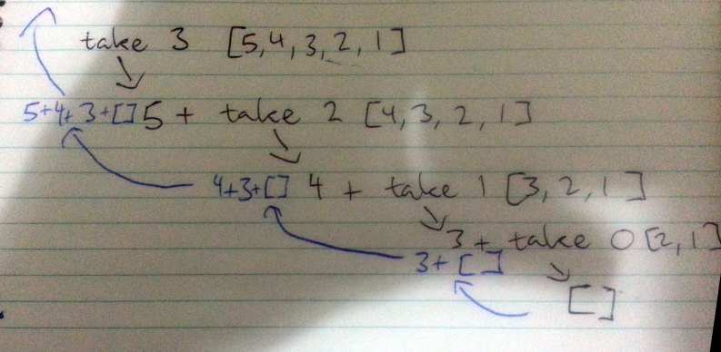

# Recursion

* No while or for loops, instead use recursion.
  * Imperative languages = computation is defined as how to get something.
  * Haskell (declarative languages) = what something is.

* To get maximum of a list in procedural language:
  * Define a maxium so far placeholder variable.
  * Loop through items in list and if one is higher than max, replace max.
  * Return max.

  ```
  def maximum(l):
    if not l:
       raise Exception('No max of an empty list.')

    maximum = l[0]

    for i in l:
        if i > maximum:
             maximum = i

    return i
  ```
* To get maximum in Haskell:

   ```
    maximum' :: (Ord a) => [a] -> a
    maximum' [] = error "Can't return max of an empty list."
    maximum' [x] = x
    maximum' (x:xs)
      | x > maxTail = x
      | otherwise = maxTail
      where maxTail = maximum' xs
    ```

  * Define edge condition patterns:

    * Empty list: fail.
    * Singleton list: return single item.

  * Split list into head and ass.
    * Return head if bigger than the max of the ass else return max.
    * Common idiom when doing recursion with lists.

 * Same style in Python (out of interest):
  
    ```
    def maximum(lst):
      if not lst:
         raise Exception('No max of an empty list.')

      head = lst[0]

      if len(lst) == 1:
        return head

      max_tail = maximum(lst[1:])

      return head if head > max_tail else max_tail
    ```

  * Even simpler Haskell implementation using the ``max`` function:

    ```
    maximum' :: (Ord a) => [a] -> a
    maximum' [] = error "Can't return max of an empty list."
    maximum' [x] = x
    maximum' (x:xs) = max x (maximum' xs)
    ```

* Take implementation:
  
  ```
  take ' :: (Num a, Ord i) => i -> [a] -> [a]
  take' n _
    | n <= 0  = []
  take' _ []  = []
  take' n (x:xs) = x : take' (n - 1) xs
  ```

  * Implementation:

  </img>

* Quicksort:

  * Algorithm defintion:

    * Split a list into: ```tail | middle | head```

      * Tail: all the items smaller than middle (sorted with same algorithm)
      * Head: all the items large than middle (sorted with same algorithm)

  * Implementation:

    ```
    quicksort :: (Ord a) => [a] -> [a]
    quicksort [] = []
    quicksort (x:xs) =
      let smallerSorted = quicksort [a | a <- xs, a <= xs]
          largerSorted = quicksort [a | a <- xs, a > xs]
      in  smallerSorted ++ [x] ++ largerSorted
    ```

    In Python:

    ```
    def quicksort(unsorted):
        if not unsorted:
            return []

        pivot, tail = unsorted[0], unsorted[1:]

        smaller_sorted = [i for i in tail if i <= pivot]
        larger_sorted = [i for i in tail if i > pivot]

        return (
            quicksort(smaller_sorted) + [pivot] + quicksort(larger_sorted))
    ```

* Thinking recursively
  * First define the edge case (eg empty list).
    * Usually something where recursive application doesn't make sense (sort an empty list).
  * Then apply a function that does something to one of the elem, then apply same function to the rest.

## Exercises

* Fibonacci in Haskell:

  ```
  fib :: a -> a
  fib x
    | x < 0 = error "Bad input."
    | x < 2 = x
    otherwise fib (x - 1) + fib (x - 2)
  ```

* Quicksort in Haskell (from memory):

  ```
  quicksort :: (Ord a) => [a] -> [a]
  quicksort [] = []
  quicksort (x:xs) =
    let smallerSorted = [a | a <- xs | a <= x]
        biggerSorted = [a | a <- xs | a > x]
    in smallerSorted ++ [x] ++ biggerSorted
  ```
