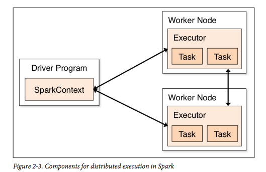

# Chapter 2: Downloading and Getting Started

## Downloading and Running Shell

* Steps to download and install locally:

```
> wget http://d3kbcqa49mib13.cloudfront.net/spark-1.2.0-bin-hadoop2.4.tgz
> tar -xvf spark-1.2.0-bin-hadoop2.4.tgz
> cd spark-1.2.0-bin-hadoop2.4
```

* Start Python shell:

```
> bin/pyspark
```

* Reduce verbosity of shell by editing ``conf/log4j.properties`` (create ``conf/log4j.properties`` by copying ``conf/log4j.properties.template``

``
> cd conf
conf/> cp log4j.properties.template log4j.properties
conf/> vi log4j.properties
- log4j.rootCategory=INFO, console
+ log4j.rootCategory=WARN, console
```

* To use IPython with pyshark:

```
> IPYTHON=1 ./bin/pyspark
```

* Create an RDD from a text file and perform basic operations like so:

```
In [1]: lines = sc.textFile("README.md")

In [2]: lines.count()
Out[2]: 98

In [3]: lines.first()
Out[3]: u'# Apache Spark'
```

## Intro to Core Spark Concepts

* Each Spark applications consists of "driver application"
* Programs are run across worker nodes called *executors*.



* Driver programs access Spark through a ``SparkContext`` object, which is automatically created as the var ``sc``:

```
In [4]: sc
Out[4]: <pyspark.context.SparkContext at 0x1038d80d0>
```

* You use the ``SparkContext`` to build *RDDs*:

```
In [5]: lines = sc.textFile('README.md')

In [6]: type(lines)
Out[6]: pyspark.rdd.RDD
```

* Can pass functions to operators, like so:

```
In [7]: lines = sc.textFile('README.md')

In [8]: p_lines = lines.filter(lambda line: 'Python' in line)

In [9]: p_lines.first()
Out[9]: u'high-level APIs in Scala, Java, and Python, and an optimized engine that'
```

... and they also support parallelizing across the cluster

## Standalone Applications

* You write applications as scripts then run with ``bin/spark-submit`` script in Spark.

* Need to initialize own SparkContext:

```
> cat tmp/test.py
from pyspark import SparkConf, SparkContext

conf = SparkConf().setMaster('local').setAppName('My App')
sc = SparkContext(conf=conf)

lines = sc.textFile('tmp/text')
print lines.count()
> ./bin/spark-submit tmp/test.py
```
