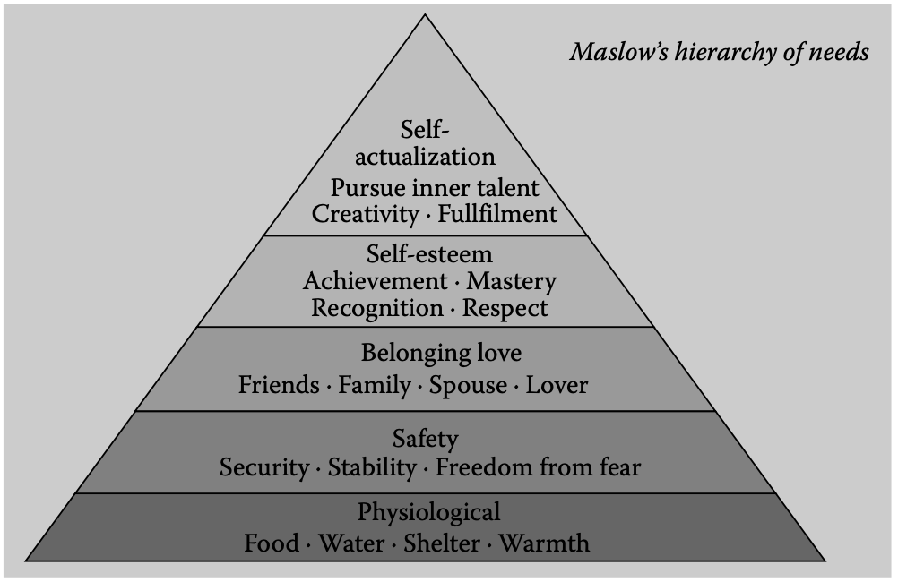
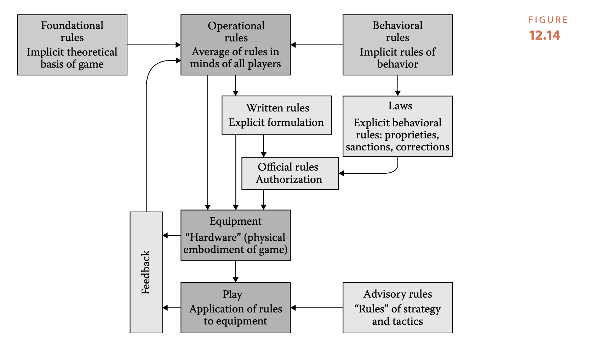

Link: https://www.amazon.com.au/Art-Game-Design-book-lenses/dp/0123694965
Title: The Art of Game Design - A Book Of Lenses (2nd Edition)
Author: [[Jesse Schell]]
Type: #book
Tags: #GameDesign

---
# The Art of Game Design - A Book of Lenses (2nd Edition)

## One: In the Beginning, There is the Designer
* You only become a game designer by designing games.
* Skills a game designer may use: animation, antropology, architecture, brain storming, business, cinematography, communcation, creative writing, economics, engineering, games, history, management, mathematics, music, psychology, public speaking, sound design, technical writing, visual arts.
	* Though no one can master all the skills, the more you can learn about each the better.
* The most important skill: listening
* 5 major categories: team, audience, game, client and self.
* Reading to consider:
	* [[Cirque de Soleil: The Spark-Igniting the Creative Fire that Lives within Us All]] - book about finding your path.
	* [[Challenges for Game Designers by Brenda Brathwaite and Ian Schreiber]] - a collection of exercises for stretching game design muscles.
* Key takeaway
    * Anyone can become a game designer but it's a skill that requires a lot of diversity of knowledge and the ability to listen and empathise.

## Two: The Designer Creates an Experience
* Goal of game designer is to create a compelling experience for the players.
* "The game is not the experience. The game enables the experience, but it _is not the experience_".
* Game designs have to deal with more interaction than designers of other mediums (ie movies).
* 3 fields that have sought to understand "mysteries of human mind and the secrets of the human heart": psychology, anthropology and design.
* Psychology
	* Behaviorists: focus on measurable behavior
	* Phenomenologists: focus on the nature of human experience and "feeling of what happens"
	* Game designers can make use of both behavioristic experiments and "phenomenological introspection:.
* Anthropology
	* Takes more holistic approach than psycology: looks at physical, mental and cultural aspects of people.
	* Cultural anthroplogists = immerse in studies world, including living with them.
	* Take a cultural anthropological approach to players: interviews, putting ourselves in their places to gain insights that would otherwise not be possible.
* Design
	* Designers seldom publish papers about their findinings.
	* Designers in a field often know little about designers in other fields.
	* Anyone who creates something for others to experience we can learn something from.
* We need to get knowledge from a range of sources, no single field has all the answers we need.
* Introspection: Powers, Peils and Practice
	*  "act of examining your own thoughts and feelings"
	*  two main perils of using introspections:
		*  Peril #1: introspection can lead to false conclusions about reality
			*  not so important to game designers, which are concerned with "feels like true" rather than what is true.
		*  Peril #2: what is true of my experiences may not be true for others
			*  Two extreme approaches to deal with this:
				*  only make games for people like me (ie only trust intuition)
					*  may not be a large enough audience for your unique tastes.
				*  only trust play testing (use no intuition only facts)
					*  some decisions need to be made before there's a game to play test
			* Observe your own experiences, then those of others to see how your experiences differ
	* Dissect your feelings
		* Must be able to analyse how you feel when you play a game.
		* Practice analysing your experience will help find the experiences you want to create from your game.
	* **Lens #1: the Lens of Emotion** #lens
		* What emotions should my players experince?
		* What emotions are they having now? Why?
		* How can I bridge the gap between emotions I want and what they're having?
	* Defeating Heisenberg
		* Heisenberg uncertainty principle from quantum mechancs: "motion of particle can't be observed without distubing the motion of that partical"
		* How can you observe your enjoyment of an experience without tainting that enjoyment?
			* Analyse memories:
				* Technique: engage in experience with intention to not analyze while you play, but immediately afterwards.
					* Requires practice.
			* Two passes:
				* Play once just experiencing.
				* Play again and take notes as you go.
			* Sneak glances:
				* With practice, can sneak glances while experience is happening.
					* Don't get carried away with analysis.
			* Observe silently:
				* It is possible with practice to silently observe your experience without interrupting it.
				* Can practice while watching TV, working etc.
				* Akin to mindfulness meditation: aware of your own autopilot without taking over.
		* Essential experience
			* Games only need the "essence of an experience", not the actual experience.
				* Game designer goal to find the essential experiences.
	* **Lens #2: The Lens of Essential Experience** #lens
		* What experience should the player have?
		* What's essential to it?
		* How can I capture it?
	* Being clear about the essential experience can give you a clearer picture of how to improve the game.
* Key takeaway
    * A game provides the essences of an experience - not the experience itself. Find the experience your game should provide, then the essence of that experience.

## Three: The Experience Takes Place In A Venue

* Mediums come and go but the venues that we consume them in persist.
* Private venues
    * The Hearth
        * People have a evolutionary connection to fire which is why homes have always had fireplaces.
        * The TV screen has replaced the fire in modern lives, and games based around it continue to be popular: Wii Sports, SingStar, Dance Central etc.
    * The Workbench
        * A private place in the house for hard problems.
        * Messy, usually not visited by guests.
        * Where the PC tends to go.
        * Games for here are played in solitude, or with likeminded people online.
        * Usually more difficult and intense.
    * The Reading Nook
        * Reading is usually done in a quiet place away from hearth and workbench.
        * Ipad gaming is a good fit for the reading nook.
* Public venues
    * What venue it is, be sure the experience is something you can't get at home.
    * The Theater
        * Place where large numbers of people experience something together.
        * Few games have made it in the theatre - maybe one day?
    * The Arena
        * Games where the results are public.
        * Some games played on the workbench are set in arena.
        * Few examples of digital games being played in traditional areas - yet...
    * The Museum
        * Including zoos and aquariums as types of museum's, they provide a chance to see the exotic and learn something about our world.
        * Museums are introducing gameplay elements to introduce visitors to information.
* Half Private / Half Public Venues
    * Venues that live in the boundary between privacy of home and openness of public.
    * The Gaming Table
        * Tabletop games, arcade machines, pool tables at bar.
        * Non-digital games are the mainstay of the gaming table, but perhaps touch screens could facilite the introduction of digital games here.
    * The Playground
        * Anywhere improvisational play happens.
        * Children largely play this way as part of their development.
        * Video game industry has largely ignored it but more mobile tech may change that.
* Anywhere
    * Crossword puzzles, sudoku, word find etc.
    * Mobile games.
    * Tend to be playable in "bite sized" chunks.
    * Players tend to prefer them to be free.
* Venues Mixed and Matched
    * Lots of gaps and overlaps with venues: bowling alleys, pinball at a restaurant etc.
    * Important thing is to see past the games and platforms to the venues and their properties.
* **Lens #3: Lens of the Venue** #lens 
	* What venue best suits game i'm creating?
	* Does venue have special properties that will influence the game?
	* What elements are in harmony with game? What elements aren't?
* Reading:
	* [[A Pattern of Language]] by Christopher Alexander et al - book about relationships between humans and spaces.
* Takeaways
    * Understanding what venue your game is designed for, allows you to see past technology and trends to understand your games key properties.

## Four: The Experience Rise Out of a Game
* We want to design experiences, but we cannot do it directly, it's done through a game.
* How can we define "game"?
    * People have slightly different definitions of what a "game" is.
    * Academics view lack of standardised definitions around game design a crisis.
* What Is A Game?
    * Surprise and fun are integral part of game experiences.
    * **Lens #4: The Lens of Surprise** #lens 
        * What will surprise players when they play the game?
        * Does the story have interesting surprises? Do the game rules? Does the artwork? The technology?
        * Do your rules give players way to surprise each other?
        * Do rules give players way to surprise themselves?
    * **Lens #5: Lens of Fun** #lens 
        * What parts of my game are fun?
        * What parts need to be more fun?
    * A possible definition for fun: "Fun is pleasure with surprises"
    * A possible definition for play: "Play is manipluation that indules curiosity."
    * **Lens #6: The Lens of Curiosity**
        * Consider player's true motivation, not just goals the game defines:
            * What questions does the game create for the player?
            * Can I create more questions for the player?
        * Example: maze-finding game with a time limit: "can I find my way through maze in 30 seconds"
        * Another question: "What will happen in the story after I complete this level?"
    * One possible definition of a game: "Games are an exercise of voluntary control systems, in which there is a contest between powers, confinded by rules in order to produce a disequilibrial outcome" - Elliot Avedon and Brian Sutton-Smith
        * Leads to some key qualities of games:
            * Games are entered willfully.
            * Games have goals.
            * Games have conflict.
            * Games have rules.
            * Games can be won and lost.
    * Another possible definition: "(A game is) an  interactive structure of endogenous meaning that requires players struggle toward a goal" - Greg Costikyan
        * Interactive structure = player is active.
        * Struggle toward a goal = implies challenge (ideally just the right amount)
        * Endogenous meaning = internally generated ie has meaning within the game context (Monopoly money)
    * **Lens #7: The Lens of Endogenous Value**
        * Think about players' feels about items, objects and scoring.
            * What is valuable to players, how can I make it more valuable?
            * What's the relation between value in the game and players' motivations?
    * Costikyan's definition add another 3 qualities for games:
        * They're interactive.
        * They have challenge.
        * They create interval value.
    * Another definition: "A game is a closed, formal system, that engages players in structured conflict and resolves in an unequal outcome" -Tracy Fullerton, Chris Swain, and Steven Hoffman
        * More items to add to the list"
            * Games engage players
            * Games are closed, formal systems
                * Another way of saying the game has clearly defined rules and boundaries.
    * Another approach to trying to define games: think about how people relate to games.
        * Most people play games because they like solving problems.
		* When problem solving is removed from a game, it ceases to be a game and is just an activity.
    * One possible definition: "A game is a problem-solving activity, approached with a playful attitude."
    * **Lens #8: The Lens of Problem Solving**
        * What problems does my game ask the player to solve?
        * Are there hidden problems to solve that arise as part of gameplay?
        * How can my game generate new problems so that players keep coming back?
* Review:
	* "Fun is pleasure with surprises."
	* "Play is manipulation that satisfies curiosity."
	* "A toy is an object you play with."
	* "A good toy is an object that is fun to play with."
	* "A game is a problem-solving activity, approached with a playful attitude."
* Reading:
	* [[Man, Play and Games]] by Roger Callois - 1961 that's a favorite of academics, containing insights about the nature of gameplay.
	* [[Finish and Infinite Games]] by James P. Carse - philosophical statement about the relationship between games and life.
	* [[Why We Play Games: Four Keys to Emotion without Story]] by Nicole Lazzaro - exploration of dimensions of fun.
	* [[Rules of Play]] by Katie Salen and Eric Zimmerman, Chapters 7 and 8 contain some very thoughtful consideration of the definition of a game.
	* [[The Grasshopper: Games, Life, and Utopia]] by Bernard Suits - thought-provoking philosophical examination of nature of games.

* Key takeaways
    * Though this chapter doesn't contain any practice wisdom, spending the time to clearly define things can help develop insights. Though personally, I didn't gain a lot from this chapter.

## Five: The Game Comprises of Elements 
* The Four Basic Elements of a Game
    1. **Mechanics**
        * Rules/goals/limitations etc of the game.
            * More linear experiences, like film and books don't have mechanics, though may have other elements.
    2. **Story**
        * The events that happen in the game: " linear and prescripted, or it may be branching and emergent"
    3. **Aesthetics**
        * Has the most direct relationship to players' excperience.
    4. **Technology**
        * Choose of technology enables and prohibits certain things.
    * Each element supports the other: none are more important than the other.

    ![[elemental-tetrad.png]]

* **Lens #9: The Lens of Elemental Tetrad
	* Is my game design using all four elements?
	* Can I enhance elements from some of the categories?
	* Are the elements working together nicely?
* Space invaders example:
	* Technology: the game was made possible due to a custom motherboard made for it.
	* Mechanics: interesting and well balanced. Aliens further away are worth more points. The more aliens you destory, the faster they get builing excitment.
	* Story: simple but effective alien invasion that supports all elements.
	* Aesthetics: 3 different alien designs. Wit hcolour achieved by gluing translucent plastic to the screen. Marching invaders made a heartbeat noise as they sped up.
	* Each element works together but also makes comprimes for the other.
* Don't want to fall into the trap of thinking only about the inner working of the game and not the player experience.
* Holographic design: thinking about the elements of the game that make the experience possible.
* **Len #10: The Lens of Holographic Design**
	* What elements make the game fun?
	* What elements detract?
	* Can game elements be changed to improve the experience?

## Six: The Elements Support a Theme
* Use unifying theme strengthen game's experience.
	* Choose theme then reinforce at every opportunity
* **Lens #11: The Lens of Unification** #lens 
	* What is my theme?
	* Am I using every possible means possible to reinforce that theme?
* Choose themes that deeply resonate with players: freedom, love.
* Truth-based themes can resonate equally as well as experienced based.
	* Titanic example:
		* One of the themes of the movie is how tragic the Titanic accident was.
		* Though the tragedy of Titanic appeared to be main theme, the underlying was: “love is more important than life and stronger than death.”
	* Stephen King's Carrie:
		* Exploration of the meaning of blood: from injury, to family ties, to coming of age and used it to tune and strengthen the story.
	* Risk Legacy:
		* Game mechanics change game permanently (modify board with irremovable stickers, write on board with permanent markers, destroy game cards), reinforces theme: “war changes a world.”
	* Toontown Online:
		* The battle of play vs work.
* **Lens #12: The Lens of Resonance** #lens
	* What is it about my game that feels powerful and special?
	* When I describe my game to people, what ideas get them excited?
	* If I had no constraints, what would the game be like?
	* I have certain instincts about the game. What is driving those instincts?
* Not all great games need a deeply resonant theme, but most can be strengthen by a unifying theme.
* Players appreciate unifying themes on an unconscious level:
    * "Players know they like a game, but they can’t quite say why. Often, the reason is that all of the elements are reinforcing a theme that is interest- ing or important to them. " -pg 66
* Reading:
    * [[The Plenitude]] by [[Rich Gold]]. Theming is just one of the many topics in this treasure trove of wisdom by the designer of the Nintendo Power Glove.*
* Key takeaway:
    * Games with unified themes, that ideally deeply resonate with players, are the best kinds of games.

## Seven: The Game Begins with an Idea
* Inspiration for games can come from anywhere - not just other games.
* **Lens #13: The Lens of Infinite Inspiration** #lens 
    * What is an experience I've had that I'd like to share with others?
    * How can I capture that experience in a game?
* Design is problem solving.
* Before you start with solutions to the problem, start with a clear problem statement.
    * By stating the problem first, and not jumping to solutions, you give yourself a wider solution space to search. Why?
        * You may discover the problem has been artifically constrained.
        * You have a clear measurement of success.
        * It's easier to communicate your goals with the team.
    * Sometimes you learn more about the problem as you iterate - that's okay, go back and update the problem description.
* **Lens #14: The Lens of the Problem Statement** #lens 
    * Start by treating the game as a solution to a problem.
    * What is the problem I'm really trying to solve?
    * What assumptions have I made that don't have solve the problem?
    * Is the game truely the best solution? Why not?
    * How can I tell if the problem is solved?
* Use subconcious and sleep to your advantage:
    * Pay attention to your subconcious, even if it seems ridiculous.
    * Record your ideas.
    * Sleep well and be otherwise healthy.
    * Allow time to solve problems.
* Brainstorming tips:
    * Write down every solution that comes to you - refine them later.
    * Sketch, use toys etc - anything that helps the creative process.
    * Change your environment.
    * Immerse yourself in the problem - talk to other people, play similar games etc.
    * Index cards on the wall - Agile style.
    * Make a list of your assumptions and challenge them.
    * Brainstorm in categories for the elemental tetrad and mix and match.
    * Find a partner, but be wearly of brainstorming in big groups. Usually better to brainstorm in small groups then combine ideas in a larger group.
* Reading:
    * [[What It Is and Picture This]] by [[Lynda Barry]]
    * [[Fifty Secrets of Magic Craftsmanship]] by [[Savador Dali]]
    * [[Prototyping a Game in 7 Days]] by [[Kyle Gray]] [[Kyle Gabler]] [[Matt Kucic]] and [[Shalin Shodhan]]
    * [[The Origins of Conciousness in the Breakdown of the Bicameral Mind]] by [[Julian Jaynes]] (Chapter 1)
    * [[Groupthink: The Brainstorming Myth]] by [[Jonah Lehrer]]
    * [[Catching the Big Fish] by [[David Lynch]]
* Key takeways:
    * Seek inspiration outside of games for the types of experiences you want to shar with your players.
    * Start with a clear problem statement for your game and expect to iterate on the problem statement as you learn more.
    
## Eight: The Game Improves Through Iteration
* Don't get stuck with decision paralysis, pick an idea and commit to it quickly.
	* Through commiting to an idea, you start to give it full attention and discover weaknesses and strengths you could otherwise miss.
* **Lens 15: Law of Eight Filters** #lens 
    * Game should pass through 8 filters:
        * Does it feel "right" to you and your team?
        * Are the intended audience likely to like it?
        * Is it well designed - does it stand up to examiation through many lenses?
        * Is the game innovative?
        * Can the game become profitable?
        * Does the game meet my community and social goals?
        * Do playtesters enjoy the game?
* Rule of loop: the more times you test and improve, the better the game will be.
  * Ideally game can be iterated on quickly, but if not, innovation is require to figure out how to prototype it.
  	* How can I make every loop count?
    * How can I loop fast?
* [[Winston Royce]] wrote the paper that was the foundation for Waterfall, though didn't use the word and actually advocated for iterative development.
* [[Barry Boehm]] in 1986 presented the spiral model of software development:
	* Create basic design.
    * Assess risks in design.
    * Build prototypes to mitigate risks.
    * Test prototypes.
    * Create more detailed dsesigns based on what you learn.
* Agile Manifesto fleshed out the ideas in the spiral model: key part of it in risk management.
**Lens #16: The Lens of Risk Management** #lens 
  * What could keep the game from being great and how can we stop that from happening?
      * We generally want to work on parts of the game we're confident in but you have to face up to the parts in danger.
* Tips for Productive Prototyping:
    * Answer a question: what can my graphics engine handle? Will core gameplay be fun? Do characters and setting fit?
    * Forget quality: aim to answer questions quickly.
    * Plan to throw a lot of the prototype away.
    * Prioritise prototypes and consider dependance - does one prototype need to happen before another?
    * Parrallelise prototypes: can the software team be testing the engine while design tries UX?
    * Prototypes can be done on paper.
    * Prototypes don't have to be interactive - sketches and animations can answer questions.
    * Choose a fast game engine for prototyping (and ideally building)
    * Build a toy first - make sure the core gameplay is fun.
        * **Lens #17: The Lens of the Toy** #lens 
            * If my game had no goals, would it still be fun?
            * When people see my game, do they instantly want to play and interact with it?
    * Always be looking for opportunities for more loops - porting to another platform could be opportunity to fix parts of game that didn't work.
* "50% rule" for budgetting
	* Plan game development so that if 50% of budget were lost, the game was still in a releasable state. Once the game is working, spend the rest of the budget making it great.
        * Develops usually apply a 80/20 wrong, forgetting that things often go wrong, eating up the 20% time.
* **Lens #18: The Lens of Passion** #lens 
    * At the end of prototyping, as well as risk assessment, check how you feel about game 
    	* Am I passionate about how great game can be or can I be?
* Reading:
	* [[Sketching User Experiences]] by [[Billl Buxton]]
    * [[Have Paper, Will Prototype]] by [[Bill Lucas]]
    * [[The Kodold Guide to Board Game Design]] by [[Mike Selinker]]
    * [[Less Talk, More Rock]] by [[Superbrothers]]
    * [[Agile Software Developer]] on Wikipedia
    * [[The 4Fs of Game Design: Fail Faster, and Follow the Fun]] by [[Jason Vandenberghe]]
* Key takeaways:
      * Game design requires a lot of prototyping. You cannot be sure of the limitations of your designs until you do a lot of prototyping.
      * Prototyping can help answer the question about the true problem you're trying to solve.
      * 50% rule: plan game development so that if 50% of your budget were removed, you'd still have a shippable game. Then use the rest to make it great.

## Nine: The Game Is Made for a Player
* Good designs find way to project themselves into the minds of players.
* When creating something aimed at large groups of players, we consider ways we can group people aka [[demographics]].
* Game industry usually breaks players of ages down as follows:
    * 0-3 - infant / toddler
        * Interested in toys.
        * No complexity and problem solving skills.
        * Can be fascinated with direct interfaces like touch screens.
    * 4-6 - preschooler
        * Show first interest in games.
        * Simple games played with parents who are willing to bend the rules to keep kids engaged.
    * 7-9 - kids
        * The "age of reasoning"
        * Usually can read and solve harder problems.
        * Beginning to develop own interests separate from parents.
    * 10-13 - preteen or "tween"
    	* starting to consider things more deeply and with more nuance.
    	* can be passionate about interests: "age of obsession"
        * boys at this age in particular often become obsessed with games.
    * 13-18 - teen
        * getting ready for adulthood.
        * can be significant divergence between male and female interests here.
            * Boys = competition and mastery, girls = real-world issues and communication.
        * Teens often interested in experimenting with new kinds of experiences.
    * 18-24 - young adult
        * Less experimentation - have clearer tastes.
        * Often have time and money, hence becoming big consumers of games.
    * 25-35 - twenties and thirties
        * Age of "peak family formation"
        * More responsibilities of adulthood and less time for games.
        * Usually casual but also "hard core gamers" where games a primary hobby.
    * 35-50 - thirties and forties
        * "family maturation"
        * caught up in career and adult responsibilities.
        * want gameplay experiences for the whole family.
    * 50+ - fifties and up
        * "empty nesters"
        * sometimes returning to games they enjoyed when young.
        * games with strong social components: golf, tennis, bridge, online multiplayer games, Facebook games etc.
* All play activities are connected to childhood, since childhood is centered around play. To create games for someone of a particular age, you must be in tune with the games and themes that were popular when they were children.
* Gender differences show up sharply in purchasing preferences of games.
* [[Raph Koster]] in [[Theory of Run]] suggests the core of winning games is mastering abstract formal systems, which is generally preferred by males to females.
	* However, that is not the only gameplay experience available: story, creativity, learning and socialisation are experiences enjoyed by females.
* 5 things males like in games:
    * Mastery - even if not important or useful. Females prefer skills with interesting purpose
    * Competition
    * Destruction
    * Spatial puzzles
    * Trial and error
* 5 things females like in games:
    * Emotion-based
    * Real world
    * Nurturing
    * Dialog and verbal puzzles
    * Learning by example - prefer clear tutorials
* **Lens #19: The Lens of The Players** #lens 
    * Questions to ask about your players:
        * What do they like?
        * What don't they like?
        * What would they expect to see in a game?
        * If I were in their place, what would I want to see?
        * What would they like a dislike about the game?
* "Psycographics" is about grouping people by interests instead of how they look including lifestyle choices and the things they enjoy
* [[Marc LeBlanc]] list of 8 primary game pleasures:
    * Sensation
        * Delivered through game aesthetics
        * Usually about the "pleasure of the toy"
        * Can't make a bad game good, but can make a good game great.
    * Fantasy
        * Imaging yourself as something you're not
    * Narrative
        * Watching the story unfold
    * Challenge
        * Problem solving and mastery
    * Fellowship
        * Community and cooperation
    * Discovery
        * Exploration of games world or features or game strategy
    * Expression
        * Building characters and levels
        * Designing outfits
    * Submission
        * Submitting to game world
        * Good games make suspending disbelief effortless
* Taxonomy of player types by [[Richard Bartle]]
    * Achievers - want to achieve goals of the game
    * Explorers - want to discover and explore breadth of game 
    * Socialities - pleasure of fellowship
    * Killers - competing with and defeating others and "impressing themselves on others" which could also include helping others
    * Graph shows that achievers are interested in acting on the world, explorers interacting with the world, socializers in interacting with players and killers interesed in acting on players:
        
* Other pleasures to consider:
    * Anticipation
    * Completion
    * Delight in other's misfortune - schadenfreude
    * Gift giving and making others happy
    * Humor
    * Possibility - having many choices and knowning you can pick any of them
    * Pride in an accomplishment
    * Surprise
    * Thrill - "fear minus death equals fun"
    * Triumph over adversity - Italian word for it: "fiero"
    * Wonder - awe & amazement
* **Lens #20: The Lens of Pleasure** #lens 
    * Questions:
        * What pleasures does my game give to players? Can they be improved?
        * What pleasures are missing?
    * Go through list of known pleasures and consider how well it's delivered.
* Reading:
    * [[Designing Virtual Worlds]] by [[Richard R. Bartle]] 
    * [[Pleasures of the Brain]] by [[Morten L. Kringelbach]] and [[Kent C. Berridge]]
 * Key takeaway:
 	* Understanding the key demographics and their interests is important, but equally import is thinking about the types of things that give your players pleasure.
    
## Ten: The Experience Is in the Player's Mind

* The are 4 main mental abilities that are used when playing games: modelling, focus, imagination and empathy.
* Modelling
    * Our brains don't consume reality directly instead a simplified model of it.
    * Example:
        * Colours are just light wavelengths that our brains registers as being distinctly different through colours.
        * We can look at a cartoon of a human and immediately understand it's a person even though it's lacking many details.
    * Games are a "predigested model" of reality explaining why they're relaxing to play: the complexity has already been stripped away.
    * By understanding the "reality illusion" you can make experiences feel as real (or even more real) than reality itself.
* Focus
    * Our brains have the capacity to focus attention selectively.
        * Example:
            * "Cocktail party effect" - can drown out noise of lots of conversations and focus on just one.
    * [[Mihaly Csikszentmihalyi]] wrote about flow: "a feeling of complete and energized focus in an activity, with a high level of enjoyment and fulfillment"
    * Key components necessary to create flow state for player:
        * Clear goals
            * If goals are unclear, we aren't sure whether our current action is useful.
        * No distractions
            * Want to engage both mind and hands
                * Menial labour causes the mind to wander
                * Sitting and thinking causes us to fidget
        * Direct feedback
            * Feedback should be directly after an action, so they know if they're closer to goal.
        * Continuously challenging
            * "flow activities must manage to stay in the narrow margin of challenge that lies between boredom and frustration"
            * Ideal game has a cycle of "tense and release" where the play experience follows a track like this:
                * 
    * **Lens #21: The Lens of Flow**
        * Does my game have clear goals?
        * Are the goals of the player the same goals I intended?
        * Is there places in the game that distract the player to the point they forget their goal?
        * Does the game provide the right level of challenge for the player?
        * The the player's skills improving at the rate I hoped?
* Empathy
    * Humans have a strong ability to feel the feelings of others (or at least our model of others)
    * Cinematographers use this knowledge to great effect
    * If games are about problem solving, empathic projection is one method of problem solving: imagine myself in the place of another to make decisions for them
* Imagination
    * Imagination is an important human skill for problem solving and "filling in the details"
    * It's also used for communication - ie story telling.
* Reading
    * [[Flow: The Psychology of Optimal Experience]] by [[Mihaly Csikszentmihaly]]
    
## Eleven: The Player's Mind is Driven By The Player's Motivation
 * All entertainment is the idea to make something unimportant seem important: they do this using motivation.
 * Maslow's Hierarchy of Needs
     * Represented as a pyramid.
     * Idea is that lower levels need to be achieved before tackling higher levels of need.
     * 
     * Most games fulfill achievement and mastery needs, so even higher levels.
 * More needs
     * [[Edward Deci]] and [[Richard Ryan]] developed self-determination theory
     * Suggest we have 3 core needs:
         * **Competance** - being good at something
         * **Autonomy** - ability to do things your way
         * **Relatedness** - need to connect to others
     * Games are good at fulfilling all these needs.
 * **Lens #22: The Lens of Need**
     * Which level of Maslow's hierarchy is my game operating?
     * Does it fill needs of competence, autonomy and relatedness?
     * Can game fill more basic needs than it already does? Can it fulfill the ones it does better?
 * Even games need to fulfill human needs: if people imagine that game is going to make them feel better about themselves or connect with their friends, they'll want to play it.
 
 * Intrinstic vs Extrinsic motivation
     * Core idea is that intrinsic is stuff you do for fun, extrinsic is stuff others motivate you to do (ie for payment)
     * Reality, most activities don't fit neatly into one category or other but on a spectrum.
     * 
* Wanna vs Hafta
    * Many gameplaying motivations are about pleasure seeking: collecting stars, getting combos etc; many are centered on pain avoidance: avoiding enemies, trying not to die.
    * Free to play games often start out as pleasure seeking, then eventually pain avoidance: not keeping daily streak etc.
* **Lens #24: The Lens of Motivation** #lens
    * What motivations do players have to play my game?
    * What motivations are most internal? Which are external?
    * What are pleasure seeking? What are pain avoiding?
    * What motivations support each other?
    * Which motivations are in conflict?
* Novelty
    * Games are always keen for a "new" experience, but they won't hang around if there isn't substance as well as novelty.
    * **Lens #25: The Lens of Novelty** #lens
        * What is novel about my game?
        * Does my game have novelties throughout or just at the beginning?
        * Do I have the right mix of novel and familiar?
        * When the novelty wears off, is my game still fun?
* Judgement
    * We have a need to know how we stack up compared to others.
    * **Lens #26: The Lens of Judgement** #lens
        * What does your game judge about your players?
        * How does it communicate this judgement?
        * Do players feel the judgement is fair?
        * Do they care about the judgement?
        * Does the judgement make them want to improve?
* Reading
    * [[Glued to Games]] by [[Scott Rigby]] and [[Richard M. Ryan]] an insightful guide to the relationship between self-determination theory and what makes games work.
    * [[Punished by Rewards]] by [[Alfie Kohn]]. This book is an excellent overview of the vast body of research about the downsides of extrinsic rewards.
    * [[Understanding Motivation and Emotion]] by [[Johnmarshall Reeve]] -college-level textbook about the world of psychological research on the subject.
    
## Twelve: Some Elements Are Game Mechanics

* Skeleton of the game, when aesthetics have been stripped away is the Game Mechanics.
* Though no universally agreed upon taxonomy for Game Mechanics exists, author breaks them down into seven main categories.
* Mechanic 1: Space
    * Generally:
        * Are discrete or continuous
        * Have some number of dimensions
        * Have bounded areas that may or may not be connected
    * Tic Tac Toe example
        * Grid is 3x3 (discrete)
        * Each circles is a 0d place.
        * Adjacency is meaningful.
    * Monopoly example
        * Grid is discrete
        * 1d space
        * Connected by loop
    * Useful to break game down into bare functional space so you aren't distracted by aesthetics
    * Sometimes useful to consider parts of game in 2d or 3d
        * Soccer example
            * 2d and continuous for understanding and modifying boundaries
            * 3d for modifying height of goals or changing rules are how high player can kick
            * 2d and discrete to consider strategy, defence, player placement et.
    * Nested spaces
        * Spaces within spaces is common: consider map world that can be freely explored that takes you to less free levels.
    * Zero dimensions
        * 20 questions could be considered zero dimensions
        * Still useful to imagine as a 1d space with a graph between question and answerer: `{Answerer's mind} -> {Conversation space} -> {Questioner's mind}`
    * **Lens #26: The Lens of Functional Space**
        * Is the game discrete or continuous?
        * How many dimensions?
        * What are the boundaries?
        * Are there subspaces? How are they connected?
        * Is there more than one useful way to abstractly model the space?
    * "If you can simultaneously see your abstract functional space and the aesthetic space the player will experience, as well as how they interrelate, you can make confident decisions about the shape of your game’s world."
* Mechanic #2: Time
    * Games can have discrete or continuous time
    * Word for unit of discrete time is "turn" aka turn-based games.
    * Clocks and Races
        * Used in many games to set absolute time limits for things
        * Can be nested: basketball has round timer and shot clock to keep game interesting
    * Controlling Time
        * Can stop or pause time ala "time outs" in sports.
        * Speed up time: Civilisation.
        * Rewind time: when you die and start level again or from checkpoint.
        * Games like Braid even make time a central mechanic.
    * **Lens #27: The Lens of Time**
        * Experiences can be spoiled when too long, too short, too fast or too slow
        * What determines the length of gameplay activities?
        * Are players frustrated that game is too short? Or bored that it's too long?
        * Would the game be better without time limits?
        * What hierarchy of time structure help game?
* Mechanic #3: Objects, Attributes and States
    * Objects are nouns of game, attributes are adjective.
    * Objects generally have one or more attributes including the position within the world.
        * Some attributes rarely change, ie max speed of car.
        * Some attributes are very dynamic: current speed of car.
    * Some state changes are supposed to be hidden from players, others should be as clear as possible
        * Rule of thumb: if things act the same, they should look the same.
    * Games have many states and attributes and it's easy for designer to get confused:
        * Useful to construct a state diagram for each attribute and to understand state changes and connections.
    * **Lens #28: The Lens of The State Machine** #lens 
        * What are the objects in the game?
        * What are attributes of each object?
        * What are the possible states?
        * What triggers state changes of each attribute?
    * Secrets	
        * In most boardgames, all information is public
        * In card games, hidden/private state is a key part of the game
        * In video games, there's also information that only the AI is aware of and also stuff that only game is aware of.
        * Small changes to who knows what information can radically change a game: great way to create drama is to make piece of private information suddenly public.
        * **Lens #29: The Lens of Secrets** #lens 	
            * What is known to the game only?
            * What is known by all players?
            * What is known by some or only one player?
            * Would changing who knows what information improve my game in someway?
* Mechanic #4: Actions
    * Actions are verbs of games: what can players do?
    * Two perspectives on actions:
        * First kind of action is *basic action*
            * Run, walk, sit etc
        * Second kind is *strategic action*
            * How can players use basic actions to achieve a goal?
    * Emergent gameplay
        * Strategic actions are actions that aren't usually part of the rules but emerge during gameplay.
        * Ratio of strategic actions to basic actions is a good indication of how much emergent behaviour the game has.
        * 5 things to add emergent gameplay:
            * More verbs / basic actions
                * Though too many that don't have good interactions can create a bloated / confusing game.
            * Verbs that act on many object
                * Instead of using a gun to shoot bad guys, can it shoot locks off doors / windows?
            * Goals that can be achieved multiple ways
                * Ie guns that can shoot at enemies or can shoot down chandeliers which kill enemies.
                * This does make game harder to balance and can result in one path being the main path players take.
            * Many subjects
                * If checkers had just two pieces: a red and black one, it'd be a lot less interesting.
                * The interaction of many pieces is what makes checkers interesting.
            * Side effects that change constraints
                * When a piece in checkers is moved, the opponents available moves are limited.
        * **Lens #30: The Lens of Emergence**
            * How many verbs do players have?
            * How many objects can each verb act on?
            * How many ways can players achieve goals?
            * How many subjects do players control?
            * How do side effects change constraints?
    * Lots of games appear to be derivatives because they share the same action. Innovative games usually introduce new actions either basic or strategic.
    * **Lens #31: The Lens of Action**
        * What are the basic actions of the game?
        * What are the strategic actions?
        * Am I happy with ratio of basic to strategic actions?
        * What actions do players want to do that they can't?
        * Deciding on actions is most fundamental decision designers can make.
* Mechanic #5: Rules
    * David Parlett's game rule diagram
        * 
        * Operational rules
            * Most basic: what do players do to play the game?
            * Understanding required for players to play the game.
        * Foundational rules
            * Abstract / formal version of rules: operation might be "the player should role a 6-sided die and get that many chips", foundational: "the players power value is increased by random value from 1 to 6"
            * Mathematical representation of game state, though there is no standard notation for game state.
        * Behavioural rules
            * Implicit / unwritten rules.
            * "Don't tickle the other player while they're choosing a move in chess."
        * Written rules
            * Document that players read in order to learn rules.
            * Falling out of favour in video games, in favor of teaching them through play.
        * Laws
            * Developed when game enters serious / high-stakes settings.
            * Tekken 5 (a fighting game)at the 2005 Penny Arcade Expo:
                * a. Single elimination.
                * b. You may bring your own controller.
                * c. Standard VS mode.
                * d. 100% health.
                * e. Random stage select.
                * f. 60 second timer.
                * g. best 3 of 5 rounds.
                * h. best 2 of 3 games.
                * i. Mokujin is banned
            * Official rules
                * Laws that merge with written rules to become offical.
                    * Saying "check" when opponent is at risk of checkmate.
            * Advisory rules
                * Rules pertaining to strategy; stuff that helps you play better.
    * Modes
        * The mini/sub games within games ie playing yoga in GTA 5.
        * Rules of play can change completely.
        * Too many modes and game can get confusing.
            * Sid Meier rule of thumb: "players shouldn't spend so long in the subgame that they forget the main game they were playing"
    * Enforcer
        * In traditional games, rules are enforced by other players or if stakes are high, referees.
        * Digital games can be enforced by computer and become a constraint in the world.
    * Cheatability
        * If players feel like game can be cheated (even if not), some will cheat, most will no longer want to play.
    * Most Important Rule
        * The object of the game is the most important rule.
        * Should be able to state the game's objective clearly: "capture your opponents King"
        * Rules for good game objectives:
            * Concrete - players understand and can state what they're doing.
            * Achievable - players must think they can achieve the goal.
            * Rewarding - players should feel rewarded and proud of their achievement.
        * Must balance short-term and long-term goals.
            * Players should know what to do next and what they're ultimately working towards.
        * Lens #32: Lens of Goals
            * What is the ultimate goal of my game?
            * Is the goal clear to players?
            * Is there a series of goals that are understood by players?
            * Are different goals related to each other in a meaningful way?
            * Are goals accurate, achievable and rewarding?
            * Balance of short and long term goals?
            * Can players decide on their own goals?
        * Good idea to pick up Lens of Toy, Lens of Curiosity and Lens of Goals at the same time.
    * Game is not just defined by it's rules, it is its rules.
    * **Lens #33: The Lens of Rules** #lens 
        * What are the foundational rules of the game? How are they different from operational rules?
        * Are there "laws" or "house rules" that should be incorporated into formal rules.
        * Are there different modes? Would game be better with more modes? Fewer modes?
        * Who enforces the rules?
        * Are rules easy to understand?
    * Make notes while playtesting about holes in rules that appear - be weary of just patching them up as the same holes will appear again elsewhere.
* Mechanic #6: Skill
    * Players skill level should be a good match to game's difficulty to stay in flow channel.
    * Games usually require a blend of skills:
        * Physical skills
            * Common in most sports.
            * Controller manipulation is one sort of physical skill.
        * Mental skills
            * Memory, observation, puzzle solving. Games that require no mental skills are rare.
            * Games are interesting when there are decisions to make.
        * Social skills
            * Reading/fooling opponent (Poker)
            * Communicating (Overcooked)
    * Real vs Virtual Skills
        * Virtual skills: skills achiquired in game that are seperate to player's skill (ie sword upgrade).
        * Virtual skills can give player a feeling of power but too many and the game will feel hollow.
    * **Lens #34: The Lens of Skills**
        * What skill does my game require?
        * Are their categories of skill the game is misisng?
        * What skills are dominant?
        * Are these skills creating experiences I  want?
        * Are some players better than others?
        * Can players improve their skill with practice?
        * Does the game demand the level of skill?
    * Lens of skill works hand-in-hand with lens of essential experience.
* Mechanic #7: Chance
    * Ten rules of probability
        * Rule #1: Fractions are decimals are percentages
            * 1/2 = 0.5 = 50%
            * Per cent = per 100
        * Rule #2: Probabilities are between 0 and 1
            * You cannot have a negative probability nor greater than 1.
            * 0 = definitely won't happen, 1 = definitely will happen.
        * Rule #3: Probability is simply "the outcomes you're looking for" / "all possible outcomes"
            * Ie probability of getting red = 26 red cards / 52 total cards = 26 / 52 = 0.5
        * Rule #4: Enumeration will solve any probability problem if you have enough time
            * If you want to know probablity of flipping coin 3 times and getting heads at least twice, you can enumerate all possibilities of 3 flips:
                * HHH --
                * HHT --
                * HTT
                * HTH -- 
                * THH --
                * THT
                * TTH
                * TTT
            * 4/8 = 50%
        * Rule #5: If outcomes are mutually exclusive, OR means  add the probability
            * For example, if you are getting the probability of drawing a face card OR an ace, since they're mutually exclusive they can be added:
                * 12/52 + 4/52 = 16/52
        * Rule #6: If outcomes are mutually exclusive, AND means multiple
            * Probability of getting a Diamond and an Ace? Since they are not mutually exclusive, you must multiple the probablility
                * 13/52 * 4/52 = 52/2704 = 1/52 (correct: there is only one Ace of Diamonds)
        * Rule #7: 1 - the probability of something happening = the probabilty of it not happening
            * If an event has a 10% chance, the probability of it not happening is 90%
        * Rule #8: The sum of multiple linear random selection is not a linear random selection
            * Linear random selection = random event with each outcome having a equal chance of winning (ie a dice roll)
            * If you sum the results of 2 dice roles, you will end up with a normal probability distribution.
        * Rule #9: Practical probabilty should get closer to theoritical probabilty with more samples
            * Theoretical probability = I expect to roll a 6 with a probabiity of 1/6 (16.6%)
            * Practical probabilty = I roll a dice 100 times and 20 times it rolled a 6 (20%)
            * Determinig probability using simulators is referred to as the Monte Carlo method.
        * Rule #10: Ask questions to math experts
    * Expected value
        * Average of all possiilible values that can result from an action.
            * Dice roll example: (1 + 2 + 3 + 4 + 5 + 6) / 6 = 3.5
        * Expected value is a good tool for game balancing
            * Example, balaincg a fantasy role-playing game:
                * Wind attack - 100% prob of hitting with 4 damage = 4 expected value
                * Fire ball - 80% chance with 5 damange = 4 expected value
                * Lightning bolt = 20% change with 40 damage = 8 expected value
            * If you have an enemy with 500 hitpoints, it makes sense to use the lightning bolt, but 15? It may make sense to use wind attack.
        * Human element of expected value
            * If players weren't told the prob of lighting bolt attack and missed 3 times, they may assume it has a 0% chance of hitting.
            * Even with perfect information, players won't necessarily choose option with highest EV
                * Psychologists [[Kahneman and Tversky]] ask subjects which game they want to play:
                    * Game A: 66% chance of winning $2400, 33% chance of winning $2500 and 1% chance of $0 (EV = $2409)
                    * Game B: 100% chance of winning $2400 (EV = $2400)
                * Only 18% picked A, even though it was better than B.
                * Why? People seek out options that create the most pleasure and avoid pain
                * Not only are people will to pay a price to avoid regret, they are willing to take risks.
                * "When it comes to taking risks for gains, people are conservative. They will make a sure gain over a problem gain. But we are also finding that when people are faced with a choice between a small, certain loss and a large probable loss, they will gamble."
            * Game designs must understand actual and perceived probablities when calculating expected values.
        * **Lens #35: The Lens of Expected Value** #lens    
            * What is the actual chance of an event occuring?
            * What is the perceived chance?
            * What valeu of the outcome of that even have? Are there other aspects of the value not considered?
            * Am I happy with expected values of possible outcomes? Do they make the game interesting?
        * Skills and chance
            * Estimating chance is a skill: ie blackjack players do card counting to try to estimate the next card.
            * Skills have a probabilty of success: even skill-based games like baseball, actions like stealing basis has some level of risk.
            * Estimating an opponents skill is a skill
            * Predicting pure chance is an imagined skill.
            * Controlliung pure chance is an imagined skill (ie superstitious rituals)
        * **Lens #36: The Lens of Chance** #lens   
            * What in my game is truly random? What parts feel random?
            * Does randomness give players positive feelings of excitment and challenge? Or negative feelings of hoplessness and lack of control?
            * Would changing my probability distribution curves improve my game?
            * Do players have opportunity to take interesting risks in the game?
            * What's the relationship between chance and skill in the game? Can random elements feel like exercise of a skill?
        * Risk and randomess can add spice to game, but too much can overwhelm everything else.
    * Reading
        * [[Game Mechanics: Advanced Game Design]] by [[Ernest Adams]] and [[Joris Dormans]]
        * [[The Oxford Book of Board Games]] by [[David Parlett]]
        * [[Uncertainty in Games]] by [[Greg Costikyan]]
        * [[The Unfinished Game]] by [[Keith Devlin]]
     
## Thirteen: Game Mechanics Must Be In Balance

* Balance: adjusting elements of game until you get the experience you want.
* 12 most common types of game balance:
    * Balance Type #1: Fairness
        * Symmetrical games
            * Equal resources are given to all players.
            * Sports and traditional board games (Monopoly, chess etc) use this method.
            * Advantages like who goes first can be sorted with random selection or giving advantage to player with the least skill: "youngest goes first".
        * Asymmetrical Games
            * Equals resources are not given to all players.
            * Lots of balancing required for these games.
            * Why?
                * Simulate real-world situations (ie warfare).
                * Allows players to explore game space (ie can learn about all strengths/weaknesses of fighters in a fighting game.)
                * Personalisation: make players feel powerful in shaping the game space.
                * Level the playing field for inexperienced players (ie golf handicaps)
                * To create interesting situaionts: players can find optimal combinations and can determine themselves if game is balanced.
        * Strategies for balancing
            * Assign a value to each resource then use expected value to determine if balanced (eg plane 1 speed = 1, firepower = 2, plane 2 speed = 2, firepower = 3).
            * Making mathematical models like this requires careful playtesting.
                * Rule of thumb for game balancing: half of development should be spent balancing.
            * Make sure each thing in the game has something else that has an advantage over it: see rock, paper, scissors.
        * **Lens #37: Lens of Fairness** #lens
            * Should my game be symmetrical or asymetrical?
            * Is it more important that game is a reliable measure of who has most skill or should it provide an interesting challenge to all players?
            * If players with different skills player together, what do I use to make it more interesting and challenging for everyone?
    * Balance Type #2: Challenge vs Success
        * Finding right balance between challenge and success is key to keeping player in flow state.
        * Common techniques:
            * Increase difficulty with every success -> players build their skills until they can complete a level, then it's increased.
            * Let skilled players get through the easy parts first.
            * Layers of challenge: ie grade scores assigned to each level, extra bonuses that can be completed to "master" a level.
            * Players choose difficulty (ie easy, medium and hard settings).
            * Play test with a variety of players: don't fall into the trap of playtesting with only novices lest you make the game too easy, nor only experts lest you make the game too difficult.
            * Give the losers a more opportunity to reclaim ground. Mario Kart would give better power ups to players further behind to level the playing field.
        * Toughest challenge in game balancing: deciding how the difficulty should progress over time.
            * Learning to play a game at all is a challenge - make sure first levels of game are simplistic while they try to understand controls and goals.
        * **Lens #38: The Lens of Challenges** #lens
            * What are the challenges in my game?
            * Are they too easy, too hard, or just right?
            * Can my challenges accomodate a variety of skill levels?
            * How does the level of challenge increase as the player succeeds?
            * Is there enough variety in the challenges?
            * What's the maximum level of challenge in the game?
    * Balance Type #3: Meaningful Choices
        * Most designers fall into trap of offering meaningless choices: if you have 10 cars to choose from but they all drive the same, it's like no choice at all.
        * On the flip side, if you have 10 cars but 1 is clearly better it's also like no choice at all.
        * When you discover you have a "dominant strategy", you should work to correct it.
            * Hidden "dominant strategies" can also be referred to as exploits.
        * Consider how many meaningful choices to give to the player:
            * If choices > desires, player is overwhelmed.
            * If choices < desires, player is frustrated.
            * If choices = desires, player feels free and fulfilled.
        * Some games call for smaller choices other endless.
        * **Lens #39: The Lens of Meaningful Choices** #lens 
            * What choices am I asking the player to make?
            * Are they meaningful? How?
            * Are they getting the right number of choices?
            * Are there dominant strategies in the game?
        * Triangulation
            * Games that are fun have elements of high-risk / high-reward options.
                * Space invaders example: the space ship in space invaders. Gives a lot of points but risks losing focus on the aliens.
                * Mario Kart example:
                    * Pick manual or automatic cars.
                    * Kart or bike? Kart has faster base speed but bike can do a wheelie to go faster than karts.
                    * Grab power ups or ignore them?
                    * Use power ups or focus on race?
                    * Keep power up you've got or opt for something better?
                    * Use speed boost pads?
                    * Hit gas early at start line?
                    * Take shortcut or safer route?
    * Balance Type #4: Skill vs Chance
        * Some players prefer very little elements of chance, others a lot. Need to understand your player.
        *  "Key to addictive game design is designing your game such that players are doing three things at all times: exercising a skill, taking risks, and working a strategy"
        *  **Lens #41: The Lens of Skill vs Chance**
            *  Are my players here to be judged (skill) or take risks (chance)
            *  Skills are usually more serious than chance: is the game serious or casual?
            *  Are parts tedious? What elements of chance can enliven them?
            *  Are parts of my game too random?
    *  Balance Type #5: Head vs Hands
        * More thinking or more physical activites?
        * Understand what your target market prefers in a game.
        * **Lens #42: Lens of Head and Hands**
            * Are playing looking for physical or intellectual challenge?
            * Would solving puzzles make the game more interesting?
            * Are there places where player can relax the brain and play game without thinking?
            * Can I give the player a choice - succeed by thinking or with physical dexterity?
    * Balance Type #6: Competition vs Cooperation
        * Both popular style of games.
        * Team competition one way to get the best of both worlds.
        * **Lens #43: The Lens of Competition**
            * Does my game give fair measurement of player skill?
            * Do people want to win my game?
            * Is winning something people can be proud of?
            * Can novices compete in the game?
            * Can experts meaningfully compete?
            * Can experts generally be sure they will defeat novices?
        *  **Lens #44: The Lens of Cooperation**
            *  Can cooperating players communicate?
            *  Are players strangers? Do you need to break the ice?
            *  Do players all have the same role?
            * Does game have tasks players need to cooperate to complete?
            * Do any tasks force communication?
        * **Lens #45: The Lens of Competition vs. Cooperation**
            *  Do players want competition or cooperation or a mix?
            *  Does team competition make sense?
    * Balance Type #7: Game length
        * Balancing game length:
            * too long == players grow bored.
            * too short == not enouch chance to develop meaningful strategies.
    * Balance Type #8: Rewards
        * Games are "structures of judgement" and people want to be judged (ideally favorably).
        * Rewards tell your player they've done well.
        * Types of rewards:
            * Praise: Nintendo games famous for giving praise via animation and sound.
            * Points: sometimes gateways to other rewards, other times reward unto themselves (especially when public)
            * Prolonged Play: ie pinpall - allows for higher score and more rewards.
            * A gateway: reward is to open a new part of the game.
            * Spectable: animations / music etc - usually paired with other rewards.
            * Expression: clothes / decoration etcs. Give more ways for a player to express themselves.
            * Powers: becoming tall in Super Mario, better gun in shooter etc.
            * Resources: in Casinos real money, games virtual currency / items.
            * Status: leaderboard rankings, badges etc.
            * Completion: feeling of closure from completing all the challenges.
        * Games usually opt to combine rewards.
        * Rules of thumb from psychology:
            * Players acclimate to rewards quickly. Simple solution is to increase the value of rewards as the game progresses.
            * [[variable rewards]]: if every 1/3 monsters you defeat gives you bonus items, it's a lot more interesting than getting them consistently.
        * **Lens #46: Lens of Rewards**
            * What are the game's current rewards? Is there room for more?
            * Are players excited when they get rewards or bored?
            * Do players understand the rewards they're getting?
            * Are the rewards too regular? Should they be given out more variably.
            * How are my rewards related to one another?
            * How do rewards build? Too fast, too slow or just right?
    * Balance Type #9: Punishment
        * Reasons to punish players:
            * Creating endogenuous value. For example, resources will be worth more if there's a chance they can be taken.
            * Excitment: balancing rewards against punishments adds a sense of risk and makes success more rewarding.
            * Possible punishment increases challenge.
        * Common types of punishment:
            * Shaming - display "Missed" or "You lose" on screen.
            * Loss of points
            * Shortened play
            * Terminated play
            * Setbacks
            * Removal of powers
            * Resource depletion
        * Psychological studies show that rewards are better for reinforcement than punishment.
            * Diablo change their original food system from: you have to eat to survive (boring and tedious) to food gives you extra powers.
        * All punishment should be understood and preventable.
        * Random / unstoppable = "unfair" experience
        * **Lens #47: The Lens of Punishment**
            * What are the punishments in game?
            * Why am I punishing players?
            * Do they seem fair?
            * Could I turn punishments into rewards with same outcome?
            * Are strong punishments balanced against strong rewards?
    * Balance Type #10: Freedom vs Controlled Experience
        * Getting control over every detail of a game experience can be boring for the player
            * "Game is meant to be more interesting than real life"
    * Balance Type #11: Simple vs Complex
        *  Types of complexity:
            *  Innate complexity
                *  Lots of rules with lots of "exception cases"
                *  Usually considered a bad thing - though some people do enjoy mastering complex rulesets.
            *  Emergent complexity
                *  The type of complexity that people praise: usually what people mean when they say "simple and complex"
        *  **Lens #48: The Lens of Simplicity/Complexity** #lens    
            *  What elements of innate complexity exist in my game?
            *  Could innante complexity be turned into emergent complexity?
            *  Do elements of emergent complexity arise from my game?
            *  Are there elements of game that're too simple?
        * Natural vs Artificial Balancing
            * Adding too many rules to balance game called "artificial balancing"
            * Prefer "natural balancing": desired effect comes naturally from interactions in game.
                * Space Invaders rule: the less spaceships there are, the faster they go. Well balanced with only a single rule.
        * Elegance
            * Game is "simple to learn but full of interesting emergent complexity"
            * Can rate the elegance of a game element by how many purposes it has.
            * Dots in Pac man example:
                * They give player short term goal: "eat dots near me"
                * Long term goal: "clear all dots"
                * Slow the player down slightly, giving triangularity scenario.
                * Give player points: earning extra life and game success
            * Hollywood rule of thumb: "if a line in a script doesn't serve at least 2 purposes, it should be cut."
            * **Lens #49: The Lens of Elegance** 
                * What are the elements of my game?
                * What are the purposes of each element?
                * For elements with only one or 2 purposes, can they be cut?
                * Can other elements take on even more purposes?
        * Character
            * On the flip side of elegance, some elements are adding to give the game character.
            * Why is Mario a plumber? Why are the tokens in Monopoly unrelated to real estate?
            * **Lens #50: The Lens of Character**
                * Is there strange stuff in my game people talk about excitedly?
                * Does my game have funny qualities that make it unique?
                * Does my game have flaws people like?
    * Balance Type #12: Detail vs Imagination
        * Deciding what should be shown and what to leave to the player to imagine.
        * Tips:
            * Only detail what you can do well
                * If you can't afford good voice acting, just do subtitles and leave to the player to imagine: the player's imagination will provide much richer experience than bad or synthesized voices.
            * Give details their imagination can use
                * Consider details filled in by chess game and how it helps to make sense of the rules: movement of the knights, castle etc.
            * Familiar worlds don't need much detail
                * For something familiar like a house or city, probably don't need much details.
                * Unfamiliar environments may need a lot of detail
            * Binocular effect
                * At an Opera, people bring binoculars then mostly use at the beginning - once they have the details, their imagination can do the rest.
            * Add details that inspire imagination
                * Controlling members of a royal army may really inspire their imagination to fill in details.
            * **Lens #51: The Lens of Imagination** #lens 
                * What does the player need to understand to play?
                * Can an element of imagination help understand that better?
                * What high-quality, realistic detail should be provided?
                * What details can be low-quality allowing them to fill in the details?
                * Can I give details to allow the imagination to reuse?
                * What details inspire/stifle imagination?
        * Game Balancing Methodologies
            * Clearly think about problem statement before you start balancing (Lens of Problem Statement)
            * Doubling and halving
                * When turning the value of something (ie rocket power), don't tune by small amounts, either double or half to really understand what direction they should go.
            * Train intution by guessing exactly
                * If a car is travelling at 60km per hour, and you think it's too slow, try to guess the exact speed it should travel then plug it in and see how far off you are. Eventually your intution will become stronger.
            * Document your model
                * Write down relationships between things you are balancing to clarify your thoughts and give framework to records results of experiments.
            * Tune your model as you tune your game
                * Alter your model if it doesn't match what you're expecting
            * Plan to balance
                * Add ability to tune your model while playing the game.
                * Add CMS that lets your tune parameters after game ships.
            * Let players do it
                * Sometimes a good idea (setting difficulty level) but mostly should be left to players
        * Balancing game economies
            * Economy defined by 2 meaningful decisions
                * How will I earn and spend money?
            * Meaningful economy is the depth and meaning in those two choices.
                * Usually in a loop: players can spend money to make more money.
            * **Lens #52: The Lens of Economy** #lens     
                * How can players earn money? Should their be more ways?
                * What can players buy?
                * Is money too easy to get? Too hard?
                * Are choices about earning and spending meaningful?
                * Is a universal currency the right idea or should their be specialised currencies?
        * Dynamic game balancing
            * Lots of young designers have a dream of a balancing system that adjusts to player skill level .It has some downsides:
                * Spoils reality of world: if they know opponents skills levels are not absolute, it damages the illusion that they have fixed skills that can be learned and mastered.
                * Exploitable: players may choose to play badly to keep difficulty low
                * Players want to improve with practice
        * Lens #53: The Lens of Balance
            * Does my game feel right or not?
        * Reading
            * Game Mechanics: Advanced Game Design by Ernest Adams and Joris Dormans
            * Design in Detail: Changing the Time between Shots for the Sniper Rifle from 0.5 to 0.7 Seconds for Halo 3 by Jaime Griesemer
     
 ## Chapter 14: Game Mechanics Support Puzzles
 
 *  Explicit puzzles were a key part of early games, now they're "more woven into the fabric of the gameplay".
 *  10 principles of puzzle design:
     *  #1: Make goal easily understood
         * If players aren’t sure what they are supposed to do, they will quickly lose interest
     * #2: Make it easy to get started
         * Quote from Scott Kim: "to design a good pizzle, first build a good toy"
         * **Lens #54: The Lens of Accessibility**
             * How do players know how to being solving the puzzle?
             * Does the puzzle/game act like something they've seen before?
             * Does the puzzle/game draw people in?
     * #3: Give a sense of progress
         * **Lens #55: The Lens of Visible Progress** #lens 
             * What is progress in my game/puzzle?
             * Is there enough progress? Can I add interim steps?
             * What progress is visible and what is hidden? Can I find a way to reveal what is hidden?
     * #4: Give a Sense of Solvability
         * If player's feel they can't solve it, they'll likely abandon it.
         * Rubik's Cube example: when it is purchased, it is completely solved.
     * #5: Increase Difficulty Gradually
         * Consider jigsaw puzzle: the difficultly increases as you progress to the more difficult sections.
         * Crossword example: play is naturally increased gradually as players gravitate to the easier questions initially.
     * #6: Parallelism Lets Player Rest
         * Give several related puzzles at once to avoid players getting frustrated and giving up.
         * **Lens #56: The Lens of Parallelism**
             * Are there bottlenecks that stops player proceeding if they can't solve? Can I add parallel challenges to guard against this?
             * Are parallel challenges different enough from each other?
             * Can challenges be connected somehow? Can making progress on one solve the other?
     * #7: Pyramid Structure Extends Interest
         * When a series of small puzzles can give clue to a larger puzzle.
         * **Lens #57: The Lens of the Pyramid**
             * Can pieces of puzzle feed into a singular challenge at the end?
             * Is the challenge at top of pyramid interesting, compelling and clear?
     * #8: Hints Extend Interest
         * A well-timed hint can renew their hope and their curiosity.
     * #9: Give the Answer
         * The "Aha!" experience people when they solve a problem, is also triggered by just seeing the answer.
     * #10: Perceptual shifts are a Double-Edged Sword
         * Puzzle where you "either get it or you don't"
         * Players who get it with feel rewarded but others may abandon it completely - use sparingly in games where you're expected to make constant progress.
 * **Lens #58: The Lens of the Puzzle**
     * What puzzles are in my game?
     * Should I have more puzzles or less?
     * Which of the 10 principles applies to each of my puzzles?
 * Reading
     *  What is a Puzzle? by Scott Kim
     *  Designing and Integrating Puzzles into Action Adventure Games by Pascal Luban

## Chapter 15: Players play games through an Interface

* Goal of interface: make players feel in control of their experience.
* **Lens #59: The Lens of Control** #lens
    *  When players use the interface, does it do what they expect?
    *  Is interface easy or hard to master?
    *  Do players feel they have a strong influence over outcome of game?
    *  Do players feel powerful and in control?
*  Breaking it down:
    *  Initially, we know we have a player and a game world.
    *  We know we need some form of input, allowing to manipulate game world and some form of output, allowing to visualise the state of game world.
    * There is also an intermediate game interface: coin/score indicator, menus, buttons etc: virtual interface.
    * As designer Daniel burwen notes, "the less abstraction there is in an interface, the more emotional connection we feel to our content."
    * Lastly, some form of mapping: data goes through transformation based on how software is designed:
        * Physical input -> world: If I push joystick harder, does player run faster?
        * World -> physical output: what parts of world will be shown at a time?
        * Physical input -> virtual interface: if a mouse based interface, what does clicking do, right-clicking etc
        * Virtula interface -> world: when a player manipulates interface what happens to the world?
        * World -> virtual interface: how are world changes manifested in virtual interface?
        * Virtual interface -> physical output: what data is shown to player? What colors etc?
    * **Lens #60: The Lens of Physical Interface**
        * What does player pick up and touch? Can it be more pleasing?
            * How does this map to actions in world?
        * What metaphor are you using to map inputs to game world?
        * How does physical interface look under lens of toy?
        * How does player see, hear or touch the world of the game? Would a physical input device make the world feel more real to player?
    * **Lens #61: The Lens of Virtual Interface**
        * What info does player need that they can't get from looking at game world?
        * When does a player need this info? Always, end of game etc.
        * How can info be delivered without ruining experince with game world?
        * Are elements of the game easier to interact with using a virtual interface or directly?
        * What kind of virtual interface works best for my physical input?
    * Players project themselves into the game world: "I shot 10 rounds at the boss but couldn't beat him"
    * Players forget that the interface is there at all, until it becomes confusing.
    * "No matter how beautiful your interface is, it would be better if there were less of it." - Edward Tufte
    * **Lens #62: The Lens of Transperancy** #lens  
        * Does interface let players met their desires and be immersed?
        * Can players use the interface without thinking (given enough practise)?
        * Is it intuitive to new players?
        * Does it work well in all situations or are there cases when it is confusing?
        * Can they use the interface in stressful situations?
    * Feedback: Information flows in a loop from player to game to player to game, round and round.A
        * Basketball net example: doesn't affect gameplay but slows ball, so all players can see that the ball went in.
        * Swiffer broom: shows feedback on sweeping with dirt on the cloth - makes cleaning pleasurable.
        * Crosswalks in UK: people press button to walk and it immediately lights up making people feel confident and in control.
    * The tenth of a second rule: response to button pushes should be within 1/10 of a second.
    * **Lens #63: The Lens of Feedback** #lens  
        * What do players need to know now?
        * What do players want to know now?
        * How can you add feedback to allow players to feel what you want them to feel?
        * What is players goal? How can feedback help towards goal?
    * When a system has a lot of "second-order motion" (ie a little effort has a lot of  impact/power/rewards), it's considered: "juicy" (as opposed to little feedback and being dry)
        * **Lens #64: The Lens of Juiciness** #lens 
            * Does interface give consistent feedback for actions?
            * Is there second-order motion created by player actions? Is it powerful and interesting?
            * When I give the player rewards, how many ways am I simultaneously rewarding them?
    * Primality
        * Touch interfaces are easy to understand, even by children, because of their "primality"
        * "The more you can engage and involve the primal parts of the brain, the more intuitive and powerful your gameplay will feel"
        * Explains why games contain:
            * Gather fruit-like items
            * Fight enemies
            * Find your way through unfamiliar environment
            * Overcome obstacles to get to mate (ie "rescue the princess")
        * **Lens #65: Lens of Primality** #lens 
            * What parts of my game are so primal an animal could play?
            * What parts of the game could be more primal?
    * Channels of information
        * Steps to figure out how to present info to player:
            * Step 1: List and prioritise info
                * What do you need to know every moment? Eg surrounding
                * What do you need to know from time-to-time? Number of rubies, keys, health, distant surrounding etc
                * What do you need to know occassionally?
                    * Other inventory
            * Step 2: List channels
                * Top of screen, bottom of screen, my avatar, game sound effects, music, border of screen, chest of approaching enemy, word balloon over character?
            * Step 3: Map info to channels
                * Main display area: immediate surrounding
                * Top dashboard: rubies, keys, health etc
            * Step 4: Review use of dimensions
                * Channels can have multiple dimensions.
                * If you mapped numbers that fly out of enemy to damage, you could also encode information in font/colour/size of numbers.
                * Good use of channels makes for elegant and juicy interface.
            * **Lens #66: The Lens of Channels and Dimensions**
                * What data should travel to/from player?
                * What data is most important?
                * What channels do I have? What should I use for certain data?
                * What dimensions are on different channels?
                * How should I use dimensions?
    * Modes
        * Change in mapping from input to output.
        * Tips for modes:
            * Use as few as possible
            * Avoid overlapping modes
            * Make modes look as distinct as possible
                * Make changes large and visible: ie gun changes in 3d shooters
                * Change action avatar is taking
                * Change on screen data
                * Change camera persective
        * **Lens #67: Lens of Modes**
            * What modes does my game need?
            * Can modes be collapsed or combined?
            * Are modes overlapping? Can they be put on different input channels
            * Does player know the mode has changed in gameplay?
    * Other tips
        * Steal
            * Take a known interface and modify it to change the things unique to your game
        * Customise
            * The opposite of the above approach. List info, channels and dimensions. You may find you invent a whole new way to play games
        * Design around a physical interface
            * Make core interaction of your game unique to what is unique to the physcial interface (see Angry Birds)
        * Theme your interface
            * Go over interface with Lens #11: Unification and make sure it ties into overarching theme
        * Map sounds to touch
        * Balance options and simplicity with options
            * can achieve this by creating layers of interface through modes and submodes. 
        * Use metaphors
        * If it looks different, it should act different
            * Don't make enemies appear differently if they behave the same
            * Also, don't make things look at same if they have different behaviour: ie an X that represents close in one part of the game and delete in another
        * Test
            * Use prototypes virtual and physical to get interface in front of players
        * Break rules to help players
            * If a game only needs one click of the mouse, you could leave the right-click disabled or just map it to the left-click. Makes life easier for players, especially childen.
* Reading
    *  The Design of Everyday Things by Donald Norman.
    * Game Feel by Steve Swink.
    * The Visual Display of Quantitative Information by Edward Tufte.

## Chapter 16: Interest Curves
* An entertainment experience is a "series of moments"
* **Lens #68: The Lens of Moments**
    * What are the key moments in my game?
    * How can I make each moment powerful?
* The level of guests interest for each moment can be charted out as follows:
    * ![[interest-curve-example.png]]
    * At point A, guest will come into experience likely with some interest, otherwise they couldn't be there.
    * We aim to make point B "the hook".
    * Then the interest from then on continues to rise until the peak G.
 * By making this chart about the expected interest of the experience, trouble spots can become clear and resolved.
 * Interest curves can be fractal: experiences within the overall interest curve can have their own curve.
     * Typical video game follow this pattern:
         * Overall game: Intro move, then series of levels with rising challenges followed by climax before player beats the game.
         * Each level: a new aesthetic or challenge greats the player while they work through challenges until boss battle at end of level.
         * Each challenge: may have an interest curve itself: interesting into + stepped rising challenge.
 * **Lens #69: The Lens of the Interest Curve**
     * What is the shape of my interest curve?
     * What's the hook?
     * Does it rise gradually with periods of rest?
     * Is the grand finale the most interesting thing?
     * What challenges give a better curve?
     * Is there a fractal structure to the curve?
     * Do intuitions about the curve match the observed interest of players?
 * What comprises interest?
     * Factor 1: Inherent Interest
         * Risk is more interesting than safety.
         * Fancy more than plain
         * Unusual more than ordinary
         * Dramatic change or potential for dramatic change.
         * **Lens #69: The Lens of Inherent Interest**
             * What aspect captures players attention immediately?
             * Does game let players do something they've never done before?
             * What base instincts does game appeal to?
             * Higher instincts?
             * Does the game have dramatic change or anticipation of it?
         * Events don't stand alone but build on each other ala a story arc.
     * Factor 2: Poetry of Presentation
         * The more beautiful the artistry, the more compelling players will find it.
         * **Lens #71: The Lens of Beauty**
             * Can the elements of the game be made more beautiful?
             * Some elements are more beautiful in combination - can elements be combined to achieve this?
             * What is beauty in the context of my game?
     * Factor 3: Projection
         * Extent to which you can use empathy and imagination to compell your guest to put themselves into an experiences.
         * Events that happen to us, or that we imagine happening to us, are more interesting than events happening to others.
         * Multiple ways to enter the world can provide extra immersion: toys and games based on characters within your world allows for players to spend more time in the world increasing the immersion.
         * **Lens #72: The Lens of Projection**
             * What can players relate to in my game? Can I add more?
             * What in the game captures players imagination?
             * Are there places in the game players have always wanted to visit? Or experiences they've always wanted to have?
             * Does a player get to be a character they could imagine themselves to be?
             * Is there an activity that once started is hard to stop?
     * Interest Factor Examples 
         * Chainsaw juggling street performer: inherent high-interest, usually low poetry, lots of projection (nervous cringing).
         * Violin concerto: usually low inherent interest (with exception), high poetry, low projection.
         * Tetris: low inherent interest and poetry but intense projection: success or failure entirely based on player's decisions.
* Reading
     * Magic and Showmanship by Henning Nelms
  
 ## Chapter 17: One Kind of Experience Is the Story
 
 * Game as a new medium for stories introduces new challenges for story tellers: they must deal in probabilities, not absolutes.
 * Traditional, non-interactive stories compell listeners to make decisions (don't open that door etc), they just cannot act on the decisions.
 * Dream of game designers is to tell a rich story but still allow player complete freedom - that hasn't worked in reality.
 * Methods of story telling in games:
     * String of Pearls
         * Most dominant method
         * Story is completely noninteractive but player is given a period of free movement and control between story moments
         * The Last of Us is a recent example of this approach.
     * The Story Machine
         * Many stories are generated by sports like boxing, golf etc.
         * Games like Minecraft or The Sims are designed to be story machines.
         * When players have choices about how to achieve goals, stories can arise.
         * Conflicts can lead to stories
         * **Lens #73: The Lens of the Story Machine**
             * How can I give players more choices that generate stories?
             * How can I give players more interesting conflict that leads to stories?
             * How can I let players personalise their character and setting?
             * Do my rules lend to stories with good interest curves?
             * Who can players tell story to that will actually care?
 * The 2 methods are actually opposite and clearly neither is a real interatice story? Why not?
 * Problems of storytelling:
     * #1: Good stories have unity
         * The problem that's presented in the first 5 minutes, leads all the way to the end.
         * Allowing a player to immediately solve the problem, leads to a poor interest curve.
         * To craft a story with many endings from one beginning, may lead to many weak narratives.
     * #2: Combinatorial explosion
         * If you story is ten choices deep, if each choice leads to a unique event and three new choices, you will need to write 88,573 different outcomes to the choices the player will make.
         * Usually solved by fusing story outcomes together, but that creates lots of non-meaningful choices - they all lead to the same place anyway.
     * #3: Multiple Endings Disappoint
         * If players suspect there's a better ending to the track they're on, it might defeat an attempt at story telling
         * Players may opt to play the game again, but that will be an experience seeing lots of repeat content.
     * #4: Not enough verbs
         * Current technology mainly limits game actions to physical actions: run, shoot, climb, throw, cast, punch etc, whereas movie characters can: talk, ask, negotitate, convince, argue, shout, plead, complain etc
         * This limits ability to have story outcomes based on communication
     *   Game designer Chris Swain suggests: "when technology advances to the point that players can have an intelligent, spoken conversation with computer-controlled game characters, it will have an effect similar to the introduction of talking pictures."
     * #5: Time travel makes tragedy obsolete
         * In a tragic story, there may be a moment when you sense the inevitabilty of what will happen to the protagonist and you are powerless to stop them: this doesn't happen in a game where the protagonist has a time machine and can "undie".
 * Does it even matter? You should be focusing on the experience, not obsessing over the story.
 * Story tips for game designers
     * Goals, obstacles and conflicts
         * Main ingredients for a story: 1) a character with a goal and 2) obstacles that keep them from reaching the goal.
         * Particularly interesting when another character has conflicting goals
         * As game designer, want to think about the challenges that the player does and their unity with the goals of the protagonist.
         * **Lens #74: The Lens of the Obstacle**
             * Why does the main character care about their goal?
             * What's the obstacles between character and game?
             * Is there an antagonist behind the obstacles?
             * Do obstacles get harder?
             * Does protagonist transform to beat the obstacles?
     * Make it real
         * Create a backstory for your world, and understand all of the characters and their motivations.
         * The more real the world is to you, the more it will be to your guest.
     * Provide simplicity and transcendence
         * Game worlds and and fantasy worlds have in common: they provide player combination of simplicity (a simpler world than ours) and transcendance (the player is more powerful than real world)
         * Mediveval: is an example of this: simpler weapons and life but usually with some kind of magical element.
         * Futuristic: usually set in a post-apocopyse simpler world with advanced technology
         * War: normal rules of life are set aside and powerful weaponry allows players to feel like gods.
         * Modern: less common, but games like GTA use the criminal life to give simpliciy (don't have to obey laws) and transcendance (can truely do as you like)
         * Abstract: see Minecraft
         * **Lens #75: The Lens of Simplicitiy and Transcendance**
             * How to my world simpler than real world?
            * What transcendent power is given to player?
            * Does combination of simplicity and transcendence give player a wish fulfillment?
    * Consider the hero's journey
        *  The 1949 book, The Hero with a Thousand Faces, describes an underlying structure that most mythological stories share.
        *  Used by George Lucas as structure for Star Wars
        *  Overview:
            * Vogler’s Synopsis of the Hero’s Journey:
                * Ordinary world: hero is a regular person living a normal life
                * Call to adventure: hero is given a challenge that disrupts their normal life.
                * Refusal of the call: hero avoids the call
                * Meeting with mentor: a wise figure in hero's life gives advice, training or aid
                * Crossing the threshold: hero leaves ordinary world (often under pressure) to enter adventure world
                * Tests, allies, enemies: hero faces minor challenges, makes allies, confronts enemies and learns about adventure world.
                * Approaching the cave: hero overcomes setbacks and needs to get a new approach.
                * The ordeal: hero faces a major life or death crisis.
                * The reward: hero survives, overcomes their feel and gets reward.
                * The road back: hero returns to ordinary world but problems still aren't solved.
                * Resurection: hero faces a greater crisis and has to use everything learned.
                * Returning with the elixir: journey well and truley complete and hero's success has improved lives of everyone in ordinary world.
            * Stories shouldn't be written based on the heros journey, but used as a tool to analysis the structure of written story.
            * **Lens #76: The Lens of the Hero’s Journey**
                * Does story have elements that make it a heroic story?
                * How does it match structure of hero's journey/
                * Would story be improved by including more archetypical elements?
                * Does story match the form too closely so it feels hacky?
    * Put your story to work
        * Don't be afraid the mould the story to the best gameplay.
            * The story is usually the most pliable of design tedrad.
    * Keep the story world consistent
        * If you have rules for the world, be consistent with them.
    * Make your story world accessibile
        * Truth and accuracy aren't always neccessary parts of a story: what the player will believe and enjoy is more important.
        * Weird things in game can give meaning to unusal game mechanies but too many can alienate players.
        * **Lens #77: The Lens of the Weirdest Thing**
            * What's the weirdest thing in my story?
            * How can it not confuse or alienate the player?
            * Are there multiple weird things? Should they be merged or one removed?
            * If there's nothing weird, is it still interesting?
    * Use cliches judiciously
        * Don't overuse cliches but don't avoid them completely: sometimes familiarily can be appealing to a player.
    * A map can sometimes bring a story to life
        * Stories often happen in worlds, by making a map of the place, it may compell you to think about who lives there and why.
* **Lens #78: The Lens of Story**
    * Does my game really need a story?
    * Will players care about story?
    * Does story support other parts of design and vice versa?
    * Can story be better?
* Reading
    * Character Development and Storytelling for Games by Lee Sheldon
    * Interactive Storytelling for Video Games by Josiah Liebowitz and Chris Klug
    * Story by Robert McKee
    * The Writer’s Journey: Mythic Structure for Writers by Christopher Vogler and Michele Montez

## Chapter 18: Story and Game Structures Can Be Artfully Merged with Indirect Control
* Games can give a player a sense of freedom unlike any other form of media.
* Lens #79: The Lens of Freedom
    * When do my players feel freedom of action?
    * When are they constrained? Is it at all times?
    * Can I let players be more free at any point?
    * Is there anywhere they're overwhelmed with freedom?
* Freedom does not have to come at the expense of interest curve.
* Can exert "indirect control" to guide player through experience but still give feeling of freedom:
    *  Indirect Control Method #1: Constraints
        *  Giving player freedom to choose between limited selection of choices.
    *  Goals
        * Giving player clear goals gives palyers a reason to care about your game
            * Once goals have been established, world can be built around goals.
            * No need to build extra game content that doesn't relate to a players goals.
    * Interface
        * If you give your Rockband game players a plastic guitar, they probably arent going to wonder if it's an open-world free roam game.
        * Choose of avatar also a factor: if you player looks like Terminator, there will be expectations about what they can do vs a dog.
    * Visual design
        * If you can control where someone will look, you control where they'll likely go.
        * Key to good level design: player's eyes pull them through the level effortlessly.
    * Characters
        * If you can make the player empathise with your characters, you can use that to control your players.
        * Animal Crossing example: by having islanders rate the inside of your house, gives players an incentive to improve their house.
        * Part of human nature is wanting to be helpful.
        * **Lens #80: The Lens of Help**
            * In game, who is player helping?
            * Can player feel more connected to characters they're helping
            * Can I tell the story of how meeting goals helps players?
            * Do helped characters show their appreciation?
    * Music
        * Music choose can have profound effect on players actions.
        * See restaurant example: fast music is played during lunch rush to get patrons to each faster, slower during slower periods.
        * What music will encourage players: look around, destroy everything, move careful, go as fast as they can etc
* Care should be taken with indirect control as design can have unintended consequences on player expectations.
* **Lens #81: The Lens of Indirect Control**
    * What would I like the players to do?
    * Can constraints, goals, visual interface; game character;  sound and music or some other method help?
    * Is the design inducing behaviours I don't want?
* Collusion
    * Common technique is to have game character colluding with the designer to give player best possible experience.
    * Pirate ship example: Enemies flee player to one of the islands to ensure players end up seeing the whole map.
    * **Lens #82: The Lens of Collusion**
        * What experience do I want for the player?
        * Can characters help to fulfill this without comprising their role in the world?
* Reading
    *  Picture This: How Pictures Work by Molly Ban

## Chapter 19: Stories and Games Take Place in Worlds

* Transmedia worlds
    * Term coined by Henry Jenkins: fantasy worlds that can be entered through many media:. coined the term transmedia worlds to refer to fantasy worlds that can be entered through many different media: print, video, animation, toys, games, and many others.
	* Star Wars toys were popular because they provide "another gateway into that world": kids could write their own Star Wars stories.
	* Pokemon another strong example: the TV show and card game reflected the intricate rules of the gameplay closely: "multiple media as gateways into a single, well-defined world"
	* Can be long-lived: see James Bond, Disney etc.
	* They can evolved over time: Sherlock Holmes did not originally start out as character with cap and pipe, that was made popular in play by William Gillette.
* **Lens #83: Lens of Fantasy**
	* What fantasy does my world fulfill? What does the player fantasize about being and doing?
* Properties of successful transmedia world's:
	* Are rooted and strongest in one medium: Pokemon in the gameboy game, Sherlock Holmes in the novel etc.
	* Intuitive: rules of the world are consistent.
	* They have a creative individual at their core: usually not made by large teams.
	* Can tell many stories.
	* They make sense through any gateway.
	* Fulfill a "deep and important" wish.
* **Lens #84: The Lens of the World**
	* How is my world better than the real world?
	* Can their be multiple gateways that support each other?
	* Is the world centered on a single story, or can many stories happen?
* Huge part of what makes them interesting is who lives there: the characters.

## Chapter 20: Worlds Contain Characters
* Great stories contain memorable characters.
*  Patterns contrasting game characters to other media:
	*  Mental -> Physical
		* "Characters are defined by their media"
			* Characters in movies are involved in emotional and physical struggles.
			* Characters in games are entirely phyiscal, since the player does the thinking for them.
		* Reality -> fantasy
			* Novels are usually reality based, movies rooted in reality with fantasy aspect and game entirely fantasy.
		* Complex -> simple
			* Complexity of plots and depth of charaters diminishes moving from novel to games.
* Avatars
    * Used by a player to project themselves into the game world.
    * Projection is more powerful if we relate to characters in someway.
    * Avatar choice can be a player's ideal form: heroic warrior, beautfiul princess etc.
    * Can be blank slate: a basic face that a person can project themselves onto: Mario, masked superheros etc.
    * **Lens #85: Lens of the Avatar**
        * Is my avatar an ideal form to resonate with player?
        * Does avatar have iconic qualities that let player project themselves unto character?
* Tips for creating compelling characters:
    * List character functions
        * Hero character who plays the game.
        * Mentor: gives advice and useful items.
        * Assistant: gives tips.
        * Tutor: explains how to play game.
        * Final boss: someone to have the last battle against.
        * Minions: bad guys
        * Three bosses: tough guys to battle against.
        * Hostage: someone to resuce.
        * Match characters to functions: useful to seperate functions from vision of characters.
        * **Lens #86: Lens of Character Function**
            * What are the roles characters need to fill?
            * What characters have I already imagined?
            * Which character map well to which roles?
            * Can any characters fill more than one role?
            * Do I need to change the characters to better fit the roles?
            * Do I need any new characters?
    * Define and use character traits
        * Create a "small, distilled list of traits that encapsulate the character".
            * Sabu: trustworthy, short tempoered, valiant, a fiery lover.
            * Lester: arrogant, sarcastic, spiritual, impulsive.
        * If your character is sneaky, does it show in their jump animation?
        * Should a depressed character walk and never run?
        * **Lens #87: Lens of Character Traits**
            * What traits define the character?
            * How do traits manifest themselves in appearance, words and actions?
    * Use interpersonal circumplex
        * Graph to visualise the relationships between characers
            ![[_media/relationship-between-characters.png]]
        * Example from Star Wars:
            * With Han Solo in the middle, shows how characters relate to him
            ![[_media/relationship-to-character.png]]
        * **Lens #88: Lens of the Interpersonal Circumplex**
            * Put character in the middle, and plot hostile/friendly and dominant / submission toward character - help to understand interpersonal dynamics.
            * Are there any extreme characters on the graph? Should there be?
            * Are character's friends in the same quandrant or diff?
    * Make character web
        * **Very useful tip**
        * What do characters think of all the other characters?
        * Success of TV Shows like Lost and Simpsons come from deep character webs.
        * **Len #87: Lens of Character Web**
            * How do each characters feel about other characters?
            * Are there other connections unaccounted for? Can I use them?
            * Are there similiar connections? Can they be more different?
    * Use status
        * Low-status behaviour: fidgeting, avoiding eye contact, touch one's own face and being tense.
        * High-status behaviour: relaxed and in control, making good eye contact, not moving your head while you speak.
        * Book recommendation [Improv by Keith Johnstone](https://www.amazon.com.au/Impro-Improvisation-Theatre-Keith-Johnstone-ebook/dp/B00AC26KUU)
        * Because it's subconcious, character designers don't think to put status postures in.
        * **Lens #88: Lens of Status**
            * What are the relative status of each character?
            * How should they show that status?
            * Are my characters vying for status?
            * Do changes of status happen?
            * Does player get opportunity to express status?
    * Use the power of voice
        * Games have had trouble with voice acting in the past, but recent titles are improving on it.
    *  Use the Power of the Face
        * Investment in good facial animations can pay dividends.
        * Eyes are a crucial part of it: can use to tell who's related, what's cute, evil etc.
    * Powerful stories transform characters
        * Character transformation chart can show changes to characters over time.
        *  Look at each character over time, not just the story thread, helps us understand our characters.
    *  **Lens #91: The Lens of Character Transformation**
        *  How do each characters change throughout the game?
        *  Can I communicate that more clearly?
        *  Is there enough change?
        *  Are changes surprising,  interesting and believable?
    *  Let characters surprise us
        * When characters surprise us with an unexpected emotional response, we pay attention.
        * Sometimes characters have to act in surprising ways to maintain interest.
    * Uncanny valley
        * The more something resembles a human the more empathy we give it.
        * However, just before something looks exactly human, we tend to get repulsed by it.
* Reading
    * Better Videogame Characters by Design by Katherine Isbister
    * Impro by Keith Johnstone
    * Understanding Comics by Scott McCloud

## Chapter 21: Worlds Contain Spaces

