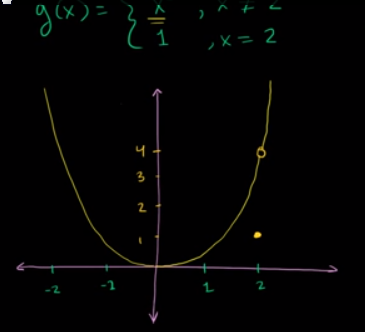

# Limits

## Introduction to Limits

* ``f(x) = (x-1) / (x-1)``
    * ``undefined`` when ``f(1)`` otherwise always ``f(x) = 1``
    * "The limit, as ``x`` approaches ``1`` of ``f(x)`` is ``1``."
* ``g(x) = x**2 if x != 2 else 1``
    * graph is shaped like a parabola.
    * note the gap in the below graph when ``x == 2``

    

    * Note that the limit of the function is 4. So, the limit of the function as ``x`` approaches 2 is 4.
    * ``lim g(x) = 4``
