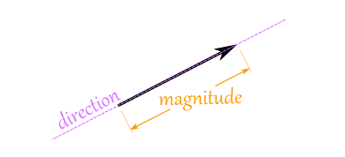
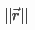

# Vectors

* A vector is something that has both a "magnitude and a direction"
	* Magnitude = how long it is
		</img>
	* Examples:
		* The point (5, 5)
		* 5mph east ("velocity" ie "vector")
* Vector's are represented mathematically like:
    </img>
* The magnitude of a vector is represented as two vertical bars (or 2 double vertical bars to avoid confusion with absolute value):
    </img>