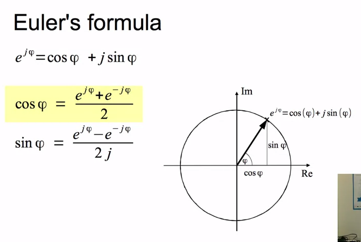

# Week 1

## Introduction to Audio Signal Processing

Stuff I'll learn:

* What is audio signal processing
* Applications of asp:
  * storage
  * data compression
  * effects
  * transformations
  * synthesis
  * description


### What is audio signal processing?

* "Engineering field that focuses on the computation methods for intentionaling altering sound."
* Can be digital or analog
  * Digital: occurs mathemtically on binary representation of sound.
  * Analog: occurs on electrical signals (changing air pressure of wave form etc).

### Applications

* Storage
  * Can be recreated from enscriptions on media (like a CD).
* Data compression
  * Reduce bandwidth requirements of digital audio stream.
  * Lossless (no information lost)
  * Lossy (sound information lost, but try not to be perceivable by humans).
* Transformations
  * Echo, equalizer, flanger, phaser, chorus, pitch shift, time stretching, voice effects, 3D audio effects, morphing.
* Synthesis (generating sounds)
  * Subtractive: start with a complex sound and remove stuff.
  * FM synthesis: modulate one oscillator by another.
  * Additive synthesis: build up sounds from basic components.
* Description
  * Algorithm that extracts "core" of sounds.

## Course outline

* Basics of maths
* Discrete Fourier transform
  * DFT equation
  * Complex exponentials
  * Scalar product in the DFT
  * DFT of complex sinusoids
  * DFT of real sinusoids
  * Inverse-DFT
* Fourier transform properties
  * Linearity, shift, symmentry, convolution
  * Energy conservation and decibels
  * Phase unwrapping, zero padding
  * Fast Fourier Transform (FFT)
  * FFT and zero-phase windowing
  * Analysis/synthesis
* Sort-time Fourier transfor
  * STFT equation
  * Analysis window
  * FFT size and hope size
  * Time-frequenc compromise
  * Invesrse STFT
* Sinusoidal model
  * Sinusoidal model equation
  * Sinewaves in a spectrum
* Harmonic model
  * Harmonic model equation
  * Sinusoids-partials-harmonics
  * Monophonic/polyphonic signals
  * Harmonic detection
  * Fundamental frequency detection
* Sinusoidal plus residual modeling
  * Stochastic model
  * Stochastic approximataion of sounds
  * Sinusoidal/harmonic plus residual mdel
  * Residual subtration
  * sinusoidal/harmonic plus stochastic model
  * Stochastic model of residual
* Sound transformations
  * Short-time Fourier transform
    * Filtering; morphing
  * Sinusoidal model
    * Time and frequency scaling
  * Harmonic plus residual mdoel
    * Pitch transposition
  * Harmonic plus stochastic model
    * Time stretching; morphing
* Sound/music description
  * Spectral-based audio features
  * Description of sound/music events and collections

## Some basic maths

* Sounds are "discrete signals", processes are "discrete systems". Thus, we need [discrete mathematics](https://en.wikipedia.org/wiki/Discrete_mathematics).
* Sinusoidal functions

  </img>

  Example Python code for a sinewave plot:

  ```
  >> A = .8  # amplitude
  >> f = 1000  # frequency in hertzs
  >> phi = pi / 2  # initial phase at time 0
  >> fs = 44100
  >> t = arange(-.002, .002, 1.0 / fs)  # Time array that goes from -.002 seconds to .002 seconds.
  >> x = A * cos(2 * np.pi * f * t + phi)  # Generates soundwave.
  array([ -3.42901104e-16,  -1.13595454e-01,  -2.24888891e-01,
        -3.31624941e-01,  -4.31640595e-01,  -5.22909028e-01,
        -6.03580681e-01,  -6.72020739e-01,  -7.26842259e-01,
        -7.66934282e-01,  -7.91484340e-01,  -7.99994925e-01,
        -7.92293569e-01,  -7.68536341e-01,  -7.29204682e-01,
        -6.75095650e-01,  -6.07305768e-01,  -5.27208802e-01,
  ```

  Prereqs: [Khan Academy Trigonometry missions](https://www.khanacademy.org/mission/trigonometry).  
  
* Complex number
  * "Numbers built from two parts: real ```a, b``` and imaginary part ```j = math.sqrt(-1)```.
  * Complex plan:
    * Re (real axis).
    * Im (imaginary axis).
  * Rectangular form: ```(a + jb)```
  * Polar form (no idea what this means):
     ```
     A = math.sqrt(a ** 2 + b ** 2)
     angle = (tan() ** -1) ** (b/a)
     ```
* Euler's formula

</img>

* Complex sinewaves

</img>

### Stalled on math prereqs (2015-06-13)

* [Trigonometry](https://www.khanacademy.org/mission/trigonometry)
* [Vectors and Spaces](https://www.khanacademy.org/math/linear-algebra/vectors_and_spaces)
* [Imaginary and Complex Numbers](https://www.khanacademy.org/math/precalculus/imaginary_complex_precalc)
* [Euler's Formula](https://www.khanacademy.org/math/integral-calculus/sequences_series_approx_calc/maclaurin_taylor/v/euler-s-formula-and-euler-s-identity)
