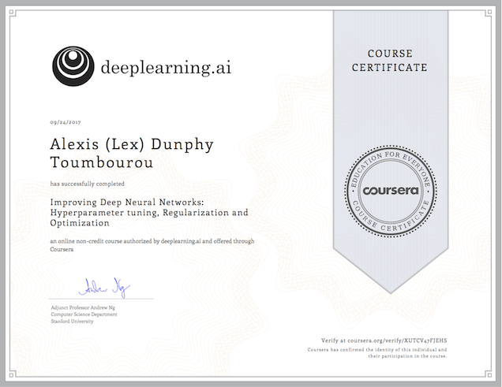

# Improving Deep Neural Networks: Hyperparameter tuning, Regularization and Optimization

## Status

Complete - 2017-09-24

</img>

## Contents

* [Week 1 - Practical aspects of Deep Learning](notes/literature/moocs/coursera/deep-neural-network/week-1.md)
* [Week 2 - Optimization algorithms](notes/literature/moocs/coursera/deep-neural-network/week-2.md)
* [Week 3 - Hyperparameter tuning, Batch Normalization and Programming Frameworks](notes/literature/moocs/coursera/deep-neural-network/week-3.md)
