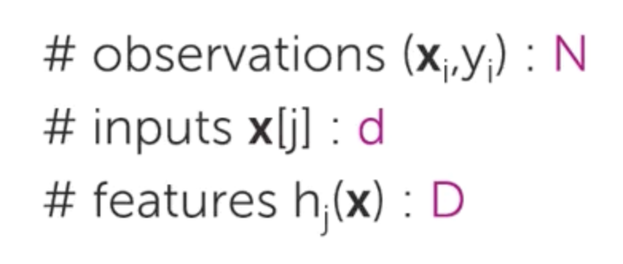

## Week 2

* Polynomial regression:

  * Even with only a single input variable, a linear equation model may not represent the relationship between the output variable.
  * Could use a higher-order function (quadratic, polynomial etc):
    * ``yᵢ = W₀ + W₁Xᵢ + W₂Xᵢ² ... + WpXᵢ^p + εi``

    * Treat different powers of ``x`` as "features":

      * feature 1 = ``1 (constant)``
      * feature 2 = ``x``
      * ..
      * feature p + 1 = ``x^p``

    * Different coefficients = parameters.

* More inputs added to regression model lets you factor in other relationships between your output variable.

  </img>
  </img>

  * |Question| What letter will be used to represent number of observations?
    * ``N``
  * |Question| What letter will be used to represent no of inputs? (``x[i]``)
    * ``d``
  * |Question| What letter will be used to represent no of features? (``hⱼ(x)``)
     * ``D``

* Commonly used equation:

  </img>

* Interpreting coefficients of fitted function
  * Co-efficient's should be considered in the context of the entire model.
    * Eg: Number of bedrooms might have a negative coefficient if the square feet of the house is low.
  * If in a situation where you can't "fix" an input (eg if all features are a power of one input), then you can't interpret the coefficient.

* [Linear Algebra Review](linear-algebra.md)

* Stages for computing the least squares fit:

  * Step 1: Rewrite regression model using linear algebra

    * Rewrite the regression model for a single observation in matrix notation:

      </img>
    
      * Multiple two vectors:

        1. A row vector (aka transposed column vector) of parameters / coefficients
        2. A column vector of features.

      * Then add the error term.

    * Rewrite model for all observations:

      </img>

        * Rows of middle matrix (matrix ``H``) = vector of features from previous section.

  * Step 2: Compute the cost

    * Algorithm = search all different fits to find the smallest cost (RSS). 
    * RSS in matrix notation:
      
      </img>
      
      * ``y - Hw`` is a residual vector.
      * Using vector multiplication of that vector times the transpose, you end up with a scalar of the residual sum of squares.

  * Step 3: Take the gradient of the RSS:

    * ``-2 * H_vector_transposed * (y_vector - H_vector * w_vector)``

      </img>

  * Step 4: Approach 1, closed-form solution: solve for W.

    * Set result to 0 and solve.
    * Matrix inverse * matrix = identity matrix (??)

## Week 3

* Goal: figure out how much you are "losing" using your model compare to perfection.

  * Example: low predictions causing house to be listed too cheap.

* Loss can be measured with a *loss function*: $L(y, f _\hat{w}(\mathbf{x}))$

  * Examples:

     * Absolute error:  $L(y, f _\hat{w}(\mathbf{x})) = |y - f _\hat{w}(\mathbf{x})|$
     * Squared error: $L(y, f _\hat{w}(\mathbf{x})) = (y - f _\hat{w}(\mathbf{x}))^2$
       * Can have a very high cost if difference is large, compared to absolute error.

* Compute training error:

  1. Define some loss function (as above).
  2. Computing training error.
    * Example: Average loss on training set using squared error: 
        * = $1/N \sum\limits_{i=1}^{N} L(y, f _\hat{w}(\mathbf{x}))$ - average of loss function
        * = $1/N \sum\limits_{i=1}^{N} (y - f _\hat{w}(\mathbf{x}))^2$ - average of squared error
        * = $\sqrt{1/N \sum\limits_{i=1}^{N} (y - f _\hat{w}(\mathbf{x}))^2}$ - convert to root mean squared error (RMSE) for more intuitive format (dollars, instead of squared dollars).

* Training error vs model complexity:

  * Training error obviously is lowers as complexity of model increases (can get extremely good fit with high complexity models):
    * Doesn't necessarily mean that predicts will be good, in fact they can get extremely bad with overfit models.
     * Summary:  low training error != good predictions.

* *Generalisation error* can help with training error's limitations:
  * Weight house price pairs ``(house, price)`` by how they are to occur in dataset and use to evaluate predictions.
    *  For a given square footage, how likely is it to occur in the dataset?
    * For houses with a given square footage, what house prices are we likely to see? 
  * Theoretical idea: impossible to compute *generation error*.

* *Test error*: actually computable.
  * Keep some results out of training set for evaluation.
  * Average loss on houses in test set: $1/Ntest \sum_\limits{i=1}^{Ntest} L(y, f _\hat{w}(\mathbf{x}))$
