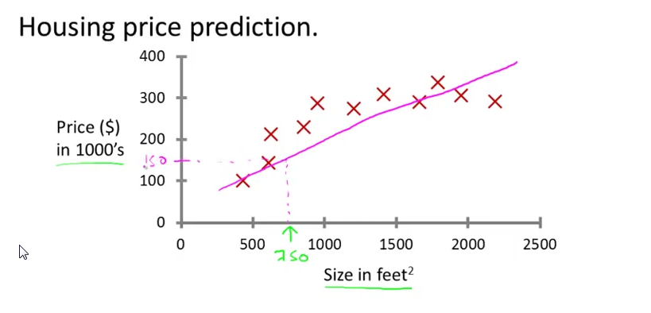
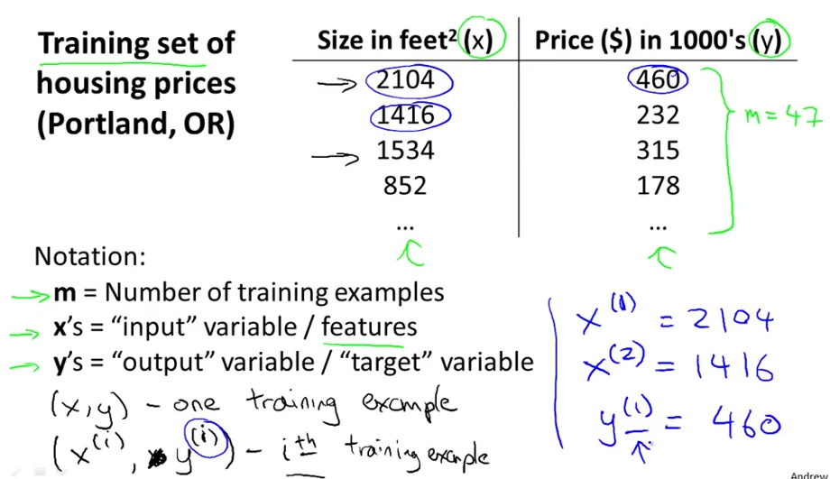
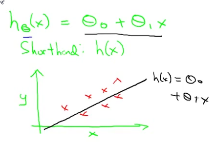
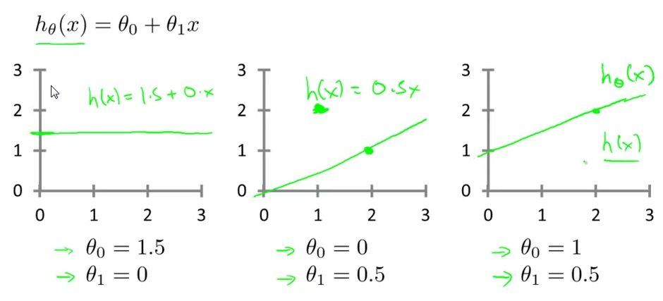

## Introduction

### Welcome

* Grew out of AI
    * New capabilities for computers
* Modern examples
    * Database mining
        * Dealing with large datasets
    * Stuff you can't program by hand
        * Autonomous helicopters
        * Handwriting recognition
        * Natural Language Processing (NLP)
    * Self-customizing programs
        * Amazon, Netflix product recommendations
    * Understanding human learning (brain, real AI
* Machine Learning is at the top of 12 most desired skills for IT employees

### What Is Machine Learning

* "Field of study that gives computers the ability to learn without being explicitly programmed" -- Arthur Samuel (1959)
* Well-posed Learning Problem: "A computer program is said to learn from experience E with respect to some task T and some performance measure P, if its performance on T, as measured by P, improves with experience E."
    * Example of T: classifing emails as spam or not spam
    * Example of E: watching you label emails as spam or not spam
    * Example of P: The number (or fraction) of emails correctly classified as spam / not spam
* Algorithms
    * Supervised learning
    * Unsupervised learning
    * Reinforcement learning
    * Recommender systems

### Supervised Learning

* Most common type of ML algorithm
* Give algorithm dataset with a set of answers and asked it to give you "more" right answer
* Regression problem
    * Continous valued output (like price)
    * Examples
        * Determining housing prices based on historical prices
            * Learning algorithm could "put a straight line through data" to do predictions

                </img>

            * Or, could use a quadratic function or second-order polynomial to get closer to true prediction
                * ```a*x**2 + b*x + c``` is a 2nd-order polynomial because the highest exponent of x is 2.
                * The graph of a quadratic function is a parabola (the u-shaped graph)
* Classification problem
    * Discrete valued output (0 or 1)
    * Examples
        * Determine whether a tumor is malignant or benign based on other tumors 
* Features
    * Input variables used to make predictions
    * Examples
        * Age / Tumor size

### Unsupervised learning

* 2nd most common type (out of two, I guess?)
* Instead of giving algorithm "right answer", we give it a dataset and say: "find some patterns"
* Looks for patterns/groups in data called "clusters"
    * Examples
        * Google News find articles and attempts to related them into clusters
* Cocktail party algorithm
    1. Record people talking with two microphones
    2. Separate voices using data from inputs
    3. Separate voices and background noise from two inputs 
    * Can be expressed in one-line of code: ```[W,s,v] = svd((repmat(sum(x. *x,1), size(x,1),1).*x)*x');```

## Linear Regression with One Variable

### Model Representation

* You have a dataset called "training set" 
* Notation:
    * **m** - number of training examples
    * **x** - "input" variable / features
    * **y** - "output" variable / "target" variable
    
    </img>
* Algorithm flow
```
Training Set -> Learning Algorithm
            |
            V
Size of house (x) -> hypothesis (h) -> estimated price (y)
```
* h is represented as:

</img>

### Cost Function

* Hypothesis: ```h_theta(x) = Theta 0 + Theta 1*x```
    * Theta 0 and Theta 1 are the parameters of the model

    </img>
    
    * You want to pick a Theta 0 and Theta 1 so that h_theta(x) works out as close to y as possible for training examples
    * In more formal terms, you want to minimize your Squared Error

    </img>

        * (Multiple by ```1/2m``` to make the math "easier" (?))
        * This is called Cost Function or Squared Error

### Gradient Descent for Linear Regression

* Apply gradient descent to minimize: ```J( set(thetas) )```
