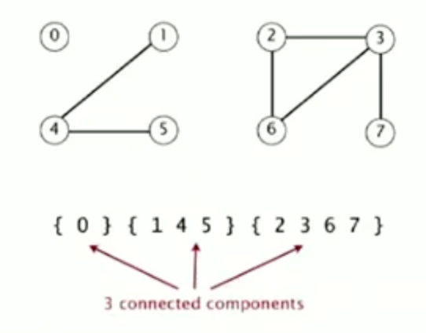
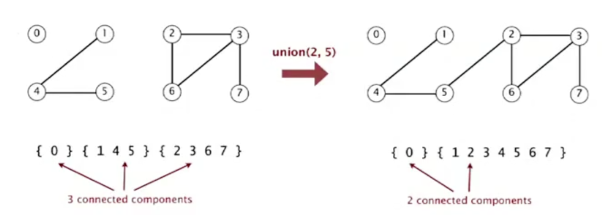

# Week 1


* About the "Union find problem"

  * Set of algorithms for sovling the "dynamic connectivity" problem. 
  * Look at "Quick find" and "Quick union"

* Steps to developing a usable algorithm -- scientific approach.

  1. Model the problem -- what are the main components of problem that need to be solved?
  2. Find an algorithm to solve it.
  3. Fast enough? Fits in memory?
  4. If not, figure out why.
  5. Find way to address problem.
  6. Iterate until satisfied.

* Dynamic connectivity.


  * Given set of N objects:
    * Find / connected query: is there a path connecting any 2 objects?

      </img>

    * Assumptions:

      * "Is connected to" is an "equivalence relationship:
        * Reflexive: Node A is connected to itself.

            * |Question| Word to describe equivalence relationship when ``p`` is connected to ``p``?

        * Symmetric: If Node A is connected to Node B, Node B is connected to Node A.
          * This might not be the case in a social network graph, for example.

          * |Question| Word to describe equivalence relationship when ``p`` is connected to ``r`` infers ``r`` is connected to ``p``?

        * Transitive: if Node A is connected to Node B, and Node B is connected to Node C, then Node A is connected to Node C.

          * |Question| Word to describe equivalence relationship when ``p`` is connected to ``r`` and ``r`` is connected to ``s``, then ``p`` is connected to ``s``?

    * Connected components

      * "Maximal set of objects that are mutually connected."

        </img>

* Implementing the operations

  * Find query - checks if 2 objects are in the same "component" (referring to above section about "Connected components").
  * Union command - union 2 component objects and use to replace the 2 componets when two nodes get connected.

      </img>

* Union-find data type

  * Goal: make efficient data structure for union-find.
    * Number of objects ``N`` can be huge.
    * Number of operations ``M`` can be huge.
    * Find queries and union commands may be intermixed.
    * Python example:

      ```
      class UnionFind(object):

          def union(p, q):
              """
              Args:
                  p (int) - node 1 to union.
                  q (int) - node 2 to union.
              """

          def connected(p, q):
              """
              Args:
                  p (int) - node 1 to check if connected.
                  q (int) - node 2 to check if connected.

              Return:
                  bool
              """
      ```
* [Dynamic connectivity client](./code/dynamic_connectivity_client.java)
