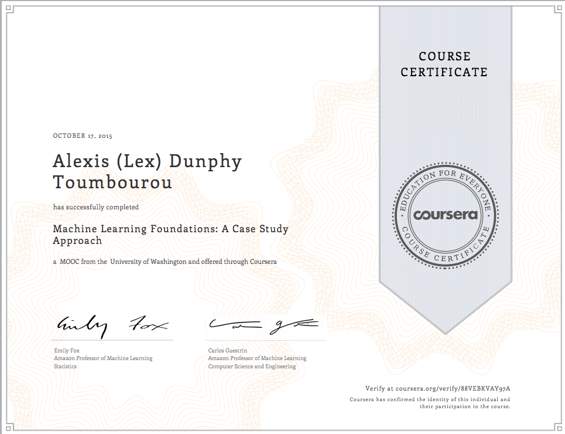

# Machine Learning Foundations: A Case Study Approach (Coursera - ml-foundations)

## Status

Complete - 2015-10-17

</img>

## Contents

* [Week 1](./week-1.md)
* [Week 2](./week-2.md)
* [Week 3](./week-3.md)
* [Week 4](./week-4.md)
* [Week 5](./week-5.md)
* [Week 6](./week-6.md)
