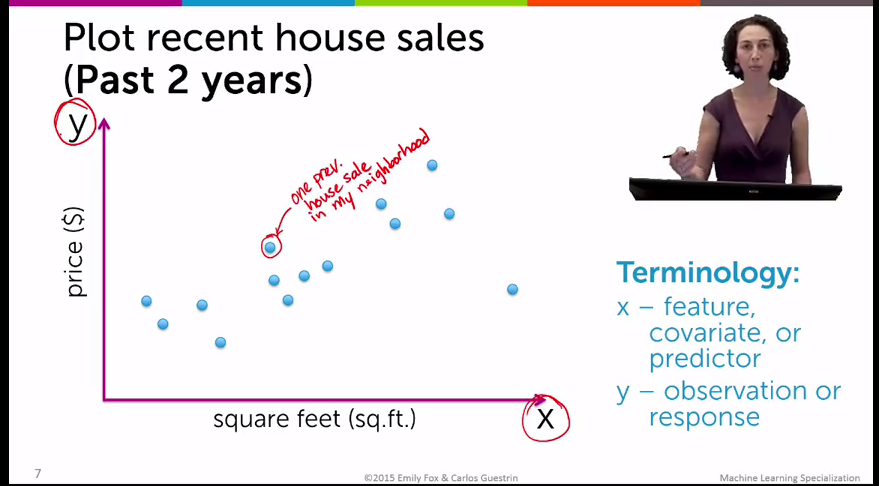

# Week 2

* Regression:

  * Have a set of features and observations and figure out how the observations change as the features change.
  * Example of features: house features:"size of house", "how many bathrooms", "suburb".
  * Example of observations: house observations: "price of house", "how quickly it sells".

* Predicting house prices

  * How do you estimate the value of a house?
    * Look at how much other houses sold for.
      * Look at sizes of other houses
      * Look at other features

* Terminology:

  </img>

  * x axis
    * Feature
    * Covariant
    * Predictor
    * Independant Variable
  * y axis
    * Observation
    * Response
    * Dependant variable

* Naive approach:

  * Take other prices near your set of features and use those.
  * Problem: limited because it doesn't take into account the other data available.

* Model-based approach

  * "Understand relationship between square footage and house price"
  * Put a line through the data.

    * Line definition:
      * ``f(x) = W0 + W1 * x`` (reversed from usual slope intercept definitions)
      * ``W1`` == slope (weight on feature or coefficient of independant variable)
      * ``W0`` == intercept

    * Extra resources:
      * [Squared error of regression of line (Khan Academy)](https://www.khanacademy.org/math/probability/regression/regression-correlation/v/squared-error-of-regression-line)

  * How do you find the best line? Use Residual sum of squares (RSS) algorithm and find the lowest for set of possible ``W1`` and ``W0`` values.

    * RSS algorithm in Python:

      ```
      def RSS(W0, W1):
          output = 0
          for house_price, house_squared_footage in house_data:
              output += (house_price - W0 + W1 * house_squared_footage) ** 2

          return output
      ```

* Adding higher order effects
  * Firstly, "higher-order" in this context refers to using exponents in equations
    * Second order equation: ``x**2 + 3x + 1`` (aka quadratic).

  * Data might not have a linear relationship, could be quadratic.
  * Even with quadratic best fit lines, still considered "linear regression" because the squaring in the model is just considered another feature.
  * Could even be a 13th order polynomial, which might be best fit for data but returns results we now intuitively are not correct.

* Overfitting via training / test split.

  * Overfitting: your model is perfect fit for your data but not a good general algorithm for making predictions.
  * Potential solutions:
    * "Simulate predictions":
      1. Take some data out of your dataset
      2. Fit model on remaining data.
      3. See what predictions model would make for data you took out.
  * Training set: data you're using to create model.
  * Test set: data you're pulling out of set above.
  * Training error:
    * Same as RSS calculation but with test set removed.
  * Test error:
    * Same as RSS calculation but *just* test set.
  * Then: "how does training error and test error vary as a function of the model complexity"
