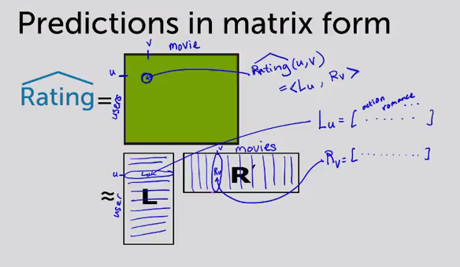

# Week 5

* Recommender systems in action

  * "Personalization"
  * Netflix: product recommendations
  * Pandora
  * Facebook friend recommendations
  * Drug-target interactions

* Building recommender with classification

  0. Popularity

    * What are people viewing now?
    * Limitation
      * No personalization

  1. Classification model

    * "Use features of products and users to make recommendations"
    * Features
      * User info
      * Purchase history
      * Product info
      * Other info
    * Classifier takes features as input and return the probability of buying the product
    * Pros:
      * Personalized: considers user info etc
      * Features can capture context: time of day, what user just saw
      * Handles limited user history: age of user etc.
    * Cons:
      * Features may not be available (might not know age etc).
      * Doesn't work as well as "collaborative filtering"

  2. Collaborative filtering

    * "People who bought x also bought y."
    * Matrix C:
      * Store # users who bought both items i & j
        * no items x no items matrix
      * Considered a "symmetric" matrix because ``matrix['comic_book']['bmx'] == matrix['bmx']['comic_book']``
        * "Number of users who bought a comic book and a BMX is the same as users who bought a BMX and a comic book."
    `
    * How it would be used:
      1. User buys a comic book.

      2. Go to comic book row and find other items with the highest row.

  * Need to normalize co-occurrence matrix

    * Very popular items "drowns out" other items.
    * One strategy: "Jaccard similarity"

  * "Jaccard similarity"

    * Normalize by popularity.
    * Overview:

      1. Count people who purchased i and j
      2. Count people who bought i or j
      3. Divide 1 by 2

    * In code:
    
        ```
        purchased_i.union(purchased_j) / purchased_i.intersection(purchased_j)
        ```

    * Limitations:

      * Doesn't factor in purchase history, only looks at current item.

  * (Weighted) average of purchased items

    * For all potential recommendable products, go through and calculate similarity score based on each of user's purchase history (maybe weigh recent purchases higher).

    * In code:

        ```
        user_inventory = {'book', 'hat', 'shoe'}
        for product in potential_recommendations_in_inventory:
          score[product] = average([some_similarity_score(p) for p in user_inventory])

        highest_j = sort(score)
        ```

    * Limitations:

      * Doesn't use a variety of available features:

        * Context
        * User features
        * Product features

      * "Cold start problem" - dealing with user's with no purchase history.

  3. Discovering hidden structure by matrix factorization

    * Matrix of movies x users.
    * Attempt to fill in unrated movies with user's ratings and rating of other users.
      * Point: guess the rating a user would give to movies they haven't seen.
    * Overview:

      1.  Descrive movie ```v``` with topics ```R(v)```: how much action, romance, drama:
           ```
           movie_genres = ['action', 'romance', 'drama']
           taxi_driver_topic = [0.3, 0.001, 1.5]  # R(v)
           ```

      2. Describe how much user ``u`` with topics ``L(u)``.

           ```
           user_genres = [2.5, 0, 0.9]  # L(u)
           ```
               
      3. ``Rating(u, v)`` is the product of two vectors:

            ```
            Rating = lambda u, v: sum([x * y for x, y in zip(u, v)])
            ```
      4. Sort movies by ```Rating(u, v)```

* Predictions in matrix form
  
  * Looking at score for ```Rating(u, v)``` == ```<Lu, Rv>``` < element-wise product and sum.
  * Can get the ```u```th from the ```L``` matrix row and multiple by the ```v```th row from the ``R`` matrix column.
    
  </img>

* Discovering hidden structure by matrix factorization 

  * Using only observed rating (black squares), we want to estimate L and R matrices. 
  * Look at predictions compared to actual observed rating (similar to Regression):
  
    ``RSS(L, R) = (Rating(u, v) - <Lu, Rv>) ** 2 + sum([(u_prime, v_prime) for pairs if Rating(u_prime, v_prime)`` 

  * Reason called a "Matrix Factorization Model" because taking matrix and approximating with factorization.
  * Many efficient algorithms for factorization.
  * Limitations:
    * Cold start problem: new user or new movies (no ratings).

* Featurized matrix factorization

  * Features capture context

    * Time of day
    * What I just saw
    * User info
    * Past purchases

  * Discovered topics from matrix factorization capture "groups of users" who behave similarly.

    * Women from Seattle who teach and have a baby.
  * Combine to mitigate cold-start problem
    * Ratings for a new user from features only.
    * As more information about user is discovered, matrix factorization *topics* become more relevant.

  * "Blending models"

    * Winning team of Netflix prize blended over 100 models.

* Performance metric for recommender systems

  * Classification accurary

    * Problems:
      * Major class: recommend no items.
      * Can only get a limited subset of correctly classified items, since user has limited attention.

  * How many liked items were recommended?

    * How many user liked vs how many were recommended.
    * Formula: ```liked_and_shown / liked`` eg 
    * "Precision": look at all the recommended items, what fraction were items the user liked.

* Optimal recommenders

  * "How do you maximise recall?" - just recommend everything.
    * Small precision.
  * What is optimal recommender:
    * Recall = 1 (everything liked was recommended).
    * Precision = 1 (everything recommended was liked).

* Precision-recall curve

  * Input: a specific recommender system
  * Output: Algorithm-specific precision-recall curve
  * Optimal recommender precision / recall curve:

    </img>

  * Realistic recommender:

    </img>

  * Comparing algorithms:

    * Largest "area under the curve" (AUC).
    * Set desired recall and maximise precision (precision at k).

* Recommender systems ML block diagram

  * Training data: user, products, ratings table
  * Feature extraction:
    * (user_id, product_id).
    * Also may include other features like gender, age, product description etc.
  * Goal (y-hat): predicted rating for user, product pair.
  * Model: matrix factorization.
    * Set of features for every user (how much user likes action, comedy etc).
    * Set of features for every product (how much a movie action, comedy etc).
  * Quality metric:
    * RSS (compare error between predicted ratings and observed values).
