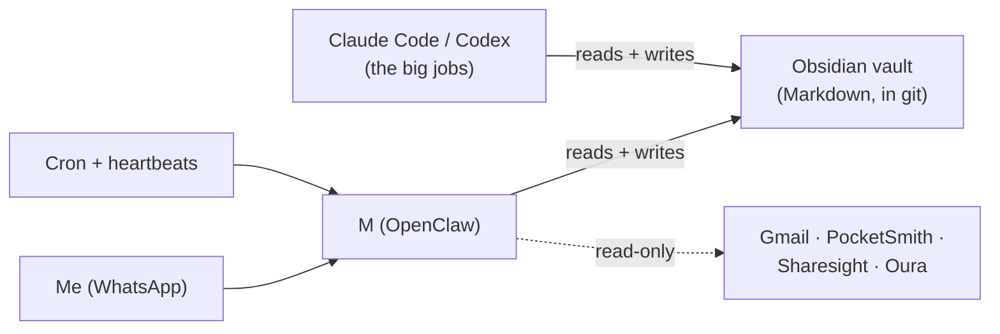
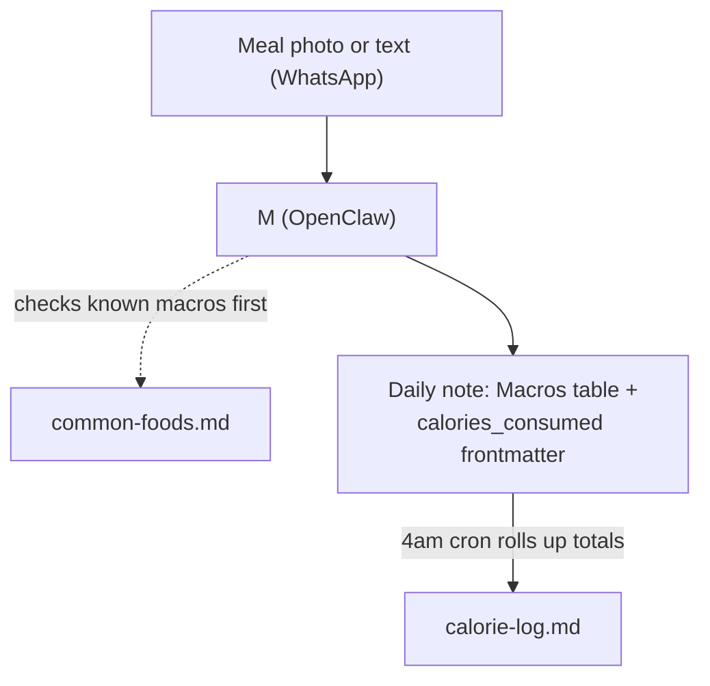
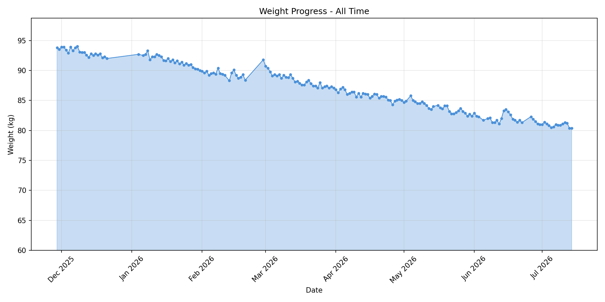
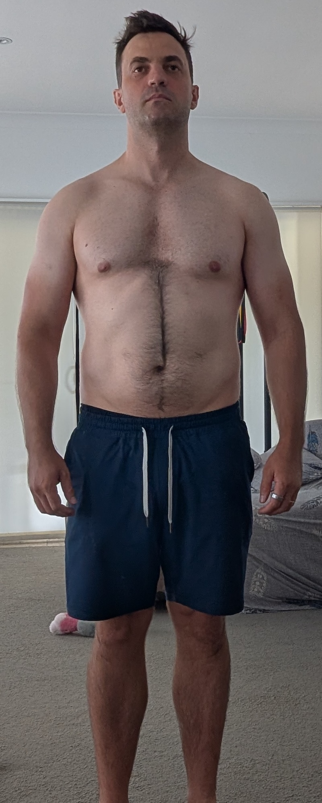
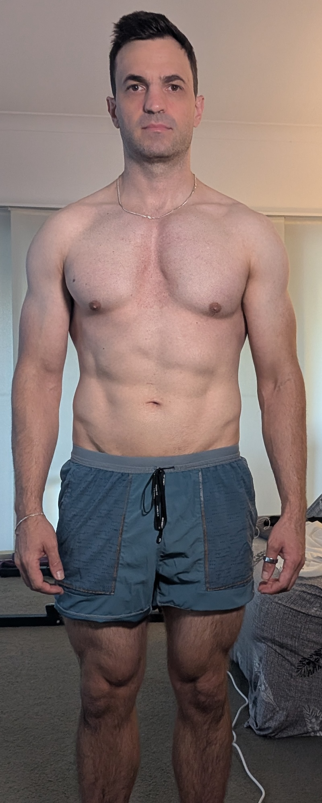
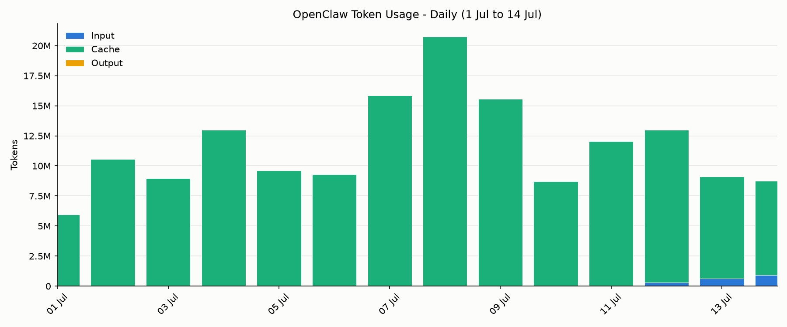

[OpenClaw](openclaw.md) was really popping off on the tech internet when it came out earlier this year, but if Google Trends is anything to go by, the hype has died significantly.

---

But I'm still using it every day, and have been ever since I set it up in late January. I use it as a convenient entry point to my Markdown-based (Obsidian) life admin and note-taking system. The combination of LLM agents, cron, and chat apps connectors has proven very useful.

I feel like it's the final piece to the promise of having a "second-brain", a digital memory store for everything going on in my life.

I also love that it lets me create a [Memory](memory.md) of the work I do with LLMs that is vendor-agnostic; when a better LLM comes along, I can just switch to it with a config change and take my information with me.

I wrote an article about my setup a few weeks into my OpenClaw journey, and my setup hasn't meaningfully changed much (see [OpenClaw: the missing piece for Obsidian's second brain](openclaw-the-missing-piece-for-obsidians-second-brain.md)). However, in this article, I want to do a kind of retrospective on what I actually achieved from running an OpenClaw instance and share a few things I've learned along the way.

## My High-Level Workflow

I'll assume that if you're reading this blog, you're familiar with OpenClaw and likely Obsidian too. But if not, [OpenClaw](https://openclaw.ai/) is a self-hosted agent harness that offers a range of connectors for popular chat apps alongside a large collection of plugins and security vulnerabilities. [Obsidian](https://obsidian.md/) is a Markdown text editor with a few handy conventions, such as [daily notes](https://obsidian.md/help/plugins/daily-notes), and features like automatically updating internal links and file syncing.

I have an Obsidian vault, a collection of Markdown notes and documents I've been accumulating for years. Every day, I create a daily note to write my to-do list in, and it serves as a dumping ground for any notes and info I need to remember. I also create separate notes for projects, people and topics, which are linked back to the daily notes. Each of those notes has a journal, with entries that are updated as I work on or interact with the thing.

On top of that, I also maintain a centralised to-do list, and aim to put everything here, with links to the project pages.

Initially, my vault was maintained entirely by hand, but in recent years, it's become a hybrid of an [LLM Wiki](llm-wiki.md) and a journal.

I still like to do a lot of writing by hand, but I'm also okay with an LLM managing certain parts of the vault, especially admin stuff.

OpenClaw runs on a personal laptop that's always on. Its [agent workspace](https://docs.openclaw.ai/concepts/agent-workspace) is a folder in my vault, and I mostly poitn OpenClaws file to refer to existing files in my vault, instead of managing its own file structure.

This also gives me the flexibility to use whichever agent I need - at work, I use both Claude Code and Codex, and for some personal projects, like tax filing, I like to use a coding agent. The vault can be used interchangeably by all. I just run whichever agent makes sense over my vault and get to work.

OpenClaw also never sees anything relating to work - in fact, my work prohibits it for good reason. I maintain a separate vault for work stuff that only exists on my work machine. And I make sure it never syncs.

I use WhatsApp to communicate with OpenClaw - since it's already the chat app that my family and friends use - and bought a new SIM card to give me a separate WhatsApp account for my OpenClaw agent named M.

## The main use cases

### 1. Calorie, weight and workout tracking

Late last year, I set myself a goal of getting lean, and doing so has meant tracking calories for every meal I eat and trying to stay in a deficit. Generally, I found LLMs to be a convenient way to do this. The freeform nature of the text and the fact that most of them can absorb photos and labels make it pretty straightforward to track meals.

For things that have labels, or where I know the calories (like fast food or restaurants that publish their nutrition info online), I'll tell OpenClaw the specific calories and also have it update a log of food I've eaten before, called `common-foods`.

For meals I cook, I'll typically give OpenClaw the recipe and then weigh the portions to get precise measures.

I aim to eat about 2200 kcal per day, which should be about a 500 kcal deficit per day at my weight and height of around 181cm.

Then, every morning, I weigh myself, naked, after relieving my bladder.

OpenClaw tracks my daily weight, and a script generates this nice, pretty graph.

As you can see, the trend is moving nicely, except for a few blips for holidays, where I didn't do any calorie counting and went back to my boozy old ways.

I follow a muscle-building plan based on ideas from Jack Woods and Mindful Movers (who I highly recommend), which involves performing maximum-effort callisthenics movements a few times a week. No surprise that I track my progress with OpenClaw, sending new PRs.

I also track stretching and use it to track recovery from any injuries. Once a week, I share body progress photos, and OpenClaw saves them in a nice table.

There are also some before-and-after photos, although I didn't think to create a great before shot.

<table style="width:100%; table-layout: fixed; border: none;">
  <tr>
    <td style="text-align:center; vertical-align:top; border: none;">
       
      Jan 2026 - 91.5 kg
    </td>
    <td style="text-align:center; vertical-align:top; border: none;">
       
      Jul 2026 - 81.4 kg
    </td>
  </tr>
</table>

### 2. Life Admin - everything goes here

On top of helping me with my fitness goals, it's simplified the way I manage different things in my life. Like preparing for my taxes, planning holidays, doing maintenance around the house, etc.

I have project files for all the different things going on in my life, and encourage OpenClaw to create new ones if needed.

Then, documents get stored in a `_media` directory and are linked to the project. If I donate some money to a fundraiser, I'll tell OpenClaw, and it will track it in my tax deductions. If I get invited on a trip, I'll tell OpenClaw, and it will add the items to my to-do list and create a project file.

If something needs to be done around the house, I'll create a new project file for it. Then, use it to track any research I do into tradespeople, and make sure to log any conversations I have.

When I have to take my dog to the vet, I'll log any notes from the vet and track any medication in my Obsidian to-do list.

Any reminders, like subscriptions to cancel, all go into the vault via OpenClaw.

There's just one place where everything goes: whether it's in Dropbox, in email, or sent by mail, I make sure it ends up in my vault, and anything I need to act on is turned into a to-do item. I give OpenClaw read-only access to my email so it can help me find and triage things, but it doesn't send anything on my behalf.

### 3. Morning Routine

I have a cron that runs every morning that creates the Daily Note around 4 am. It checks my to-do list for any projects or items that need action. It scans my people files for any upcoming birthdays. I have it connected to my finance-tracking software [Pocketsmith](https://my.pocketsmith.com/), and it shows how my spending is going. It has access to my stock portfolio and tells me how it's doing.

It tells me what workout I'll be doing today.

Then, after I give it my morning weight, it knows that I'm up and fetches stats from Oura, like my sleep and how many steps I walked the night before.

Not life-changing stuff, just kinda handy.

It's nice to have all this in one place. If I don't want to use Oura anymore, I can track my sleep some other way, but my data lives on.

### 4. Tracking everything

Again, OpenClaw is agentic LLMs, cron and chat apps. And that turns out to be really useful for tracking things. On top of calories and workouts, I tell M when I get sick, and it tracks my sicknesses, which can be handy for spotting patterns. If I notice a growth on my dog's body that the vet tells me to keep an eye on, I get M to create a weekly cron, and I take photos when I get alerted, to show my vet.

There are tapping sounds around the house that I'm trying to get on top of. Birthday present ideas for my wife. Things I want to buy on my next visit to the supermarket. Subscriptions to cancel.

These things end up in daily notes, project files and people files, and I get reminders when I need them.

It's really handy.

## Principles and Lessons

### Everything in one place

Everything I need to remember in my personal life goes in the vault. Documents, reminders, to-do items, and book recommendations - they all have one place.

When I have other projects I'm working on, like family history or other open-source projects, I still tend to prefer to keep them in my vault or symlink them to it.

I'll keep a project journal in the vault and update it as I work on the project. Again - everything in one place.

### Read-only Access Only

I find it convenient to give OpenClaw access to a few things, particularly email, my finances, and my investments, but it's all read-only. I'm not comfortable having an agent do things on my behalf, and frankly, why would I want to? I like sending emails to people.

OpenClaw can of course write to the vault, but it's all in Git and I review changes it makes periodically when I commit. The rest of my security setup is covered in [OpenClaw: the missing piece for Obsidian's second brain](openclaw-the-missing-piece-for-obsidians-second-brain.md).)

I use [googleworkspace/cli](https://github.com/googleworkspace/cli) for Gmail/Docs access - a really handy way to turn emails into project journal items and to-dos; I use my [pocketsmith-skill](https://github.com/lextoumbourou/pocketsmith-skill) for Pocketsmith access; and [Sharesight Skill](https://github.com/lextoumbourou/sharesight-skill) for my investments.

### Keep Cron Jobs Light

Cron jobs get pretty unwieldy pretty fast, and they're not convenient to edit.

My rule is typically to keep cron jobs small, and they either point to a file or a skill that provides the instructions.

I also prune old ones regularly (to-do research how to do this)

### Use a Coding Agent for Real Work

Some bigger projects just do not make sense to do via OpenClaw - like coding, and even admin tasks like preparing my tax return for my accountant.

I'll use Codex or Claude Code in that case.

I try to make sure that my repo is totally agent-agnostic, and the OpenClaw stuff just points to files that other agent files, like AGENTS.md and CLAUDE.md, also point to.

## Models and Costs

After a bit of exploring options, I've found that OpenAI's $20 Plus subscription tends to be enough to do everything I need in OpenClaw. Sometimes I've needed to add extra credits to top up my monthly credit allocation, but not very often. It's fairly manageable.

I'm using between about 6 and 21 million tokens a day, but most of it is cache.

My initial attempt at using Claude directly via the API had me racking up $10-$20 in API costs per day. LOL. Eventually, I moved to GPT-5.4 as my main session model, with GPT-5.4-mini for "heartbeats", that is, OpenClaw's background check-in process.

On Monday, I cut over to the GPT-5.6 family of models, and it's another order of quality for around the same price - they're really nice. Clearly more intelligent.

I'm running [`gpt-5.6-terra`](https://developers.openai.com/api/docs/models/gpt-5.6-terra) (the mid-tier model - equivalent to Claude Sonnet) for the main session, and [`gpt-5.6-luna`](https://developers.openai.com/api/docs/models/gpt-5.6-luna) (the lower tier, equivalent to Haiku) handles heartbeats and cron jobs.
## OpenClaw vs Hermes

Seems that during the time I've been experimenting with OpenClaw, a lot of people got excited by a similar project called Hermes, which promises to be a self-improving AI agent that "grows with you". I had a brief look at Hermes, but I decided that a self-evolving agent isn't really what I want.

I just want something that I can get working exactly the way I want, and that remains consistent.

Even in my own experimenting, any changes that I made to the system had unexpected knock-on effects that proved frustrating. Adding additional scripts and routines to the daily note sometimes caused it to fail. I love the new capability the LLMs have unlocked in the world, but I don't think they're quite ready to self-improve - more likely self-destruct, if left unchecked.

Hermes likely isn't for me - but if it works for you, that's great.

## Wrap Up

I've lost weight and happy with how my fitness is tracking. That's enough for me to be happy with my pal M. I love it for life admin.

I will say that one complaint is now I'm annoyingly tied to my phone - even more so than before. But that's the price of tracking things meticulously I guess.

Also, it's a new software project, which means it's going to be broken a bunch. The OpenClaw development team is pretty quick to patch issues, though I must admit that the GitHub issue board is quite hard to follow with all the AI slop that's posted everywhere. Wish they had a policy of human-only issues, like other open-source projects.

I haven't managed to run a 5-figure monthly SaaS business from it, and my OpenClaw hasn't gone rogue by posting spam on message boards, but it's a handy companion, and I think it's a worthy open-source project.