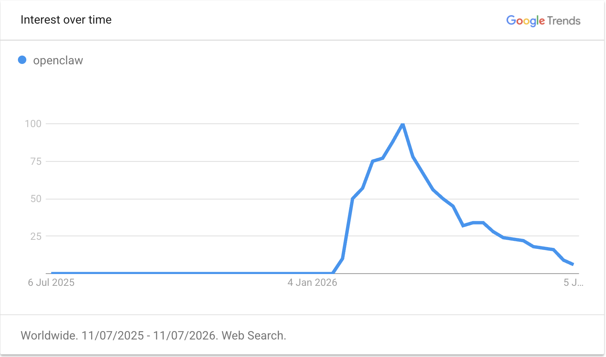
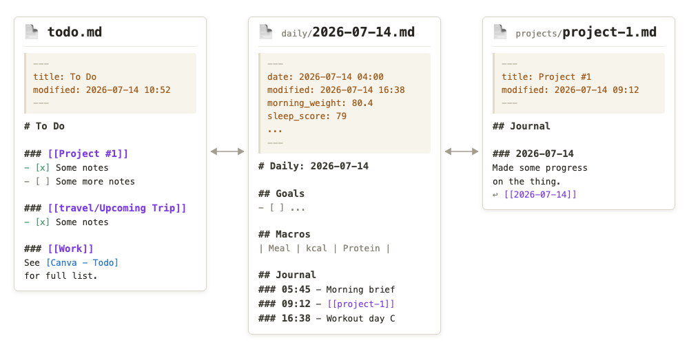
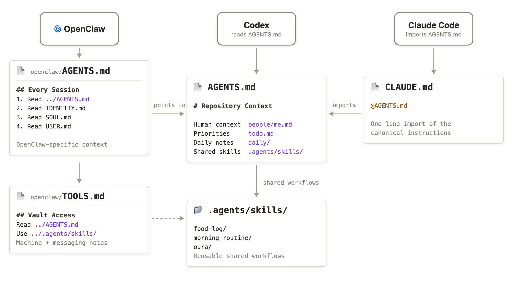
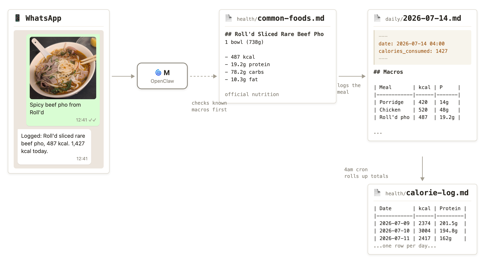

[OpenClaw](openclaw.md) went viral earlier this year on tech internet, but the hype has died down quite a bit, especially if Google Trends is anything to go by.



But I'm still using it daily, and have been ever since I set it up in January, when it was called Clawdbot.

I use it as an entry point to my Markdown-based life admin and note-taking system. The combination of LLM agents, cron, and chat app connectors has proven very convenient.

I feel like it's the final piece to the promise of having a "second-brain". I also love that I'm building a [LLM Memory](memory.md) system that's vendor-agnostic; I can just switch to a different LLM (ideally, one day, a locally running one) and all my memories switch with me.

I wrote an article about my setup a few weeks into my OpenClaw journey, and my setup hasn't changed meaningfully since then (see [OpenClaw: the missing piece for Obsidian's second brain](openclaw-the-missing-piece-for-obsidians-second-brain.md)). However, in this article, I want to reflect on what I actually achieved by running an OpenClaw instance and share a few things I've learned along the way.

## My High-Level Workflow

### Obsidian vault

I have a private Obsidian vault, which is a collection of Markdown notes and documents I've been accumulating for years. Every day, I create a daily note to plan my day. It also acts as a journal and a dumping ground for anything I need to remember.

Then, projects, people, trips and goals get separate notes, as does anything I want to track over time. Those notes can have their own journal, and I link the journal entries back to the daily note, so I can retrieve information by day or by topic.

I also keep permanent notes for ideas and reference notes for papers, books and courses. When a note becomes substantial enough, I'll move it to the public repo published on this site. On top of that, I maintain a centralised to-do list which tracks all my key tasks and deadlines.

Initially, my vault was maintained entirely by hand, but in recent years, it's become a hybrid of an [LLM Wiki](llm-wiki.md) and a journal. I still do all writing by hand, but I'm also okay with an LLM managing and updating certain files in the vault, especially projects that are just information dumps.



### OpenClaw and other agents

OpenClaw runs on an old laptop that I treat as a server. Its [workspace](https://docs.openclaw.ai/concepts/agent-workspace) is a folder in my vault, and OpenClaw is instructed mostly to refer to the parent folder's `AGENTS.md` file - which itself just explains how the vault is structured. This means that any other agents I want to work with, such as Claude Code or Codex, also have the same context as OpenClaw, and that I can use whichever tool I need for a particular job. I keep the shared skills in `.agents/skills`, which Codex and OpenClaw load directly and Claude Code accesses through symlinks.



I primarily use WhatsApp to communicate with OpenClaw. It's already the chat app that my family and friends use, and I bought a new SIM card to create a separate WhatsApp account for my OpenClaw agent, **M**.

Also, I do use Obsidian and an LLM wiki for work, but I keep it in a totally separate vault that doesn't sync with my personal vault and that OpenClaw never sees, per my work's security policy.

## The main use cases

### 1. Calorie, weight and workout tracking

Last year, I set a goal of getting lean, and I have been trying to maintain a calorie deficit by meticulously tracking the calories in every meal I eat, much to the chagrin of those in my life. I've found LLMs to be a convenient way to do this, particularly because most of them can handle freeform information through text descriptions, images of nutrition labels, or images of the food itself.

OpenClaw consults a file called `common-foods.md` when I tell it what I've eaten. The file contains recorded calories and macros for foods I've eaten before. This is something I'm building over time to make the process more convenient - I can just tell it I'm eating my regular Subway order or that Musashi protein bar I usually buy, for example.

I'm aiming for about 2,200 kcal per day, which should give me a daily deficit of around 500 kcal based on my size and activity level.



Then, every morning, I weigh myself naked after relieving my bladder, which gives me a consistent daily measurement. I share that weight with OpenClaw, which logs it, regenerates the progress graph below and kicks off the second phase of my daily routine, described later.


As you can see, the trend is moving nicely, except for a few blips during holidays, when I went back to my careless, boozy old ways.

For workouts, I follow a muscle-building plan based on ideas from [Jack Woods](https://jackhwoods.com/) and [Mindful Mover](https://mindfulmover.com/), which involves short, maximum-effort callisthenics sessions a few times a week. I track these with OpenClaw.

I am also trying to get more flexible, so I track my stretching, and, at times, my recovery from any injuries. After a particular workout session every week, I share body progress photos, and OpenClaw saves them in a nice table.

There are also some before-and-after photos, although I didn't think to take a great before shot at the time.

<table style="width:100%; table-layout: fixed; border: none;">
  <tr>
    <td style="text-align:center; vertical-align:top; border: none;">
      <a href="../_media/6-months-of-openclaw/weight-before-jan-2026.jpg" target="_blank">
        
      </a><br>
      <span style="font-size:smaller;">Jan 2026 - 91.5 kg</span>
    </td>
    <td style="text-align:center; vertical-align:top; border: none;">
      <a href="../_media/6-months-of-openclaw/weight-after-jul-2026.jpg" target="_blank">
        
      </a><br>
      <span style="font-size:smaller;">Jul 2026 - 81.4 kg</span>
    </td>
  </tr>
</table>

### 2. Morning routine

I have a cron that runs every morning around 4 am to create the Daily Note. It checks my to-do list for any projects or items that need action. It scans my people files for any upcoming birthdays. I have it connected to my finance-tracking software [PocketSmith](https://my.pocketsmith.com/), and it shows how my spending is going. It has access to my stock portfolio and tells me how it's doing.

It checks my workout and stretching history and tells me what tasks I need to do today. I also have it fetch my OpenClaw token usage data, so I know how my OpenClaw spending is tracking.

Then, after I give it my morning weight, it knows I'm up and fetches my Oura data, including how much I slept and the previous day's step count and calorie burn.

I like that key Oura data is copied into my vault. It gives me a sense of freedom from one particular vendor. If I want to track my sleep some other way, maybe with a watch or something, my historical data will live on.

It's nice to be a guy who remembers people's birthdays now. I also don't pay bills later anymore and generally feel on top of things.

### 3. Life admin, reminders and trackers

On top of helping me with my fitness goals, it's simplified the way I manage things like preparing for my taxes, planning holidays and doing maintenance around the house.

I encourage OpenClaw to create new project files when something needs tracking.

Any documents ingested get stored in a media directory and linked to the project. If I make a tax-deductible donation to a fundraiser, I'll tell OpenClaw, and it will record it in my tax notes. If I get invited on a trip, I'll tell OpenClaw, and it will add the related tasks to my to-do list and create a travel-specific project file.

If something needs doing around the house, I'll create a project file for it. I use it to track my research into tradespeople and log any conversations I have with them.

When I take my dog to the vet, I'll log the vet's notes and track any medication in my Obsidian to-do list, sometimes using cron for reminders. I also have a cron job that checks the weather every afternoon and tells me if there's going to be thunder, so I can give Doggo her anti-anxiety medication.

Any reminders, such as subscriptions I want to check before they renew, go into the vault as to-do items and automatically appear in my daily note when they're due.

On top of calories and workouts, I tell M when I get sick so it can update my sickness log, which is handy for spotting patterns. When the vet tells me to monitor a growth on my dog's body, I get M to set up a weekly reminder to take a photo. This gives me a record I can show the vet.

I use it for smaller things too. I'm currently tracking some tapping sounds around the house, birthday present ideas for my wife and things I want to buy on my next trip to the supermarket.

There's just one place where everything goes. Whether a document comes from Dropbox, email or the post, I make sure it ends up in my vault. Anything I need to act on is turned into a to-do item. I give OpenClaw read-only access to my email so it can help me find and triage things, but it can't send anything on my behalf.

Depending on what they are, these things end up in daily notes, project files or people files, with reminders when I need them.

The result is that I don't lose track of documents, tradespeople, appointments, or the small life-admin jobs that used to quietly evaporate.

## Key Principles

### Read-only access outside of the workspace

I find it convenient to give OpenClaw access to a few things outside my vault, particularly email, my finances and my investments, but it's all read-only. I'm not comfortable having an agent do things on my behalf - plus, I mostly like sending emails to people.

OpenClaw can, of course, write to the vault, which is version-controlled with Git. I commit manually, so I periodically review the changes it makes. The rest of my security setup is covered in my [original article](openclaw-the-missing-piece-for-obsidians-second-brain.md).

### Keep cron job instructions light - point them to docs and skills

Cron jobs get unwieldy pretty fast, and they're not convenient to edit or manage.

My rule is typically to keep cron jobs small, and they either point to a file or a skill that provides the instructions.

For example, my 4 am cron doesn't contain all the steps for creating my daily note and morning brief. A simplified version of the command that creates it looks like this:

```bash
openclaw cron add \
  --name daily-note-morning-4am \
  --cron "0 4 * * *" \
  --tz Australia/Brisbane \
  --session isolated \
  --announce \
  --channel whatsapp \
  --to "<my WhatsApp number>" \
  --message "Run Phase 1 of the shared morning-routine skill exactly. Send the resulting brief as your final message for WhatsApp delivery."
```

The workflow lives in a skill that I can edit, test and use with other agents.

### Use an actual coding agent for bigger jobs

Some jobs just don't make sense to do through OpenClaw, such as building software or tackling larger admin tasks like preparing my tax return for my accountant.

In those cases, I'll use Codex or Claude Code instead.

### Only add the skills you need

It's tempting to install any skill you come across that sounds useful, but they can quickly confuse OpenClaw and mess up a good working system. Most just aren't that useful. I prefer to keep a small collection of skills that I've either created myself or hand-curated. Most wrap external functionality, such as a CLI tool or API.

For external services, I use [Google Workspace CLI](https://github.com/googleworkspace/cli) directly for Gmail and Docs. It's a really handy way to turn emails into project journal entries and to-dos. I also use my [PocketSmith skill](https://github.com/lextoumbourou/pocketsmith-skill) for my finances and [Sharesight skill](https://github.com/lextoumbourou/sharesight-skill) for my investments.

### Keep the vault agent-agnostic

Since I want to use the right agent for each problem, I try to keep my vault agent-agnostic. The vault explains itself in a root `AGENTS.md` file. Codex reads that directly, Claude Code imports it through `CLAUDE.md`, and OpenClaw's `AGENTS.md` points back to the same instructions.

Personal facts live in normal notes, with `people/me.md` as my canonical profile. Reusable workflows, like food logging and my morning routine, live as shared [Agent Skills](https://github.com/lextoumbourou/lex-skills) under `.agents/skills`. Each agent can have a small amount of agent-specific configuration, but I don't want separate copies of how my vault works because they'll inevitably drift.

That means OpenClaw is just one interface to the system. If I switch to something else, my notes, memories and workflows can stay where they are.

## Models and Costs

(All figures as of July 2026.)

After exploring a few options and racking up some pretty painful Claude API bills, I've found that running GPT models through Codex with my $20 ChatGPT Plus subscription is usually enough for everything I need OpenClaw to do. Occasionally I've had to buy extra credits after using the included monthly allowance, but not very often.

I'm using between 6 and 21 million tokens a day, but most of that is cached input.


At current [Opus 4.8 API prices](https://platform.claude.com/docs/en/about-claude/pricing), that kind of traffic would cost me roughly $10–$40 per day, depending on the cache mix, so I really need a subscription to make this setup affordable.

Previously, I used GPT-5.4 as my main session model, with GPT-5.4-mini handling "heartbeats" (OpenClaw's background check-in process). I've recently cut over to the GPT-5.6 family, which feels like a big jump in quality for around the same price. They're really nice.

I'm now running [GPT-5.6 Terra](https://developers.openai.com/api/docs/models/gpt-5.6-terra) (the mid-tier model - think Claude Sonnet) for my main session, while [GPT-5.6 Luna](https://developers.openai.com/api/docs/models/gpt-5.6-luna) (the lower-tier model - think Claude Haiku) handles heartbeats and cron jobs.

## OpenClaw vs Hermes

While I've been experimenting with OpenClaw, many people have got excited about [Hermes](https://github.com/NousResearch/hermes-agent), a similar project that describes itself as a self-improving AI agent that "grows with you". I took a brief look and even tried to install it. The installation failed, maybe just because I was lazy, but I decided that a self-evolving agent isn't really what I want anyway.

I just want something I can set up exactly the way I want and trust to keep running in perpetuity.

Even in my own experiments with OpenClaw, changes to the system have had unexpected knock-on effects. Adding scripts and routines to my daily-note workflow has sometimes caused it to fail. I love what LLMs have unlocked, but I don't think they're ready to self-improve - left unchecked, they're more likely to self-destruct.

Hermes would probably work fine too, to be honest. I just couldn't be bothered spending more time setting up another agent.

## Complaints

One complaint is that I'm now annoyingly tied to my phone - even more so than before. Every meal, workout and stretching session involves pulling it out. One day, I'd really like to be less connected to the device, but that's the price of tracking things meticulously, I guess.

My other complaint is that it's a new software project, which means it's going to be broken a bunch. The OpenClaw development team is pretty quick to patch issues, though its GitHub issue board is hard to follow with all the AI slop issues and bot spam posted there.

## Summary

I've lost weight and am happy with how my fitness is tracking; I never lose track of documents or tradespeople's phone numbers; I remember birthdays, etc. OpenClaw has been a welcome addition to my life.

I haven't built a five-figure-a-month SaaS business with it, and my OpenClaw hasn't gone rogue and started posting spam on message boards. It's just a handy tool, and I'm happy the project exists.
