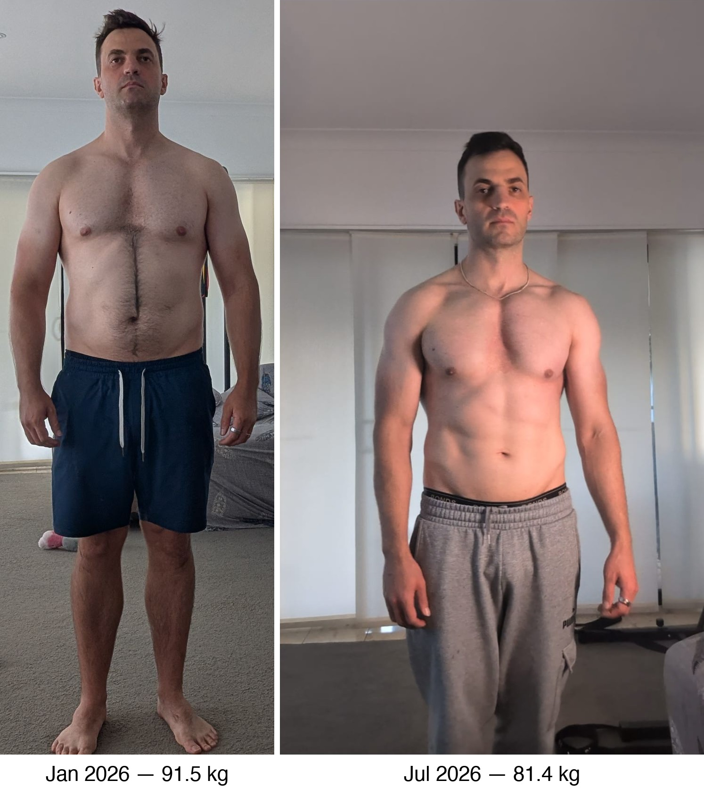

OpenClaw was really popping off on the internet when it came out all those months ago, but there's certainly a lot less talk about it on the internet feeds I scroll, and if Google Trends is anything to go by, the hype has died down a bunch.

But for me, it became an integral part of my life over the last 6 months. It's the one missing piece to the promise of a "second-brain". An extremely convenient entry point to my notes.

## My High-Level Workflow

A few weeks into setting up OpenClaw, I wrote an article that goes into detail about my setup: [OpenClaw: the missing piece for Obsidian's second brain](openclaw-the-missing-piece-for-obsidians-second-brain.md).

My workflow hasn't changed meaningfully since then.

But basically: 
I have an Obsidian vault - a collection of Markdown notes that I've been accumulating since 2020. I use the pattern of creating a daily note that links to other project journals and so forth.

I would say my vault is a hybrid between an LLM Wiki and a collection of daily and project journals that I write.

OpenClaw runs on a personal laptop. I only use it for personal files. I do have a vault for work files, but OpenClaw never sees it.

## Morning Routine - create Daily Note

I have a cron that runs every morning that creates the Daily Note around 4 am.

It adds any key tasks that I need to remember from my to-do list. It also logs last night's stock market results and tracks my spending via the Pocketsmith Skill.

It tells me what the day's workout will be, based on the `workout/program.md` I have defined.

The daily note is the default place for anything that happens on that day. I instruct OpenClaw to write to it whenever I tell it something to remember. However, I also prefer to have project files in one place. So if I have an ongoing project, I will typically have either a journal file I write in or a journal section on the project page. Each time I update the journal, I will also update the daily note.

## Calorie and weight tracker

Late last year, I started working towards a goal of getting lean. The only viable way to do that is to consume fewer calories than you burn, and the best way to do that is to track your calories.

I've found OpenClaw to be really handy for this. I typically weigh my food and tell OpenClaw what I ate, or take a picture of the nutrition label, or, if all else fails, just take a picture of the meal.

I have a simple skill for this called `food-log`, which is instructed first to consult a `common-foods` file. The common foods file lets me build a collection of precise macros, especially for items that can be annoyingly hard to find online, like fast-food items.

I used to use ChatGPT projects for this, but I prefer to be LLM agnostic wherever possible.

## Weight Tracking

Every morning, the first thing I do is weigh myself, naked, after using the toilet.

When I give it my weight, it triggers the next part of the daily routine:

* Save my weight to the frontmatter.
* Run a `weight-agg` script that tracks my weight over time.
* Fetch the sleep score from Oura.

You can see that my weight has progressed nicely:

There are also some before-and-after photos, although I didn't think to create a great before shot.

## Life Admin - A Place for Everything

Having a chatbot that has access to my life admin files is handy.

I give OpenClaw read access to my emails, and it checks them periodically.

It's nice to just have a dumping ground for any upcoming dates to track.

If I need to do repairs around my house, I'll immediately create a new project file to keep track of any research I need to do.

Any notes I get from the vet get saved to my dog's file, and it gives me a sense of being organised.

## Email

It's helpful to grant OpenClaw access to your emails. But at the same time, just having it read everything that comes in burns through a lot of tokens, and LLMs aren't really discerning enough to figure out signal from noise.

## Skills

I find it somewhat useful to turn tasks into Skills. A lot of the time, skills are useful outside the context of OpenClaw, so packaging a workflow as a skill lets me reuse it in Codex or Claude Code if I need to.

## Costs

## Lessons

### Use a proper agent for real work

OpenClaw is great as my document dumping grounds - for reminders, tracking odds and ends. But for the big tasks like preparing your tax documents for an accountant or building a software project, it makes no sense for me to do it via a chat interface. For that kind of work, I use Claude Code or Codex directly on the vault.

### Read-only policy

Another MO of mine has been to give OpenClaw only read-only access to things: Gmail, finances, shares - all read-only.

### Keep cron jobs light - reference skills

Cron jobs are an SQLite file now; they're hard to manage. I like the cron jobs to be super light and just reference a Markdown file or a skill.
