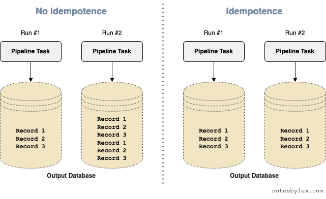

When building a data pipeline, planning to make it idempotent will save you a lot of trouble.

When an operation is idempotent, we can run it multiple times, and the result will be the same as if we ran it once. In math, we express an idempotent function as: $f(f(x)) = f(x)$.

Consider a simple data pipeline task that loads and transforms source records into batches, then stores the result in a relational database.
---
title: Idempotent Data Pipelines
date: 2022-07-16 00:00
tags:
  - DataEngineering
cover: /_media/idempotence.png
hide_cover_in_article: true
---

Idempotence is a feature I prioritize above others when building a data pipeline.

When an operation is idempotent, we can run it multiple times, and the result will be the same as if we ran it once. In math, we express an idempotent function as: $f(f(x)) = f(x)$.

Consider a simple data pipeline task that loads and transforms source records into batches, then stores the result in a relational database.

If the pipeline did not have idempotence, running the job twice would generate 2x as many records as running it once. In this scenario, we have to be very careful only to run it once. If the pipeline fails halfway through, we must ensure that we resume it from where it broke. However, if it failed midway through a batch (especially one that partially succeeded in writing to the database), it may become difficult or near impossible to resume. Our only action is to clear the destination database and run the pipeline from the start or manually correct the destination database by hand.

On the other hand, an idempotent data pipeline would have each record first checked to see if the destination record exists. It would then either update, delete or perform a no-op on the destination record. In this configuration, we can safely resume the job from somewhere before the failed batch or, worst case, restart the entire pipeline from scratch. We can even have our tasks automatically rerun on error.

</img>

To achieve idempotence in a data pipeline, we need to figure out how to unique identify our transformed records. Sometimes this is as simple as taking a primary key already provided in the source data. Other times we need to concatenate metadata together to identify a record uniquely. Sometimes the entire body of a source record must be hashed to identify it uniquely.

A side benefit of doing this is that you will have a richer understanding of your source data and transformations. It will force you to think about what makes each record unique.

Then, it's a matter of converting `INSERT`-like queries to `UPSERT` (`UPDATE` if exists else `INSERT`) or `DELETE` and `INSERT`, or even a no-op, depending on what how your data is being used.

Performing an initial query to check for existing records will add performance overhead to the pipeline, however, the savings in operational complexity far outweigh the penalty in my experience. If you can just rerun parts of your system on errors, or when you find that your transforms need to be updated, you will spend far less time babysitting them.

It's not just pipelines that benefit from idempotence. Eric Lathrop describes a customer billing operation that he makes dramatically simpler to operate after introducing idempotence [on his blog](https://ericlathrop.com/2021/04/idempotence-now-prevents-pain-later/).

It's much easier to build idempotence from the start than bolting it on later.

Unfortunately, this is a lesson many of us have to learn the hard way.

---

[1] Inspired by [this](https://livebook.manning.com/concept/apache-airflow/idempotent-task) diagram from Data Pipelines with Apache Airflow.
If the pipeline did not have idempotence, running the job twice would generate 2x as many records as running it once. In this scenario, we have to be very careful only to run it once. If the pipeline fails halfway through, we must ensure that we resume it from where it broke. However, if it failed midway through a batch (especially one that partially succeeded in writing to the database), it may become difficult or near impossible to resume. Our only action is to clear the destination database and run the pipeline from the start or manually correct the destination database by hand.

On the other hand, an idempotent data pipeline would have each record first checked to see if the destination record exists. It would then either update, delete or perform a no-op on the destination record. In this configuration, we can safely resume the job from somewhere before the failed batch or, worst case, restart the entire pipeline from scratch. We can even have our tasks automatically rerun on error.

</img>

To achieve idempotence in a data pipeline, we must figure out how to uniquely identify our transformed records. Sometimes this is as simple as taking a primary key already provided in the source data. Other times we need to concatenate metadata together to identify a record uniquely. Sometimes the entire body of a source record must be hashed to identify it uniquely.

A side benefit of doing this is that you will have a richer understanding of your source data and transformations. It will force you to think about what makes each record unique.

Then, convert `INSERT`-like queries to `UPSERT` ("`UPDATE` if the record exists else `INSERT`") or `DELETE` and `INSERT`, or even a no-op, depending on your particular problem.

Performing an initial query to check for existing records will add performance overhead to the pipeline; however, the savings in operational complexity far outweigh the penalty in my experience. If you can just rerun parts of your system on errors, or when you find that your transforms need to be updated, you will spend far less time babysitting them.

It's not just pipelines that benefit from idempotence. Eric Lathrop describes a customer billing operation that he makes dramatically simpler after introducing idempotence [on his blog](https://ericlathrop.com/2021/04/idempotence-now-prevents-pain-later/).

It's much easier to build idempotence from the start than bolting it on later.

Unfortunately, this is a lesson many of us have to learn the hard way.

---

Idempotence is closely related to [Declarative programming](https://en.wikipedia.org/wiki/Declarative_programming), a paradigm used amongst Infrastructure As Code practitioners.

[1] Inspired by [this](https://livebook.manning.com/concept/apache-airflow/idempotent-task) diagram from Data Pipelines with Apache Airflow.