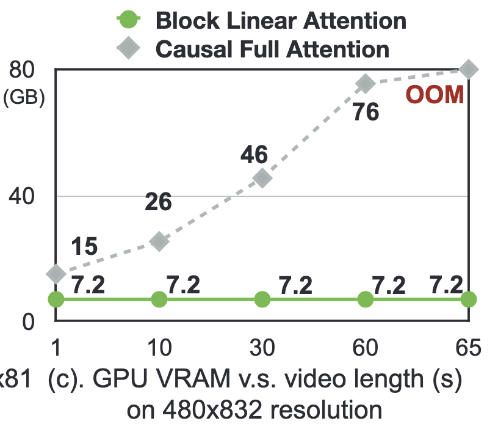
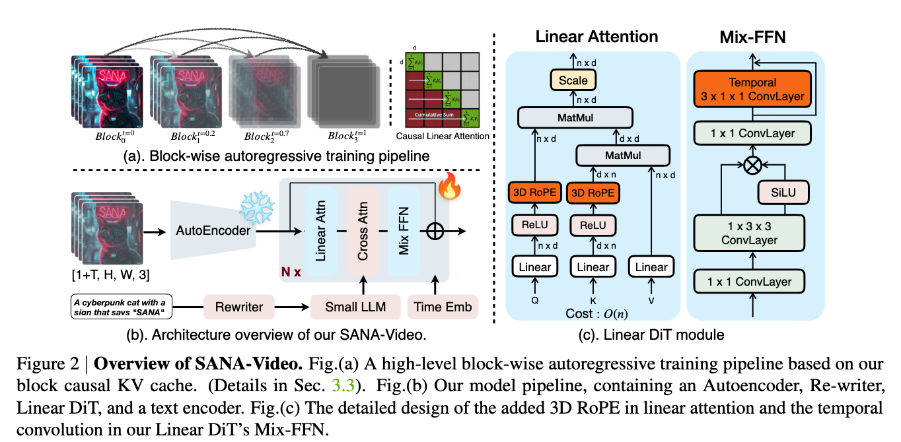

A paper from NVIDIA researchers that introduces a small diffusion model called **SANA-Video**.

It can generate one-minute videos that are 720x1280, on a [RTX 5090 GPU](rtx-5090-gpu.md).

Though I do not have an RTX 5090, I was able to generate a one-minute video generated by SANA:

```
<insert video here>
```

A single 5-second video at 720p resolution with a model like Wan 14B requires processing over 75k tokens and takes 32 minutes.

Recent models like MAGI-1 and SkyReels-V2 explore long video generation, finding efficiency is constrained by vanilla attention and KV cache.

They manage to train a video model with only 64 NVIDIA H100 GPUs for 12 days, which is about 1% of the training cost of MovieGen and 10% of OpenSora.


The improvements come down to 3 components:

[Linear Diffusion Transformer](linear-diffusion-transformer.md) - they address the quadratic computational bottleneck of traditional self-attention $O(N^2)$, by replacing all attention modules with efficient [Linear Attention](linear-attention.md). This leads to a 4x acceleration on 720p video.




They make two key improvements:

- Rotary Position Embeddings (RoPE) to improve long-context modelling.
- 1D temporal convolution added to Mix-FFNs via a shortcut connection.

This means they can leverage pre-trained image models and efficiently adapt them for video generation by aggregating temporal features.

Exposure Bias is where condition blocks are ground truth during training, but generated content during inference, which leads to error accumulation.

---
The **Video Diffusion Model** approach they use is [Rectified Flows](rectified-flows.md), which is a modelling approach which predicts the target velocity.

The inputs are embeddings conditioned on a text prompt and/or image or video ($c$).

For T2I and T2V, $c$ is just a text prompt. For I2V, the first frame and text prompt are $c$. By setting the noise of the first frame to zero, SANA-Video can realise I2V without changing the model.

Autoregressive diffusion models combine a token/block-wise chain-rule decomposition approach. Each block conditions on all previous blocks (written as $x_{j<i}$), not just the adjacent one. This is the chain rule decomposition: the full video distribution factors into a product where each new chunk sees the entire prior context. This distinction matters a lot: it's why they need a KV cache that maintains global history.




---


They start from a pre-trained T2I (text-to-image) model rather than training video from scratch, as they get the learned visual and textual semantic knowledge for free.

They use a coarse-to-fine approach, where they start at low resolution before moving to higher, which allows them to learn "dynamic information" from highly-available data, then refine the details using the scarcer high-quality data.


---

The architecture itself is based on [Sana](sana.md). So I guess that's where I should start.

---

They tailor Linear Diffusion Transformers for the challenge of T2V tasks, and propose several solutions: Vanilla Attention from Wan, Linear Attention with no Positional Embedding, Linear Attention with Relu(RoPE(x)) and Linear Attention with RoPE(Relu(x)).

Applying RoPE after ReLU means that it prevents the ReLU kernel from filtering out the positional information encoded by RoPE.

This means a clear focus on local regions, essential for capturing fine-grained video details.

However, applying RoPE directly to queries and keys can make the linear attention mechanism numerically unstable due to the difference between softmax and ReLU similarity functions.

RoPE transformation can change the non-negative nature of the ReLU output, potentially causing the denominator to become 0.

They fix this by removing RoPE from either the key or query in the denominator, ensuring the denominator stays positive.

---

### LongSANA with Block Linear Attention

Constant-memory global KV cache in the block linear attention module, which allows for long-context with a fixed GPU memory.

They introduce a two-stage autoregressive model continue training paradigm:
- autoregressive block training with a monotonically increasing SNR sampler.
- improved self-forcing method for long-context attention

### Block Linear Attention with KV Cache

You have a sequence of $N$ tokens, each represented as an [Embedding](embedding.md) vector ($\in \mathbb{R}^{1 \times D}$).

Memory for Causal Full Attention is $N \times D$, whereas Causal Linear Attention is just $D^2$ (the dimensions will be much lower than the sequence length!)

Cool.

Recent works have used full attention in a block, with causal attention to previous blocks. They use KV cache to reduce computational costs, but that comes with memory overhead.

Each new token with $N$ cached conditions requires an upper bound of $N \times D$ memory to store the cache, and also $O(N \times D)$ floating-point operations. These methods can restrict the attention window to a local scope. It's a stable cost, but it's at the expense of losing global-context scope.

On the other hand, KV Cache in Block Linear Attention, is efficient in terms of computation and memory cost, and can naturally support long video generation with global attention, while maintaining constant memory.

We need to store only the cumulative sum of state and cumulative sum of keys, so only the attention state for the $i$th token $S_i \in \mathbb{R}^{d \times D}$ is required to compute.

### Block Causal Mix-FFN

In addition to linear attention, temporal-spatial Mix-FFN enhances locality using convolutional layers.

To support long video generation, this module must also operate causally.
