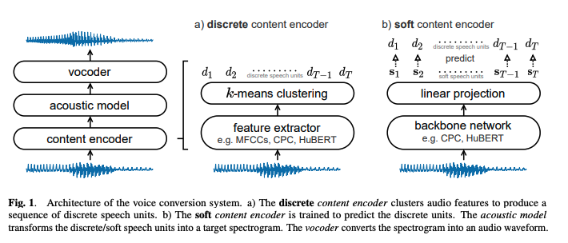

These are my notes from the paper [A Comparison of Discrete and Soft Speech Units for Improved Voice Conversion](https://arxiv.org/abs/2111.02392).

## Abstract

Paper about self-supervised representation learning approaches for voice conversion, where they compare discrete and soft speech units as input features.

They find discrete representations are able to remove speaker information, but discard some linguistic content - leading to mispronunciations.

Solution: soft speech units learned by predicting a distribution over discrete units.

Modelling uncertainty, soft units capture more content information, improving the intelligibility and naturalness of converted speech.

Voice conversion: transform source speech into target voice, keeping content unchanged.

Want to compare discrete and soft speech units as input features.

We find that discrete representations effectively remove speaker information but discard some linguistic content – leading to mispronunciations. As a solution, we propose soft speech units learned by predicting a distribution over the discrete units. By modeling uncertainty, soft units capture more content information, improving the intelligibility and naturalness of converted speech.

### Introduction

Voice conversion systems transform source speech into a target voice, keeping the content unchanged.

- Used for [re-creating young Luke Skywalker in The Mandalorian](https://www.respeecher.com/case-studies/respeecher-synthesized-younger-luke-skywalkers-voice-disneys-mandalorian)
- [restoring the voice of an Amyloidosis patient](https://www.respeecher.com/case-studies/respeecher-gives-voice-michael-york-healthcare-initiative)
- voice conversion has applications across entertainment, education and healthcare.

Typical voice conversion system:
- goal to learn features that capture linguistic content but discard speaker-specific details.
- We can then replace the speaker information to synthesize audio in a target voice.
- While systems trained on parallel data [3, 4]
    - Tomoki Toda, Alan W Black, and Keiichi Tokuda, “Voice conversion based on maximum-likelihood estimation of spectral parameter trajectory,” TASLP, vol. 15, no. 8, 2007.
    - Kou Tanaka, Hirokazu Kameoka, Takuhiro Kaneko, and Nobukatsu Hojo, “Atts2s-VC: Sequence-to-sequence voice conversion with attention and context preservation mechanisms,” in ICASSP, 2019.
    - or text transcriptions [5, 6]
        - Lifa Sun, Kun Li, Hao Wang, Shiyin Kang, and Helen Meng, “Phonetic posteriorgrams for many-to-one voice conversion without parallel data training,” in ICME, 2016
        - Wen-Chin Huang, Tomoki Hayashi, Shinji Watanabe, and Tomoki Toda, “The Sequence-to-Sequence Baseline for the Voice Conversion Challenge 2020: Cascading ASR and TTS,” in Interspeech BC/VCC workshop, 2020
    - can produce convincing results, they require costly data collection and annotation efforts.
- Unsupervised voice conversion addresses this issue by learning without labels or parallel speech [7, 8]
- However, there is still a gap in quality and intelligibility between unsupervised and supervised systems [9].

- To bridge this gap, recent work investigates self-supervised representation learning for voice-conversion. Most of these studies focus on discrete speech units [10–12]:
    - Adam Polyak et al., “Speech resynthesis from discrete disentangled self-supervised representations,” in Interspeech, 2021.
    - Benjamin van Niekerk, Leanne Nortje, and Herman Kamper, “Vector-quantized neural networks for acoustic unit discovery in the zerospeech 2020 challenge,” in Interspeech, 2020.
    -  Wen-Chin Huang, Yi-Chiao Wu, and Tomoki Hayashi, “Any-to-one sequence-to-sequence voice conversion using self-supervised discrete speech representations,” in ICASSP, 2021.
- The idea is that discretisation imposes an information bottleneck separating content from speaker details.
- While effective at removing speaker information, discretisation also discards some linguistic content - increasing mispronunciations in the converted speech.
- Take the word fin. Ambiguous frames in the fricative /f/ may be assigned to incorrect nearby units, resulting in the mispronunciation thin.
- Propose "soft speech units" to tackle the problems.
    * Using a fine-tuning procedure similar to [13], we train a network to predict a distribution over discrete speech units. 
    * By modeling uncertainty in discrete-unit assignments, we aim to retain more content information and, as a result, correct mispronunciations like fin-thin.
    * This idea is inspired by soft-assignment in computer vision, which has been shown to improve performance on classification tasks [14].
- Focusing on any-to-one voice conversion (i.e. any source speaker to a single target speaker), we compare discrete and soft speech units across two self-supervised methods: contrastive predictive coding (CPC) [15] and hidden-unit BERT (HuBERT) [13].
- Finally, we evaluate discrete and soft units on a cross-lingual voice conversion task.
- Our main contributions are as follows:
    - We propose soft speech units for voice conversion and describe a method to learn them from discrete units.
    - We find that soft units improve intelligibility and naturalness compared to discrete speech units.
    - We show that soft units transfer better to unseen languages in cross-lingual voice conversion.

Audio samples are available at [ubisoft-laforge.github.io/speech/soft-vc](https://ubisoft-laforge.github.io/speech/soft-vc/) and code at [github.com/bshall/soft-vc](https://github.com/bshall/soft-vc).

## 2. Voice Conversion Systems

In this section, we describe the voice conversion system we use to compare discrete and soft speech units. Figure 1 shows an overview of the architecture. The system consists of three components: a content encoder, an acoustic model, and a vocoder. The content encoder extracts discrete or soft speech units from input audio (illustrated in Figure 1a and 1b, respectively). Next, the acoustic model translates the speech units into a target spectrogram. Finally, the spectrogram is converted into an audio waveform by the vocoder.

### 2.1. Content Encoders

**Discrete Content Encoder**: The discrete content encoder consists of feature extraction followed by k-means clustering (see Figure 1a). Different feature extractors can be used in the first step - from low level descriptors such as MFCCs to self-supervised models like CPC or HuBERT. In the second step, we cluster the features to construct a dictionary of discrete speech units. Previous work shows that clustering features from large self-supervised models improves unit quality [13, 16, 17] and voice conversion [10]. Altogether, the discrete content encoder maps an input utterance to a sequence of discrete speech units $\langle d_1, \ldots, d_T \rangle$.

**Soft Content Encoder**: For soft speech units, it is tempting to directly use the output of the feature extractor without clustering. However, previous work [17, 18] shows that these representations contain large amounts of speaker information, rendering them unsuitable for voice conversion (we confirm this in our experiments later). Instead, we train the soft content encoder to predict a distribution over discrete units.

The idea is that soft speech units provide a middle-ground between raw continuous features and discrete units. On the one hand, discrete units create an information bottleneck that forces out speaker information. So to accurately predict the discrete units, the soft content encoder needs to learn a speaker independent representation. On the other hand, the space of speech sounds is not discrete. As a result, discretization causes some loss of content information. By modeling a distribution over discrete units, we aim to keep more of the content information and increase intelligibility.

Figure 1b outlines the training procedure for the soft content encoder. Given an input utterance, we first extract a sequence of discrete speech units $\langle d_1, \ldots, d_T \rangle$ as labels. Next, a backbone network (e.g., CPC or HuBERT) processes the utterance. Then, a linear layer projects the outputs to produce a sequence of soft speech units $\langle s_1, \ldots, s_T \rangle$. Each soft unit parameterizes a distribution over the dictionary of discrete units:

$$
p(d_t = i \mid s_t) = \frac{\exp(\text{sim}(s_t, e_i)/\tau)}{\sum_{k=1}^{K} \exp(\text{sim}(s_t, e_k)/\tau)}
$$

where $i$ is the cluster index of the $i$th discrete unit, $e_i$ is a corresponding trainable embedding vector, $\text{sim}(\cdot, \cdot)$ computes the cosine similarity between the soft and discrete units, and $\tau$ is a temperature parameter. Finally, we minimize the average cross-entropy between the distributions and discrete targets $\langle d_1, \ldots, d_T \rangle$ to update the encoder (including the backbone). At test time, the soft content encoder maps input audio to a sequence of soft speech units $\langle s_1, \ldots, s_T \rangle$, which is then passed on to the acoustic model.

### 2.2. Acoustic Model and Vocoder

The acoustic model and vocoder are typical components in a text-to-speech (TTS) system, e.g., [19, 20]. For voice conversion, the inputs to the acoustic model are speech units rather than graphemes or phonemes. The acoustic model translates the speech units (either discrete or soft) into a spectrogram for the target speaker. Then, the vocoder converts the predicted spectrogram into audio. There are a range of options for high-fidelity vocoders, including WaveNet [21] and HiFi-GAN [22].
