

This new image editing model from Black Forest Labs called [FLUX.1: Kontext](flux1-kontext.md) is really good.

You can read my paper summary here: [FLUX.1 Kontext: Flow Matching for In‑Context Image Generation and Editing in Latent Space](../reference/papers/flux1-kontext-flow-matching-for-in-context-image-generation-and-editing-in-latent-space.md)

Although GPT Image is still one of the <a href="https://notesbylex.com/imagen-4-is-faster-but-gpt-is-still-the-goat">best image models out there</a>, it is pretty limited in its ability to edit: characters get lost, and there's usually unrelated changes returned in the images.

On the other hand, FLUX.1: Kontext, thanks to approach of [Flow Matching](flow-matching.md) in latent space, maintains a high-quality level of text-to-image quality but with an absurdly good ability to edit photos. One remarkable thing is that it can maintain character consistency through many edits (called *multi-turn editing*). Even without the context of the chain of images, or any sort of in-painting, I found that it was able to keep a source character consistent, even after many rounds of editing.

To demonstrate the character consistency, I found the most recently taken photo of my dog, Doggo.

Doggo recently had TPLO surgery on each of her legs in two separate staggered surgeries due to some painful arthritis. She is fully recovered now and doing much better.

However, for the first two weeks after surgery, our poor puppy had to wear a giant cone to prevent her chewing off her stitches, which she hated.

Let's see if Flux.1: Kontext can remove the cone from poor Doggo's head.

> "remove the cone from my dog's head"

Much better.

That works so well. Of course, if you look close enough, you can see the artifact where the cone was, but that's my dog, alright.

Again, the amazing thing about the Kontext model is its ability to do multi-turn editing. Using the most recent output as input, let's see if we can make my poor Dog look like her usual happy self:

> "make my dog look happy"

Admittedly, I had to try this a few times before I got something that looked convincing like this. One of them made her head too big, and the other did some weird stuff with her ears.

Anyway, that's pretty happy! I don't think she's ever quite smiled like that, but it's close.

Now, to maximise her happiness, I move her to one of her favourite places in the world:

> "change the background to a sunny beach scene."

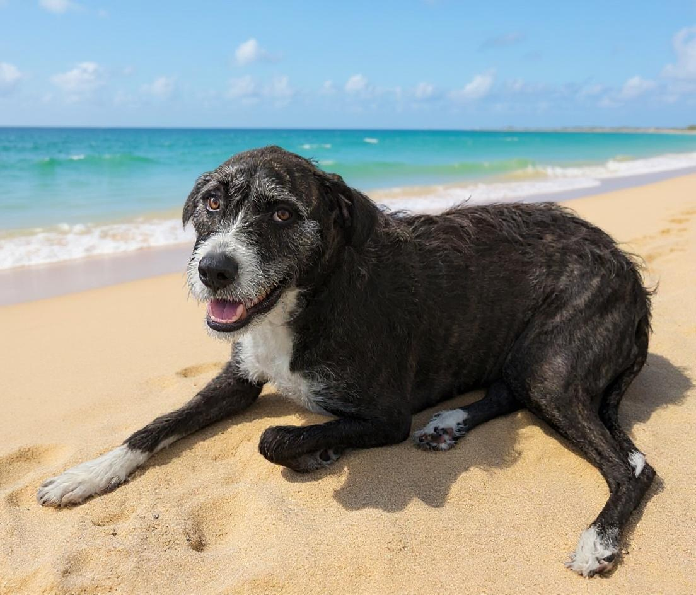

I'm really impressed by the cast shadows. The model has figure out where it wants the sun to be, and can generate shadows at roughly match that model. Wild.

Finally, to achieve peak happiness, I put her favourite chew toy next to her, a red deer antler.

> "add an antler bone in front of her"

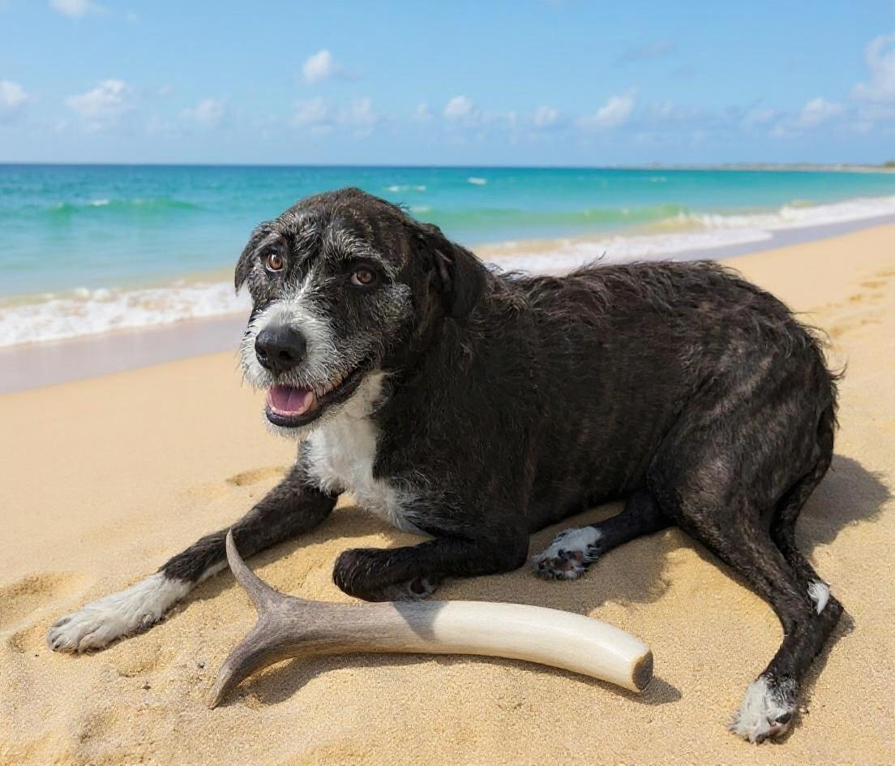

Even after four rounds of editing, it still looks exactly like Doggo - really impressive stuff.

She looks so happy; I think this could be a birthday card.

My nephew's birthday is coming up, and he loves Minecraft. So I'll try turning it into a Minecraft-themed bday.

> Change background to minecraft. Write "Happy Birthday, Nephew" in bright, colorful text on top of the image.

Looking pretty good, albeit a little distorted.

I wonder if I can use the same photo for all my future greeting card needs. It's June, but still, it's never too early to be planning Christmas. It is coming into winter in the Southern Hemisphere, after all. Isn't Christmas in July a thing?

> change text to "Seasons Greetings" with a Christmas font. Convert into a snowy background. Remove antler. Add a snowman next to her. Add a Christmas hat on top.

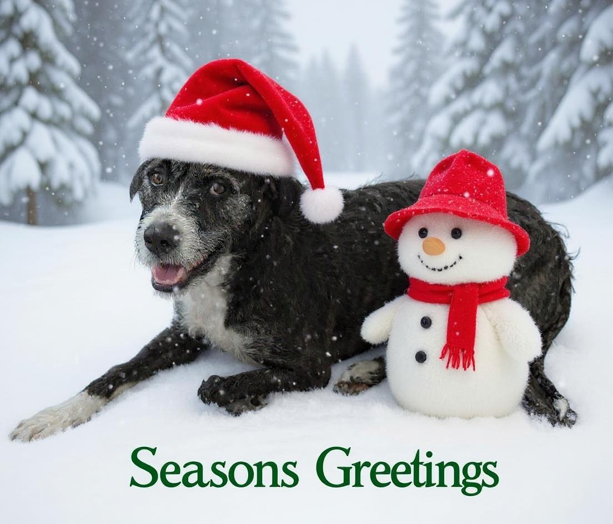

Amazing. Now we're seven edits deep, and it still looks like my Doggo. Granted, we've started to see some artifacts, and there's some roughness around the edges, but this is looking good.

Flux.1 also excels at style transfer, so let's try a few different styles for the Christmas Card.

<table style="width:100%; table-layout: fixed;">
  <tr>
    <td style="text-align:center; vertical-align:top;">
      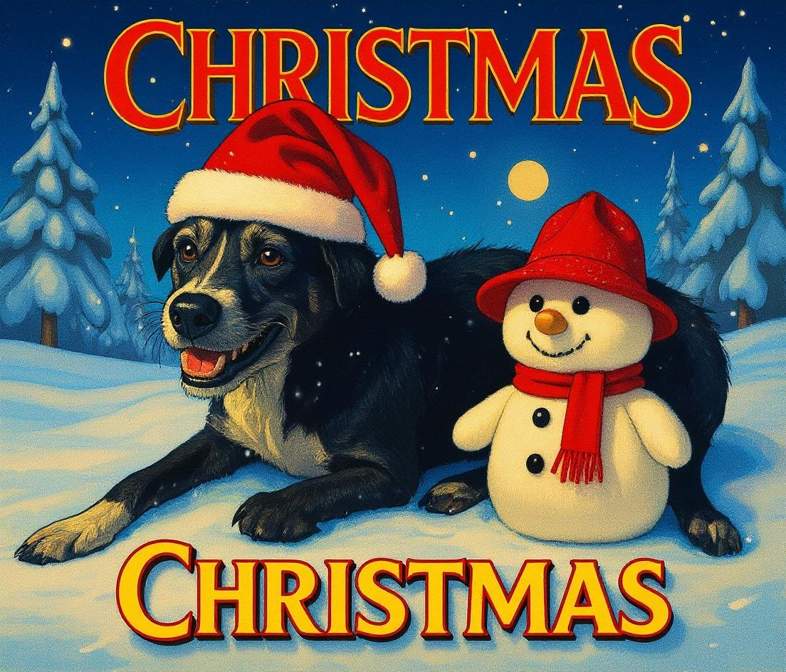 
      "Convert into the style of a 90s Christmas Movie poster"
    </td>
    <td style="text-align:center; vertical-align:top;">
      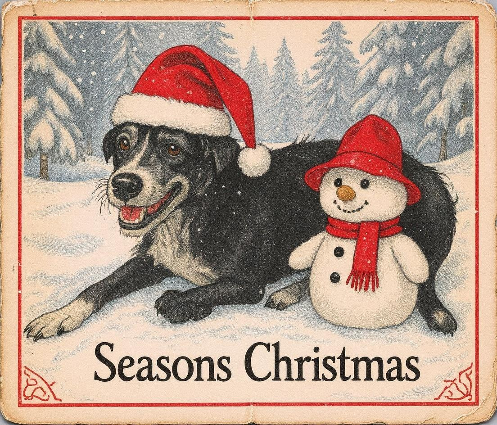 
      "Convert into a Vintage Storybook Style Christmas Card."
    </td>
    <td style="text-align:center; vertical-align:top;">
      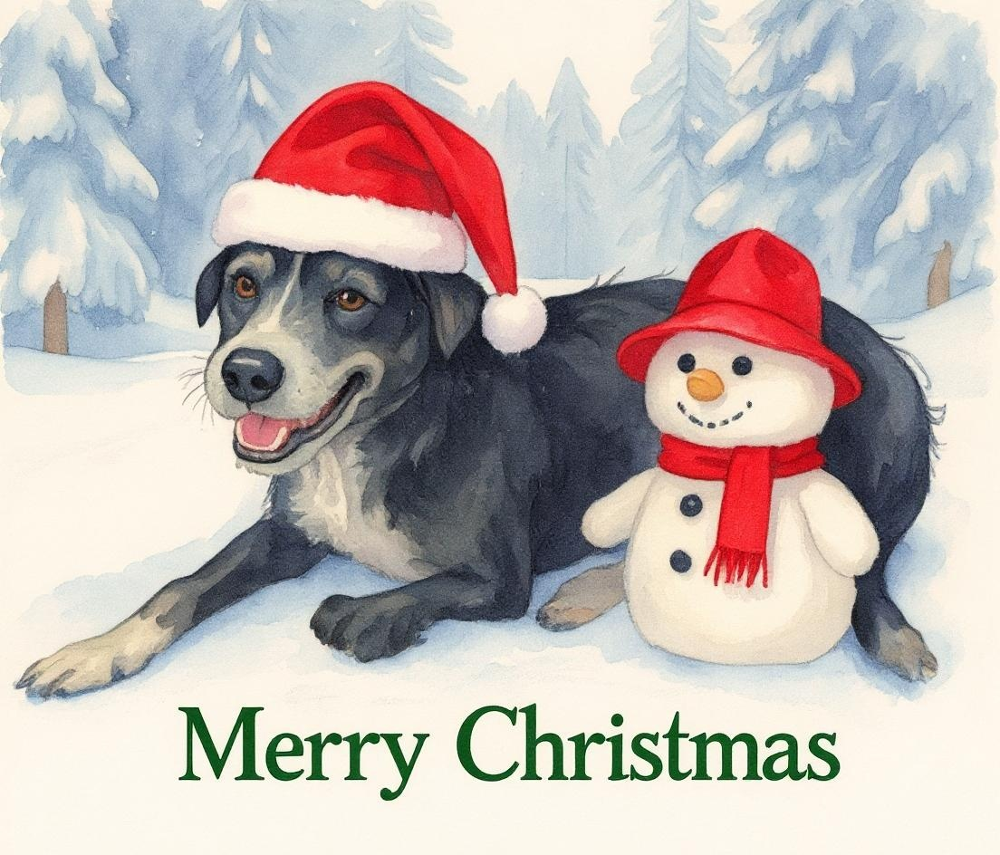 
      "Convert into a watercolor illustrated Christmas Card."
    </td>
    <td style="text-align:center; vertical-align:top;">
      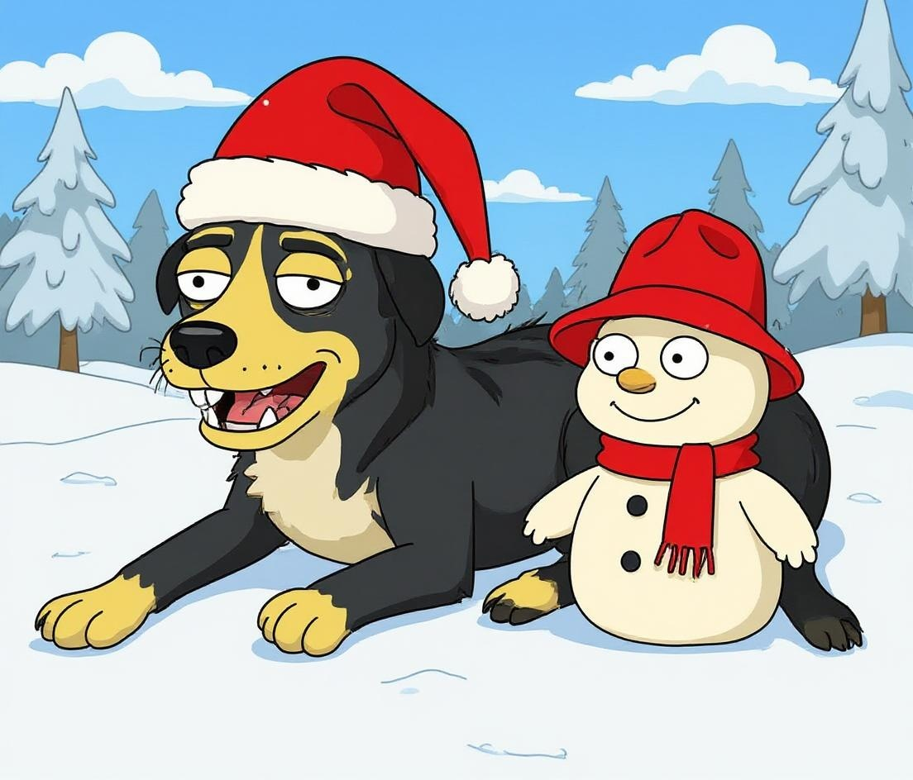 
      "change into the style of The Simpsons"
    </td>
  </tr>
</table>

Few interesting variations on the text, but very impressive nonetheless.

Back to the original Christmas Card, the Kontext paper demonstrates even more incredible global edits, like adding multiple characters, and rotating camera angles.

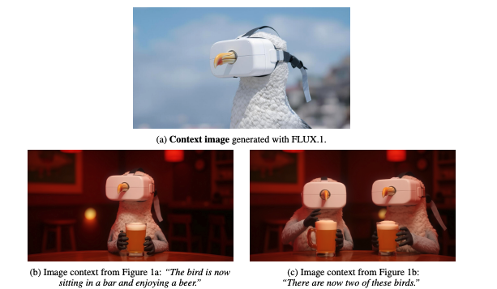

*Figure 1: Consistent character synthesis with FLUX.1 Kontext by Black Forest Labs*

Let's experiment with some of that.

> Remove text. There are now two dogs driving in a pink convertible.

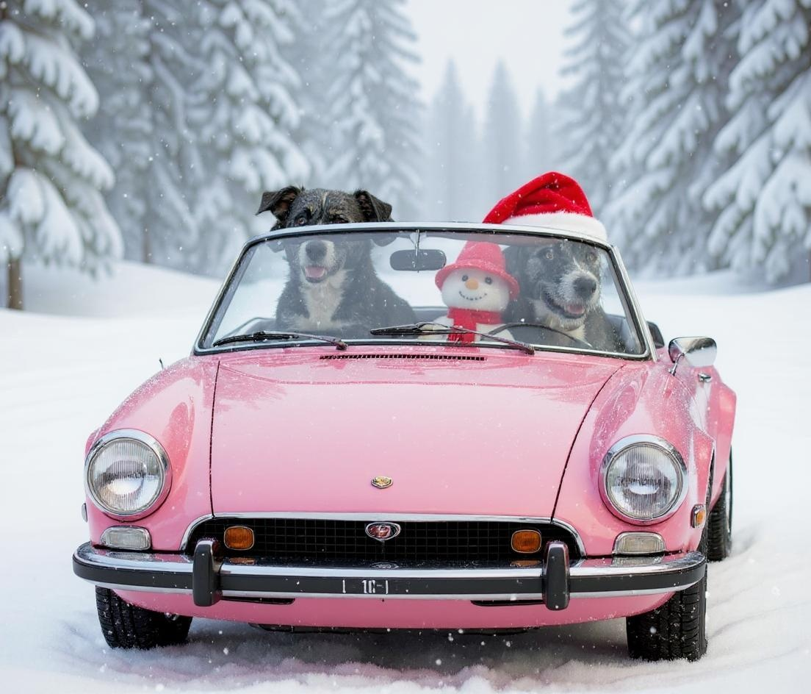

I mean, that kind of works. I think it's still my dog in the driver's seat. Hard to tell whether the snowman or Doggo is driving the car, but between them I assume they've got it covered.

I tried the prompt "Watch them from behind.", which is actually given as an example in the paper. That was immediately flagged as NSFW and refused. Flux, you definitely are misunderstanding me.

I tried an alternate prompt.

> "turn the camera to watch them from the back"

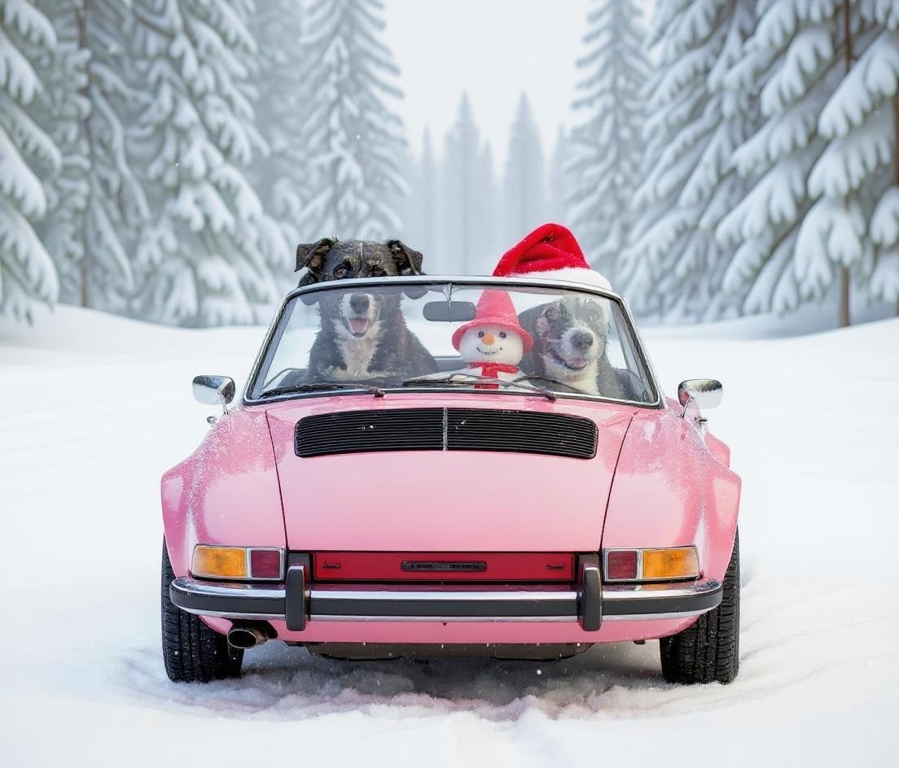

Not sure exactly what's going on here, but it has turned the car around, but not any of the character. Starting to get a little terrifying, feeling a bit like [Loab](https://en.wikipedia.org/wiki/Loab) might be waiting a few turns down the line, so I'll stop.

Now, the showcase of all the edits:

## Flux.1: Kontext - Character Consistency

<table style="width:100%; table-layout: fixed;">
  <tr>
    <td style="text-align:center; vertical-align:top;">
       
      Source image
    </td>
    <td style="text-align:center; vertical-align:top;">
       
      "remove the cone from my dog's head"
    </td>
    <td style="text-align:center; vertical-align:top;">
       
      "make my dog look happy"
    </td>
    <td style="text-align:center; vertical-align:top;">
       
      "change the background to a sunny beach scene"
    </td>
  </tr>
  <tr>
    <td style="text-align:center; vertical-align:top;">
       
      "add an antler bone in front of her"
    </td>
    <td style="text-align:center; vertical-align:top;">
       
      "Change background to Minecraft. Write 'Happy Birthday, Nephew' in bright, colorful text"
    </td>
    <td style="text-align:center; vertical-align:top;">
       
      "Seasons Greetings, snowy background, snowman, Christmas hat, remove antler"
    </td>
    <td style="text-align:center; vertical-align:top;">
       
      "Two dogs driving in a pink convertible"
    </td>
  </tr>
</table>

It's a very impressive model indeed. We can contrast the same sequence of turns with gpt-image-1, which the paper reports as the second best performing model for character consistency.

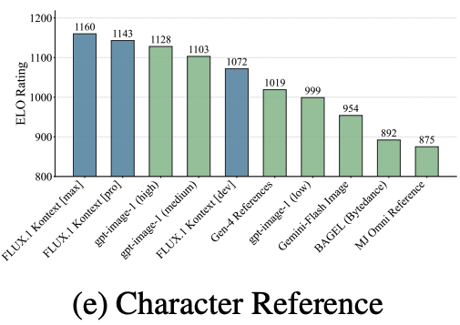

*Figure 9: Image-to-image evaluation on KontextBench by Black Forest Labs*

## gpt-image-1 - Character Consistency ref

<table style="width:100%; table-layout: fixed;">
  <tr>
    <td style="text-align:center; vertical-align:top">
       
      Source image
    </td>
    <td style="text-align:center; vertical-align:top;">
       
      1. "remove the cone from my dog's head" (gpt-image-1)
    </td>
    <td style="text-align:center; vertical-align:top;">
       
      2. "make my dog look happy" (gpt-image-1)
    </td>
    <td style="text-align:center; vertical-align:top;">
       
      3. "change the background to a sunny beach scene"
    </td>
  </tr>
  <tr>
    <td style="text-align:center; vertical-align:top;">
       
      4. "add an antler bone in front of her"
    </td>
    <td style="text-align:center; vertical-align:top;">
       
      5. "Change background to minecraft. Write 'Happy Birthday, Nephew' in bright, colorful text on top of the image."
    </td>
    <td style="text-align:center; vertical-align:top;">
       
      6. "change text to 'Seasons Greetings'. Convert into a snowy background. Remove antler. Add a snowman next to her. Add a Christmas hat on top."
    </td>
    <td style="text-align:center; vertical-align:top;">
       
      7. "Remove text. There are now two dogs driving in a pink convertible."
    </td>
  </tr>
</table>

Still an incredible model, but we can see clearly that even by the second image it's a totally different dog.

Black Forest Labs cooked with this one, as the kids would say.