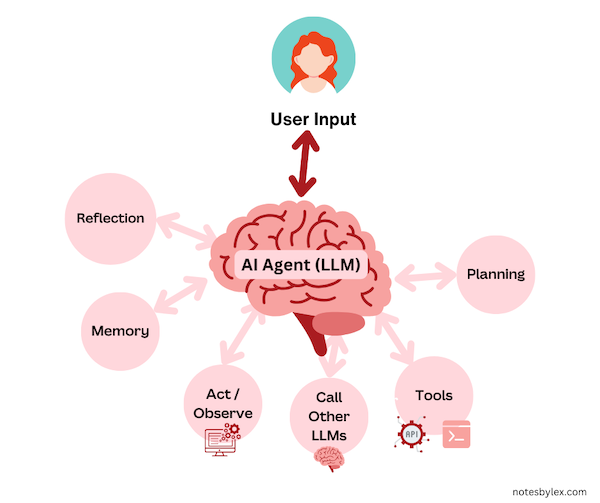

**Agentic Reasoning** refers to strategies in which [Large Language Models](large-language-models.md) can route between states like planning, reflecting, observing, and utilising tools, allowing them to take actions and handle much more complex tasks. Unlike traditional LLM approaches focusing on single-turn responses, agentic reasoning involves multi-step interactions, enabling the model to dynamically adjust its behaviour based on context and goals.

LLMs are called [AI Agents](ai-agents.md) within this framework. Agents can take on different roles or states, like planning actions, using tools, reflecting on their own outputs, and storing information for long-term use. In [Multi-Agent Systems](multi-agent-systems.md), an agent can collaborate with other agents.

In contrast, non-agentic workflows include direct methods like [Zero-Shot Prompting](zero-shot-prompting.md), where the LLM returns the result based on a single prompt. Some techniques from agentic reasoning are also used in zero-shot prompting, so the line between agentic and non-agentic is not always clear.

However, there are a series of ["design patterns"](https://www.deeplearning.ai/the-batch/how-agents-can-improve-llm-performance) that are indicative of an agentic system.

### [Tool Use](tool-use.md)

The clearest example of when an LLM becomes an AI Agent is when it calls another tool to do a job—for instance, booking a flight via an API or sending an email. This interaction allows the LLM to extend beyond text generation and perform meaningful actions in the real world.

Typically, approaches to tool use allow the model to generate command sequences that get translated into API commands, such as [Atomic Actions](atomic-actions.md), which are LLM outputs that can be mapped into API commands. Alternatively, the LLM may generate code used to call a tool. Recent papers like [ToolGen: Unified Tool Retrieval and Calling via Generation](../../../permanent/toolgen-unified-tool-retrieval-and-calling-via-generation.md) explore embedding tool commands directly into the model's vocabulary.

Other examples include:

* [Gorilla Large Language Model Connected with Massive APIs](../../../permanent/gorilla-large-language-model-connected-with-massive-apis.md) - they fine-tune a model that can perform tasks by retrieving API documents and calling functions. They use test-time modifications to ensure that the model can handle changes to APIs and is not limited to information in pre-training.
* [MM-REACT Prompting ChatGPT for Multimodal Reasoning and Action](../../../permanent/mm-react-prompting-chatgpt-for-multimodal-reasoning-and-action.md) - they use prompting techniques to allow ChatGPT to call vision models and other models to answer questions.

### [Memory](memory.md)

Incorporating long-term memory allows LLMs to store and recall information over extended interactions Recent papers have introduced a paradigm of long-term memory, such as [RAISE](raise.md) and [Reflexion](reflexion.md) allowing models to remember past actions and outcomes, enhancing future performance.

### [Planning](planning.md)

Planning involves decomposing tasks into smaller, manageable steps. Techniques like [Chain-of-Thought Prompting](chain-of-thought-prompting.md) encourage models to generate intermediate reasoning steps, significantly improving their ability to solve complex problems.

Systems may employ:

* [Open-loop Planning](open-loop-planning.md): Creating and executing an entire plan without adjustments.
* [Closed-loop Planning](closed-loop-planning.md): Planning an action, executing it, observing the outcome, and then planning the next step based on the new state.

### Acting / Observing

In agentic systems, the model performs actions and then observes the results, updating its plans based on feedback. This iterative process allows the agent to adapt to new information and refine its strategies accordingly.

### [Reflection](reflection.md)

Reflection enables an agent to analyse its outputs and reasoning processes. Methods like [Self-Refine](self-refine.md) allow an LLM to critique and improve its responses iteratively, enhancing the quality and accuracy of its outputs.
