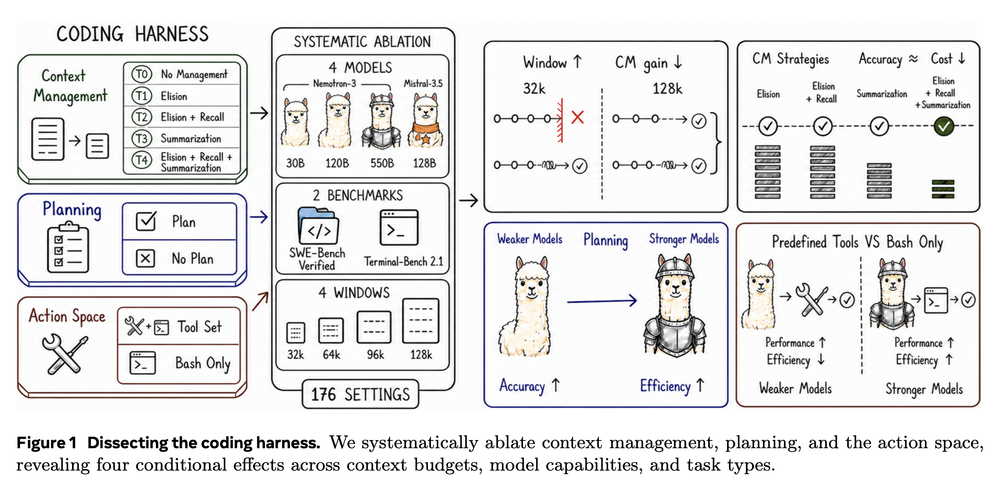

A paper that evaluates the effectiveness of individual components of a [Coding Harness](coding-harness.md) [@fanEmpiricalStudyHarness2026]. They vary aspects of the agent, including whether it gets explicit planning scaffolding, the tools it has available and the context management strategy, to help understand which parts help a coding agent, and under what conditions.

The paper's findings are not mind-blowing: the right harness depends on the model, the task, and the context-window budget. But I found the collation of harness configurations useful, and more science on harness building is always appreciated.

*Figure 1 from [@fanEmpiricalStudyHarness2026].*

## Harness Design

The authors build a lightweight harness from scratch, since many off-the-shelf harnesses have intermingled components, making them hard to test in isolation.

The harness follows the [ReAct](react-agent.md) loop: reasoning, action and observation. They also include fixed components like workspace access controls and stuck detection.

### Planning

Planning gives a persistent representation of task progress that the model maintains with an `update_plan` tool. Each turn includes the latest plan in the model input without storing it in the conversation history.

When planning is disabled, they remove the planning instructions, reminders, plan injections and tool. Basically, they test the whole persistent planning scaffold, rather than planning as a general reasoning strategy.

### Action Space

They compare predefined file, search and web-fetch tools, plus bash, against bash alone for general environment interaction. The bash-only setting still keeps `update_plan` and `recall_event` when those components are enabled.

Web search is excluded because it could expose the pull request or solution to a SWE-bench issue.

The predefined file tools also track file state, enforce reading before writing, and trigger diagnostics after edits. So this tests the complete action interface, including its instructions and validation support, not just the number of tools.

### Context Management

They test five configurations. Three use elision, which means removing older tool outputs from the active context and leaving short stubs:

| Tier | Strategy |
|---|---|
| T0 | No history compaction. Stop if the context overflows. |
| T1 | Elision: replace old, bulky tool outputs with short stubs. |
| T2 | Elision plus external storage. Retrieve original outputs with `recall_event`. |
| T3 | Summarise older history using a separate call to the same model. |
| T4 | Elision and external storage first, then summarisation if the context is still too large. |

Compaction preserves the system instructions, task and recent turns. T4 uses two thresholds: elide at the lower threshold, then summarise if the higher threshold is still exceeded.

## Evaluation

They evaluate four models: [NVIDIA Nemotron 3](nvidia-nemotron-3.md) at 30B, 120B and 550B, plus Mistral Medium 3.5 at 128B. The benchmarks are [SWE-bench](swe-bench.md) Verified (500 repository issues) and [Terminal-Bench](terminal-bench.md) 2.1 (89 command-line tasks).

Each model gets all five context strategies at 32k, 64k, 96k and 128k. Planning-off and bash-only are tested only at T4/128k. That gives 176 settings, measuring success rate and estimated token cost per task.

## Findings

- **Context management matters most when the window is small.** On SWE-bench, the average advantage over T0 falls from 35.7 percentage points at 32k to 2.7 at 128k. Much of the benefit comes from preventing overflow so the agent can keep working.
- **Remove old outputs first, summarise when needed.** T4 has similar success rates to the other managed strategies and the lowest cost in seven of eight model/benchmark combinations, averaged across context budgets. Recall is rarely used and shows no consistent accuracy benefit.
- **Planning helps different models in different ways.** For [NVIDIA Nemotron 3](nvidia-nemotron-3.md) 30B, it raises SWE-bench success from 13.6% to 25.2%, at higher cost. For the two strongest models, it mainly reduces cost, with small drops in success. Their trajectories suggest less repeated verification, while the weaker model is less likely to give up before editing.
- **Tools help when the model needs them.** [NVIDIA Nemotron 3](nvidia-nemotron-3.md) 550B does better with bash alone: SWE-bench success rises from 65.8% to 69.4%, while estimated cost falls from $2.33 to $1.11 per task. But Mistral benefits from predefined tools on SWE-bench and bash alone on Terminal-Bench. Shell proficiency and task type matter.

These are results for one harness implementation and two model families. Each setting runs once per task, and many Terminal-Bench differences are not statistically significant. Planning and action-space results may also change under other context budgets.

The results suggest choosing scaffolding for the limitations of the model and task. A component that helps one setup can add cost or get in the way in another.

## Related Work

### Coding Agents

We have benchmarks like [SWE-bench](swe-bench.md) and [Terminal-Bench](terminal-bench.md) for evaluating issue resolution and end-to-end command-line tasks, but they evaluate complete agent systems. This paper asks which components influence the agent's overall capability.

### Coding Harness

The coding harness is the software layer that includes the control loop, tool interface and context-management strategy.

Existing research shows its importance ([SWE-agent](swe-agent.md), [CodeAct](codeact.md), [Same Model, Different Harness: Different Coding-Agent Results](../reference/papers/same-model-different-harness-different-coding-agent-results.md)). Other work explores memory ([Confucius Code Agent](confucius-code-agent.md)), task graphs ([CodeR](coder.md)) and subagents ([MASAI](masai.md)). Related platforms and surveys include [OpenHands](openhands.md) and [Inside the Scaffold: A Source-Code Taxonomy of Coding Agent Architectures](../reference/papers/inside-the-scaffold-a-source-code-taxonomy-of-coding-agent-architectures.md).

- [Agentless](agentless.md) and [AutoCodeRover](autocoderover.md) show strong performance without elaborate agent architectures.
- [AgentArch](agentarch.md) finds model-specific architecture preferences. [Beyond Resolution Rates: Behavioral Drivers of Coding Agent Success and Failure](../reference/papers/beyond-resolution-rates-behavioral-drivers-of-coding-agent-success-and-failure.md) observes behavioural differences across frameworks and model generations.
- [Do Advanced Language Models Eliminate the Need for Prompt Engineering in Software Engineering?](../reference/papers/do-advanced-language-models-eliminate-the-need-for-prompt-engineering-in-software-engineering.md) finds that some prompting techniques hurt stronger models.
- [More Is Not Always Better: Cross-Component Interference in LLM Agent Scaffolding](../reference/papers/more-is-not-always-better-cross-component-interference-in-llm-agent-scaffolding.md) tests every combination of its chosen scaffolding settings, a full-factorial design. It compares models on short reasoning tasks, without explicitly testing context-window pressure.

### Context Management

Static strategies include limiting the KV cache ([StreamingLLM](streamingllm.md)), compressing prompts ([LLMLingua](llmlingua.md)), retrieving earlier content from external storage ([MemGPT](memgpt.md), [Generative Agents](generative-agents.md)), and [Recursively Summarizing Books with Human Feedback](../reference/papers/recursively-summarizing-books-with-human-feedback.md).

[ReSum](resum.md), [ACON](acon.md), [Sculptor](sculptor.md) and [MemAct](memact.md) explore learned or optimised context management. They are not all RL-trained: ReSum and Sculptor include training-free variants, while ACON optimises compression instructions without fine-tuning the agent.

These mechanisms are usually presented as improvements. This paper asks how much that depends on the context budget and whether a particular model is helped or hindered by compaction.
