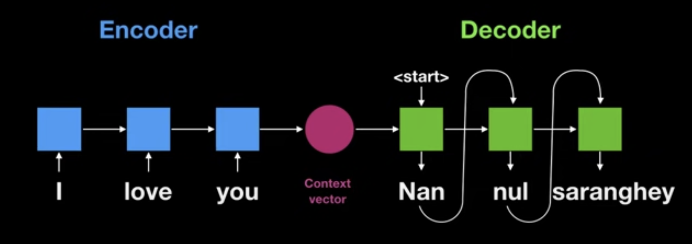
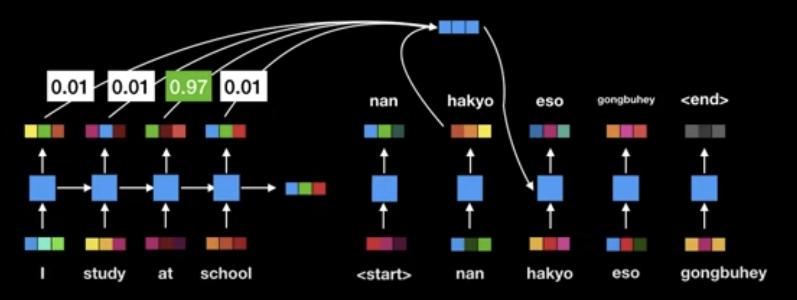

**Attention Mechanism**, or just **Attention**, is a technique for calculating a weighted combination of a sequence of vectors, inspired by the human concept of attention.

It was originally devised as a means of dealing with a bottleneck in the [RNN Encoder-Decoder](rnn-encoder-decoder.md) architecture designed for machine translation, which at the time looked like a promising alternative to the cumbersome statistical methods that were the state of the art. In this seq-to-seq architecture, the encoder and decoder are jointly trained to represent input sequences and decode their representation into a translated sequence.

## Encoder-Decoder

Typically, the encoder would encode an input sequence into a fixed-length context vector, which is provided to the decoder as context for generating a translation.

However, a single context vector limited the encoder's capacity to represent a sequence. As sequences grew longer, the performance of these models would drop.

## Encoder-Decoder with Soft-Search

Bahdanau et al. proposed an alternative architecture: allow the encoder to represent each word in the input sequence as its own vector. Then, in the decoder, compute a context vector at each step as a weighted sum of the encoded input vectors. The weights are predicted by a small learned layer trained alongside the rest of the network. They likened this to allowing the decoder to softly search through the input sequence at each decoding step - "soft" because it assigns a continuous score rather than selecting a single word.

The paper [Neural Machine Translation by Jointly Learning to Align and Translate (Sep 2014)](../reference/papers/neural-machine-translation-by-jointly-learning-to-align-and-translate-sep-2014.md) is typically credited as the origin of the attention mechanism [@bahdanauNeuralMachineTranslation2016], though the idea had been explored earlier in computer vision. This freed the encoder from compressing an entire sequence into a single vector and proved highly influential in neural machine translation.

A useful side benefit was that the computed weights were interpretable, enabling visualisations of which input words most influenced each output word.

## Architecture

Many variants of attention followed [@bahdanauNeuralMachineTranslation2016]. The most significant was [Scaled-Dot Product Attention](scaled-dot-product-attention.md) introduced in [Attention Is All You Need](attention-is-all-you-need.md), which replaced recurrence entirely and formed the basis of the [Transformer](transformer.md) architecture.
