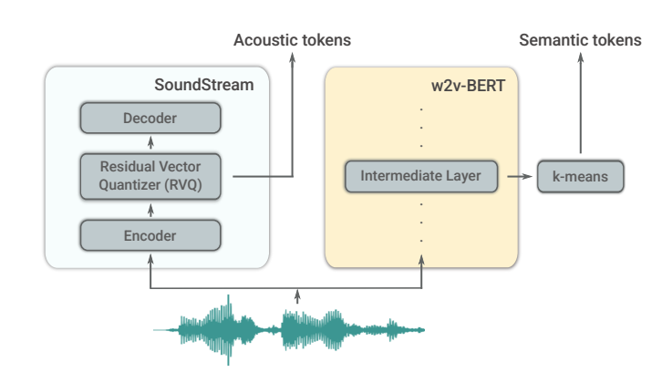

## Overview

AudioLM is a framework for audio generation with long-term consistency.

It maps the input audio to a sequence of discrete tokens, and casts audio generation as a language modelling task in this representation space.

They show how existing audio tokenisers provide different trade-offs between reconstruction quality and long-term structure.

### Key details

They map the input audio to a sequence of discrete tokens, and treat audio generation as a language modelling task.

They show how different audio tokenizers provide different trade-offs between reconstruction quality and long-term structure. They propose a hybrid tokenization scheme to achieve both objectives.

They use two types of discrete codes:
- Discrete codes from a masked language model pre-trained on audio to capture long-term structure.
- Discrete codes produced by a neural audio codec to achieve high-quality synthesis.

They train on a large corpus of raw audio waveforms, which allows AudioLM to learn to generate natural and coherent continuations given *short prompts*.

When trained on speech, without any transcript or annotation, AudioLM can generate correct sounding speech continuations while also maintaining speaker identity and speaker style for unseen speakers.

They also demonstrate that the approach can extend beyond speech to generate coherent piano music continuations, despite being trained without any symbolic representation of music.

## Notes

Audio signals, be they speech, music or environmental sounds, involve multiple scales of abstractions.

For instance, speech can be analyzed at a very local acoustic or phonetic level but also in terms of prosody, syntax, grammar, or semantics

Music also follows a long-term structure, while being composed of highly non-stationary acoustic signals.

When it comes to audio synthesis, these multiple scales interact in such a way that achieving high audio quality while displaying high-level consistency remains a challenge, in particular in the absence of strong supervision.

Recent audio synthesis models have achieved nearly veridical signal quality by leveraging methods such as autoregressive waveform modeling, adversarial training or diffusion.

Yet, when not provided with strong conditioning (e.g., linguistic features, a MIDI sequence), even powerful models like WaveNet [1] generate unstructured audio, such as babbling speech

Language models, on the other hand, have demonstrated their ability to model high-level, long-term structure for different content types, and the consequent advances in text– and image generation have paved the way towards synthesis of natural audio that remains intelligible and consistent over time.

An important step in that direction, coined as “textless NLP”, has been recently achieved for unconditioned speech generation.

Lakhotia et al. show that a Transformer trained on discretized speech units can generate coherent speech without relying on textual annotations.

They introduce AudioLM, a framework that enables high-quality audio generation with long-term coherent structure, as demonstrated by our experiments on both speech and piano music continuation.

They combine recent advances in adversarial neural audio compression ([SoundStream](soundstream.md)), self-supervised representation learning ([w2v-BERT](w2v-bert.md)) and language modelling (Scaling Up Models and Data with t5x and seqio).

They start from raw audio waveforms, and construct coarse semantic tokens from a model pre-trained with a self-supervised masked language modelling objective (like [BERT](bert.md)).

Autoregressive modelling of these tokens captures both local dependencies (e.g. phonetics in speech, part of melody in music) and global long-term structure (language syntax, harmony and rhythm in music).

However, these semantic tokens lead to poor reconstruction.

To overcome this limitation, they also use [Acoustic Tokens](acoustic-tokens.md) produced by SoundStream, which captures the details of the audio waveform and allows for high-quality synthesis.

Training a language model to generate semantic and acoustic tokens leads simultaneously to high quality audio and long-term consistency.

Summary of contributions:
- AudioLM is a framework for audio generation that combines semantic and acoustic tokens in a hierarchical fashion to achieve long-term consistency and high-quality.
- Compare the semantic tokens extracted from a pretrained w2v-BERT and acoustic tokens from SoundStream on a speech dataset, and they complement each other in terms of phonetic discriminability and reconstruction quality.
- Demonstrate the ability of AudioLM to generate coherent speech in terms of phonetics, syntax and semantics, without relying on textual annotations. Moreover, when conditioned on a prefix (or prompt) of only 3 seconds of speech from a speaker not seen during training, AudioLM produces consistent continuations while maintaining the original speaker voice, prosody and recording conditions (e.g., level of reverberation, background noise).

We show that AudioLM is also suited for music generation. When training on piano recordings, it generates convincing continuations that are coherent with the prompt in terms of melody, harmony, tone and rhythm.

We acknowledge the potential risks associated with the use of generative models that enable speech continuation, and we mitigate these risks by training a classifier that can detect synthetic speech generated by AudioLM with very high accuracy.

We encourage the reader to listen to the samples produced by AudioLM in the accompanying material.

## Related Work

### High-fidelity neural audio synthesis

Recent years have seen tremendous progress in the quality of audio generated by neural networks, largely attributed to the introduction of objective functions that improve over simple waveform regression.

WaveNet introduced an autoregressive classification approach to speech synthesis, with quality that significantly outperformed traditional concatenative and parametric approaches at the cost of slow inference. 

WaveNet inspired more computationally efficient alternatives such as WaveRNN or parallel WaveNet. A significant paradigm shift occurred with the introduction of adversarial audio generation, which enables high fidelity generation without any autoregressive component.

Moreover, combining such high-quality synthesis systems with differentiable quantisation, allows training end-to-end neural codecs by compressing activations in a bottleneck layer. AudioLM leverages the tokens produced by a SoundStream neural codec, not as intermediate representations for lossy reconstruction, but rather as targets for a sequence modelling task operating at a lower sampling rate, which can be decoded back to audio at the original sampling rate.

### Self-supervised learning of audio representations

While neural audio synthesis typically focuses on modelling fine details of the signal, most self-supervised learning approaches rather aim at discovering high-level representations that correlate with coarse, symbolic features (e.g., phonemes, musical notes, class labels).

This is typically achieved by proposing proxy objectives that do not rely on any transcript or label, but rather exploit regularities in the structure of the audio signals.

Among these approaches, contrastive training learns representations for which pairs of positive examples are closer to each other than negative pairs.

Positive pairs can be, for example, two segments that are close temporally or two augmented views of the same sequence.

Another line of work, inspired by NLP systems pretraining (t5x, [BERT](bert.md)), has explored the discretization of audio signals into a finite vocabulary of tokens to serve as targets for masked language modeling pre-training [19], i.e. predicting long contiguous spans of masked tokens from a wide context.

The discretization strategy is critical to the downstream performance of such models. Popular quantization strategies include quantizing representations optimized for future time step prediction, starting from quantizing lowlevel audio features followed by iterations of quantization target refinement [33], and jointly learning the quantization along with the masked language model [17].

The discriminative nature of these contrastive and predictive objectives, as well as the fact that they require exploiting long-term dependencies,
allow learning representations that encode coarse, high-level information about the signal (e.g., phonemes and word identity when trained on speech [34]).

These representations are thus particularly useful for discriminative downstream tasks such as speech recognition [33] or audio classification [30].  However, as they are not optimized to encode fine details of original audio signals, they are poorly invertible and thus not directly usable for synthesis. AudioLM avoids this limitation by leveraging these high-level representations as a conditioning signal that carries semantic information and guides the prediction of high-quality acoustic tokens.

### Generating natural signals with language models

Neural language models have demonstrated remarkable abilities for tasks as diverse as open-ended dialog modeling [35], code completion [36] or even solving integrals and differential equations [37]. 

The key underlying mechanism of the best of these models is [Self-Attention](self-attention.md), which is suitable for modeling rich and complex long-range dependencies but, in the standard form, has a computational cost that grows quadratically with the length of the input sequences.

This cost is acceptable for sequences of up to $10^3$ tokens, however, it prevents modelling natural signals in their raw form (for example, modeling a 512 × 512 image at the pixel level).

While several works have explored efficient alternatives to self-attention, another solution to this scaling problem is to work with mappings of the natural signals to a compact, discrete representation space.

A common approach is to model the representations in this space with an autoregressive Transformer, whose predictions are then mapped back to the original signal space.

This approach has been used to generate high-resolution images and long videos.

For audio, Jukebox [44] adopts a hierarchical approach to generate tokens at various temporal resolutions which are then combined to reconstruct music. 

Another notable line of work is “textless NLP” [13], [14], [45], [46], which models language directly in the speech domain, without any transcription, by training autoregressive generative models of low-bitrate audio tokens [28], [33].

While Jukebox and GSLM [14] show high temporal coherence (e.g., spoken language generated by GSLM is meaningful), their audio quality remains limited: the music generated by Jukebox displays significant artifacts, while the speech sampled from GSLM is limited to a single speaker in a clean setting. 

This is unlike Perceiver AR [41], which trains an autoregressive model on the discrete codes of a highbitrate SoundStream [16] codec

The model can then generate piano music of high signal-level quality; however the temporal structure of the generated sequences can be further improved

AudioLM tackles both challenges of long-term coherence and high-quality by combining semantic and acoustic tokens in a generative framework.

This leads to improvements over GSLM by generating speech continuations that preserve the original speaker’s identity and intonation, as well as extending audio continuation beyond speech by generating piano sequences with high-level coherence.

## Model

- In this section, we first describe the components of our framework, together with the representation and modelling challenges in audio generation.

- We address these challenges by proposing a hybrid tokenization scheme together with a multi-stage Transformer-based language model operating on the proposed tokens.

### A. Components

Consider a single channel audio sequence $x \in \mathbb{R}^{T}$, which is processed by the following three components of AudioLM framework:
- A tokenizer model, which maps $x$ into a sequence $h = \text{enc}(x)$, $h = (h_1, \ldots, h_{T'})$ of discrete tokens from a finite vocabulary, with $T' \ll T$.
- A decoder-only Transformer language model that operates on the discrete tokens $h$, trained to maximize the likelihood $\prod_{t=1}^{T'} p(h_t \mid h_{<t})$. At inference time, the model predicts the token sequence $\hat{h}$ autoregressively.
- A detokenizer model, which maps the sequence of predicted tokens back to audio, producing the waveform $\hat{x} = \text{dec}(\hat{h})$.

It is important to emphasize the following aspects: i) the number of tokens $T'$ is typically 2-3 orders of magnitude smaller than $T$. This is critical to significantly increase the temporal context size of the language model, since the computational complexity of standard self-attention grows quadratically with respect to the sequence length;

ii) the tokenizer and detokenizer are pre-trained and frozen ahead of training the language model, which decouples the tokenizers and the language model and simplifies the training setup.

### B. Trade-offs of discrete audio representations

Use semantic tokens and acoustic tokens:

- "Semantic tokens", which uses [w2v-BERT](w2v-bert.md) for embeddings
    - Capture long-term dependencies.
    - "long-term structural coherence"
- "Acoustic tokens", using [SoundStream](soundstream.md), a [Residual Vector Quantisation](residual-vector-quantization.md) compression architecture
    - Allow for reconstructing the audio waveform at high quality.
    - "high-quality audio synthesis"

Make SoundStream produce embeddings at 50 Hz (one every 20 ms) for input waveforms at 16 kHz.

This is a 16000 / 50 = 320-fold reduction in the [Sample Rate](sample-rate.md).

Each embedding is discretized using a residual vector quantizer (RVQ), which consists of a hierarchy of Q vector quantizers, each using a vocabulary of N symbols. For example, using N = 1024, Q = 4 results in a bitrate of 2000 bps ($50 \cdot 4 \cdot \log_2 1024$).

Hence, the input audio samples x are represented by a matrix $Y \in \{1, \ldots, N\}^{T_A \times Q}$ of codebook symbols, with $T_A = T/320$.

The convolutional decoder of SoundStream maps this discrete representation to real-valued embeddings and then reconstructs the waveform.

The codec achieves high quality by being trained end-to-end with a combination of reconstruction and adversarial losses.

We compute semantic tokens using w2v-BERT [17], a recently proposed model for learning self-supervised audio representations.

When trained on large speech corpora, w2v-BERT learns to map the input audio waveform to a rich set of linguistic features.

This is achieved by training a 0.6B parameter Conformer-based model [47] using a combination of two self-supervised objectives: a masked language modeling (MLM) loss and a contrastive loss.

While this model can be fine-tuned for discriminative tasks such as speech recognition or speech-to-text translation [48], AudioLM rather leverages the representations of the pre-trained w2v-BERT to model long-term temporal structure in a generative framework.

To this end, we select an intermediate layer of the MLM module of w2v-BERT and compute embeddings at this level.

We train a k-means with K clusters on these embeddings and use the centroid indices as semantic tokens. We found that normalizing w2v-BERT embeddings such that each dimension has zero mean and unit variance before clustering significantly improves their phonetic discriminability.

w2v-BERT performs downsampling along the temporal dimension, so that real-valued 1024-dimensional feature vectors are computed at a sampling rate of 25 Hz (one every 40 ms).

Hence, the input audio samples $x$ are transformed into a sequence of semantic tokens $z = (z_1, \ldots, z_{T_S}) \in \{1, \ldots, K\}^{T_S}$ with $T_S = T/640$. For example, when $T = 16000$, $K = 1024$, this results in a bitrate equal to 250 bps.

We note that our proposal for the extraction of semantic tokens from w2v-BERT resembles the token extraction from [HuBERT](hubert.md) in prior works [14], [45].

To motivate our hybrid tokenization scheme, we contrast the different properties of the acoustic tokens obtained from SoundStream, and the semantic tokens obtained from w2v-BERT, by comparing them in terms of audio quality reconstruction and phonetic discriminability.

We evaluate the reconstruction quality by training a SoundStream decoder to reconstruct audio from tokens.

We then compute the ViSQOL score [49], [50], a computational proxy for perceived similarity between a reference audio and its reconstruction. In particular, we use the “speech” mode, which operates on 16 kHz signals.

We measure phonetic discriminability in terms of ABX error rate [51]. It is a distance-based metric that considers a set of phoneme trigrams which only differ in the central phoneme (e.g., “bit” vs. “bet”).

ABX error rate measures how often a random instance X of a trigram (“bit”) is closer to an instance B of another trigram (“bet”) rather than to a different instance A of the same trigram (“bit”).

We consider cases where all three sounds A, B, and X are uttered by the same speaker (within-speaker) and where A and B are uttered by the same speaker and X is coming from a different speaker (across-speaker) [52].

To allow uniform comparison across the two representations, we represent speech using residual vector-quantized embeddings, where each frame is represented by its corresponding centroid for w2v-BERT or by the output of a SoundStream quantizer.

We calculate ABX using scripts published with the Libri-Light dataset [53] with the default settings and report scores obtained on LibriSpeech dev-clean [54].

Table I shows that acoustic tokens provide a good reconstruction quality (ViSQOL of 3.3 for 2000 bps, 3.9 for 6000 bps), but poor phonetic discriminability. Conversely, semantic tokens extracted from the 7th layer from the MLM module of w2v-BERT significantly improve phonetic discriminability, but they do not attain high reconstruction quality, even when matching the bitrate of the acoustic tokens.

Consequently, achieving both high quality and long-term consistency with only one of the tokenizers is challenging. To illustrate this point further, we can model the sequences of one of the token types and inspect the properties of the resulting model.

We perform this on the acoustic tokens, since the semantic tokens only allow for poor audio synthesis. We train a decoder-only Transformer on the sequence of acoustic tokens, by flattening $Y$ in a row-major order to a sequence of tokens $y + o$ of length $T_A \cdot Q$, where $y = (y_1^1, y_1^2, \ldots, y_1^Q, y_2^1, \ldots, y_{T_A}^Q)$, $y_t^q$ is the token produced by the $q$-th quantizer for the $t$-th time step, and $o = (o_1, o_2, \ldots, o_{T_A \cdot Q})$ is the vector of offsets for creating unique token indices for the $Q$ layers of the residual vector quantizer, with $o_i = ((i-1) \bmod Q) \cdot N$.

In the following, we omit the offsets from the notation and assume proper offsetting implicitly.

Using the model trained only on the acoustic tokens, we sample speech continuations from a prompt of 4 seconds.

While both the recording conditions and the speaker identity from the prompt are preserved, the linguistic content is inconsistent, and often akin to babbling (see “Generation without semantic tokens” in the accompanying material).

### C. Hierarchical modeling of semantic and acoustic tokens

The observations in the previous section suggest that, by modeling both semantic and acoustic tokens within the same framework, the semantic tokens would ensure long-term consistency (by capturing linguistic content for speech, melody and rhythm for music), while the acoustic tokens would ensure high-quality audio synthesis (by capturing the acoustic details).

We build the AudioLM framework on this hypothesis.

Concretely, we adopt a hierarchical approach, by first modeling the semantic tokens for the entire sequence, and then use these as conditioning to predict the acoustic tokens.

This approach has two main advantages:
i) the hierarchical modelling reflects the conditional independence assumption that semantic tokens are expected to be conditionally independent from past acoustic tokens given past semantic tokens, that is, $p(z_t \mid z_{<t}, y_{<t}) \approx p(z_t \mid z_{<t})$;

ii) the token sequence per stage is reduced compared to alternatives such as modeling the interleaved sequence of semantic and acoustic tokens, allowing for computationally more efficient training and inference.

AudioLM performs three subsequent stages, as illustrated in Figure 2. In all stages, we use a separate decoder-only Transformer trained for predicting next tokens given all previous ground-truth tokens in the corresponding stage.

**Semantic modeling.** The first stage models $p(z_t \mid z_{<t})$, the autoregressive prediction of semantic tokens to capture long-term temporal structure.

**Coarse acoustic modeling.** The second stage proceeds analogously on the acoustic tokens, but it only predicts the acoustic tokens from the coarse $Q'$ SoundStream quantizers, conditioned on the semantic tokens.

Due to residual quantization in SoundStream, the acoustic tokens have a hierarchical structure: tokens from the coarse quantizers recover acoustic properties like speaker identity and recording conditions, while leaving only the fine acoustic details to the fine quantizer tokens, which are modeled by the next stage.

We rely on the simple approach of flattening the acoustic tokens in a row-major order to handle their hierarchical structure.

Consequently, the second stage models $p(y_t^q \mid z, y_{<t}^{\leq Q'}, y_t^{<q})$ for $q \leq Q'$, where the corresponding token sequence is $(z_1, z_2, \ldots, z_{T_S}, y_1^1, y_1^2, \ldots, y_1^{Q'}, y_2^1, \ldots, y_{T_A}^{Q'})$, with $y_1^1$ being the first token predicted during training.

**Fine acoustic modeling.** The third stage operates on acoustic tokens corresponding to the fine quantizers, using the $Q'$ coarse tokens as conditioning and modeling the conditional probability distribution $p(y_t^q \mid y^{\leq Q'}, y_{<t}^{>Q'}, y_t^{<q})$ for $q > Q'$. That is, $y_t^q$ is predicted based on all tokens corresponding to the coarse $Q'$ quantizers, followed by the fine $Q - Q'$ quantizers at previous time steps, together with the already decoded tokens at the current time step corresponding to the coarser quantizers.

In this stage, we further improve audio quality, removing the lossy compression artifacts that remain after the second stage.

Although the second and third stage could be merged into a single stage, we adopt the solution with two separate stages to limit the sequence length that the model has to process at once.

First, considering that fine acoustic tokens are conditionally independent from semantic tokens when conditioned on coarse acoustic tokens, the third stage can ignore the semantic tokens, which reduces the total sequence length.

Moreover, under the assumption that the fine acoustic details are determined locally by the coarse acoustic tokens, we perform the third stage on batches of non-overlapping audio chunks of 3 seconds, allowing us to scale this stage independently of the target audio sequence length as well as to use more residual quantization layers $Q$ to achieve higher quality.
