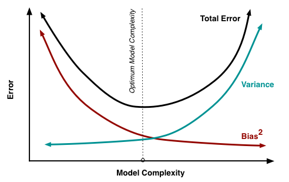

A topic that a Machine Learning practitioner should know, if nothing else for the purposes of passing interviews, is the **bias-variance trade-off**.

The basic idea is that simpler models tend to oversimplify the problem and fail to learn all the signal present in the data (underfitting). More complex models might fit the training data too closely and fail to generalise to new examples (overfitting).

The trade-off implies there is a level of model complexity that minimises expected test error by balancing bias and variance, as [@@fortmannroeUnderstandingBiasVariance2012] shows:

Note that the error here refers to [Mean-Squared Error](../../../permanent/mean-squared-error.md). Because MSE squares prediction errors, expanding its expected value produces a squared bias term.

---

Main thing to remember:

- **High-Bias, Low-Variance** is associated with **underfitting**
- **High-Variance, Low-Bias** is associated with **overfitting**

---

The word "bias" here comes from the statistical definition: the difference between a model's expected prediction across different training sets and the true value it's trying to estimate.

High bias is often introduced by a model that is too simple to accurately represent the problem.

The word "variance" refers to a model's sensitivity to fluctuations in the training data used to fit it. A high-variance model may fit random noise in the training data.

---

This framing was applied to neural networks in the landmark work by [@@gemanNeuralNetworksBias1992], but the idea goes back at least to Grenander's 1952 "uncertainty principle" in statistics [@grenanderEmpiricalSpectralAnalysis1952], with later examples in cubic smoothing splines and a 1990 statistics textbook [@nealBiasVarianceTradeoffTextbooks2019].

In practice, the trade-off is not necessarily a given. There are many examples of complex models, especially neural networks, where increasing the size of the network can decrease both variance and bias [@nealBiasVarianceTradeoffTextbooks2019].

Test error can also follow a **double-descent** curve: the classical U-shape is followed by a second descent after the model begins to interpolate the training data [@belkinReconcilingModernMachinelearning2019].

Even so, there are still problems, especially with limited data, where the classical tradeoff is essential to understand.

---

Conventionally, to reduce bias, you might:

- use a more complex model (increase parameters, features, etc)
- reduce regularisation

Conversely, to reduce variance, you might:

- collect more data
- apply additional regularisation
- use a simpler model
- use data augmentation or early stopping
- combine multiple models through ensembling

---

For squared-error regression, the expected prediction error at a given $x$ is often decomposed as:

$MSE = \operatorname{Bias}(\hat{f}(x))^2 + \operatorname{Variance}(\hat{f}(x)) + \sigma^2$

Bias is squared because MSE measures squared error. Bias can be positive or negative, but either direction contributes to prediction error. When the expected squared error is expanded, the systematic difference between the model's expected prediction and the true value therefore appears as:

$\operatorname{Bias}(\hat{f}(x))^2 = \left(\mathbb{E}[\hat{f}(x)] - f(x)\right)^2$

This gives squared bias the same units as variance and MSE.

The term $\sigma^2$ represents the irreducible noise in the data that you cannot get rid of with a better model.