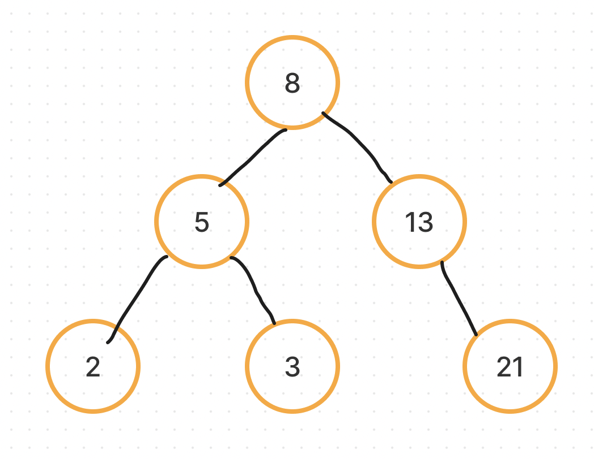

A type of [Binary Tree](binary-tree.md) where every node in a node's left subtree has a lower value, and every node in its right subtree has a higher value.

For example, inserting 8, 5, 2, 3, 13, 21 in that order gives a tree with 8 at the root, 5 and 13 as its children, 2 as the left child of 5, 3 as the right child of 2, and 21 as the right child of 13.

Note that the tree below is **not** a valid binary search tree: 3 is in the right subtree of 5, but it's less than 5.



The famously difficult problem of **Reversing a binary tree** is actually one of the simplest algorithms you can imagine.

```python
def reverse_tree(node):
    if node is None:
        return None
    node.left, node.right = node.right, node.left
    reverse_tree(node.left)
    reverse_tree(node.right)
    return node
```
