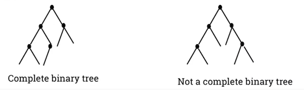

A **binary tree** is a tree in which every node has no more than two children.

## [Complete Binary Tree](complete-binary-tree.md)

A type of binary tree where all leaves, except the leaves in the last level, are placed as far to the left as possible.

