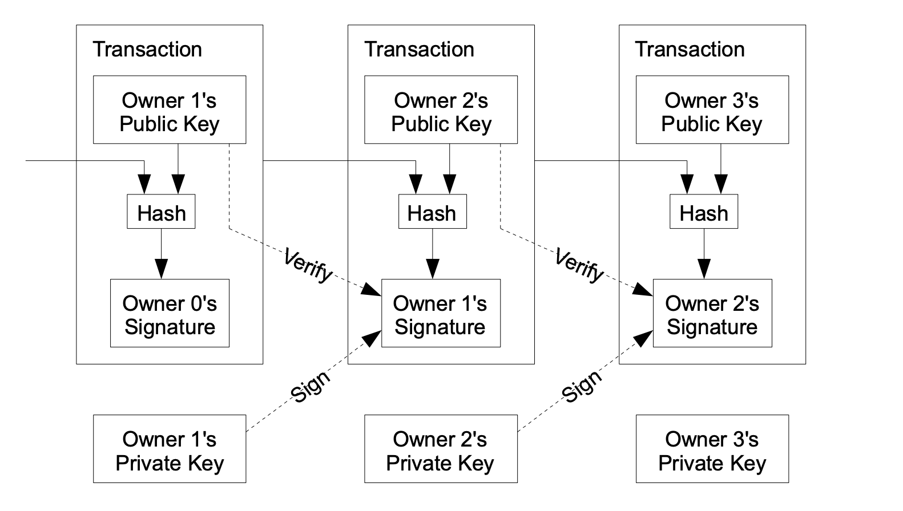
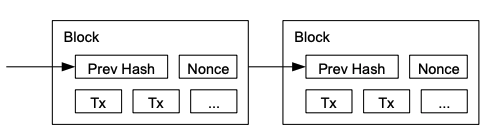
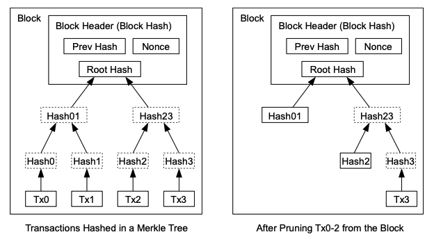
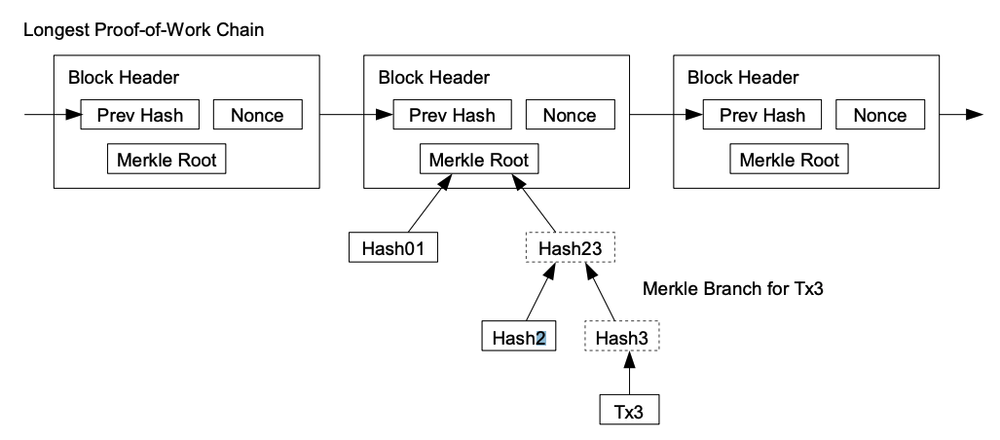
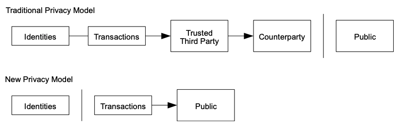

*My notes from paper [Bitcoin: A Peer-to-Peer Electronic Cash System](https://bitcoin.org/bitcoin.pdf) by [Satoshi Nakamoto](satoshi-nakamoto.md)*

---

## Abstract

The paper describes a new type of peer-to-peer electronic cash, that allows payments to be sent without a financial institution. Bitcoin utilises [Digital Signatures](digital-signatures.md), which are part of the solution, and solve [Double-Spending Problem](double-spending-problem.md) by utilising hash-based [Proof-of-Work](proof-of-work.md).

The longest chain - the ledger - of blocks serves as proof of the sequence of events, and also proof that it came from the largest pool of CPU power.

As long as the majority of CPU power is controlled by nodes that are not cooperating to attack the network, they will generate the longest chain and outpace attackers.

The solution utilises ideas from two papers:
* [Hashcash](hashcash.md) by Adam Back
* [B-Money](b-money.md) by Wei Dai.

The longest chain - the ledger - is proof of the sequences of events witnessed, and also proof that it came from largest pool of CPU power.

As long as the majority of CPU power is controlled by nodes that are not cooperating to attack the network, they'll generate the longest chain and outpace attackers.

## 1. Introduction

This paper proposes a cryptographic peer-to-peer payment system, which doesn't need intermediaries. They protect sellers through computationally irreversible transactions, while "maintaining buyer protection" through escrow mechanisms. Although the escrow mechanisms weren't described in the paper.

It utilises a [Proof-of-Work](proof-of-work.md) system, where miners compete to find a hash with specific properties, which proves a certain amount of computation was utilised for the transaction.

It remains secure as long as honest nodes maintain majority CPU control.

## 2. Transactions

An "electronic coin" is defined as a chain of digital signatures, each owner transfers a coin to the next by digitally signing a hash of the previous transaction, and public key of next owner, then adding these to the end coin. The payee can verify the signatures to verify the chain of ownership.

However, a potential issue is that the payee can't verify that the owners did not double-spend the coin, spending on another node.

One solution is to add a trusted central authority, or a **mint** that checks every transaction. After each transaction, coin must be returned to the mint to issue a new coin, and only coins issued directly from the mint are trusted not to be double-spent.

However, the issue here is that the fate of the system relies on the company running the mint. And Bitcoin was created in reaction to the 2008 financial crisis, which caused people to have a massive distrust of banks and financial institutions. Having a central authority would defeat the purpose of a decentralised currency.

Bitcoin wants a way for a seller to know previous owners didn't sign any earlier transactions: the earliest is the one that matters, and they don't care about later attempts to double-spend.

The only way to confirm the absence of a transaction, is to be aware of all transactions.

In the mint-based model, the mint was aware of all transactions, and decided which arrives first.

Without a trusted party, transactions need to be broadcast like [B-Money](b-money.md), and need a system for participants to agree on a single history of the order they were received.

The payee needs proof that at the time of each transaction, the majority of nodes agreed it was the first received.

## 3. Timestamp Server

The solution they propose to this problem starts with a timestamp server.

It takes a hash of a block of items to be timestamped, and widely publishes the hash, similar to newspaper or Usenet post.

The timestamp proves that the data must have existed at the time, in order to be in the hash.

Each timestamp includes the previous timestamp in the hash, with each timestamp reinforcing the ones before it.

Related papers:
* [Design of a Secure Digital Timestamping Service With Minimal Trust Requirement](design-of-a-secure-digital-timestamping-service-with-minimal-trust-requirement.md)
* [How to time-stamp a digital document](how-to-time-stamp-a-digital-document.md)
* [Improving the efficiency and reliability of digital time-stamping](improving-the-efficiency-and-reliability-of-digital-time-stamping.md)
* [Secure names for bit-strings](secure-names-for-bit-strings.md)

## 4. Proof of Work Server

To implement a peer-to-peer distributed timestamp server, they use a proof-of-work system, which "also solves the problem of determining representation in majority decision making".

If the majority were based on one-IP-address-one-vote, it could be subverted by anyone able to allocate many IPs.

Proof-of-work is essentially one-CPU-one-vote. The majority decision is represented by the longest chain, which has the greatest proof-of-work effort invested in it.

If a majority of CPU power is controlled by honest nodes, the honest chain will grow the fastest and outpace any competing chains.

To modify a past block, an attacker would have to redo the proof-of-work of the block and all blocks after it and then catch up with and surpass the work of the honest nodes.

They show later that the probability of a slower attacker catching up diminishes exponentially as subsequent blocks are added.

To compensate for increasing hardware speed and varying interest in running nodes over time, the proof-of-work difficulty is determined by a moving average targeting an average number of blocks per hour. If they're generated too fast, the difficulty increases.

## 5. Network

The steps for the network operation are as follows:

1. New transactions are broadcast to all nodes.
2. Each node collects new transactions into a block.
3. Each node works on finding a difficult proof-of-work for its block.
4. When a node finds a proof-of-work, it broadcasts the block to all nodes.
5. Nodes accept the block only if all transactions in it are valid and not already spent.
6. Node express their acceptance of the block by working on creating the next block in the chain, using the hash of the accepted block as the previous hash.

Nodes always consider the longest chain to be the correct one and will keep working on extending it.

If two nodes broadcast different versions of the next block simultaneously, some nodes may receive one or the other first. In that case, they work on the first one they received, but save the other branch in case it becomes longer.

The tie will be broken when the next proof-of-work is found and one branch becomes longer; the nodes that were working on the other branch will then switch to the longer one.

New transaction broadcasts do not necessarily need to reach all nodes.

As long as they reach many nodes, they will get into a block before long.

Block broadcasts are also tolerant of dropped messages.

If a node does not receive a block, it will request it when it receives the next block and realizes it missed one.

## 6. Incentive

By convention, the first transaction in a block is a special transaction that starts a new coin owned by the creator of the block. 

This adds an incentive for nodes to support the network, and provides a way to initially distribute coins into circulation, since there is no central authority to issue them.

The steady addition of a constant amount of new coins is analogous to gold miners expending resources to add gold to circulation. In our case, it is CPU time and electricity that is expended.

The incentive can also be funded with transaction fees. If the output value of a transaction is less than its input value, the difference is a transaction fee that is added to the incentive value of the block containing the transaction. Once a predetermined number of coins have entered circulation, the incentive can transition entirely to transaction fees and be completely inflation free.

The incentive may help encourage nodes to stay honest.

If a greedy attacker is able to assemble more CPU power than all the honest nodes, they would have to choose between using it to defraud people by stealing back his payments, or using it to generate new coins.

They ought to find it more profitable to play by the rules, rules that favour him with more new coins than everyone else combined, than to undermine the system and the validity of his own wealth.

## 7. Reclaiming Disk Space

Once the latest transaction in a coin is buried under enough blocks, the spent transactions before it can be discarded to save disk space.

To facilitate this without breaking the block's hash, transactions are hashed in a [Merkle Tree](merkle-tree.md), with only the root included in the block's hash.

Old blocks can then be compacted by stubbing off branches of the tree. The interior hashes do not need to be stored.

A block header with no transactions would be about 80 bytes. If we suppose blocks are
generated every 10 minutes, 80 bytes * 6 * 24 * 365 = 4.2MB per year. With computer systems
typically selling with 2GB of RAM as of 2008, and Moore's Law predicting current growth of
1.2GB per year, storage should not be a problem even if the block headers must be kept in
memory.

## 8. [Simplified Payment Verification](simplified-payment-verification.md)

It is possible to verify payments without running a full network node. 

A user only needs to keep a copy of the block headers of the longest proof-of-work chain, which he can get by querying network nodes until he's convinced he has the longest chain, and obtain the Merkle branch linking the transaction to the block it's timestamped in.

He can't check the transaction for himself, but by linking it to a place in the chain, he can see that a network node has accepted it, and blocks added after it further confirm the network has accepted it.

As such, the verification is reliable as long as honest nodes control the network, but is more vulnerable if the network is overpowered by an attacker.

While network nodes can verify transactions for themselves, the simplified method can be fooled by an attacker's fabricated transactions for as long as the attacker can continue to overpower the network.

One strategy to protect against this would be to accept alerts from network nodes when they detect an invalid block, prompting the user's software to download the full block and alerted transactions to confirm the inconsistency.

Businesses that receive frequent payments will probably still want to run their own nodes for more independent security and quicker verification.

## 9. Combining and Splitting Value

Although it would be possible to handle coins individually, it would be unwieldy to make a separate transaction for every cent in a transfer. 

To allow value to be split and combined, transactions contain multiple inputs and outputs.

Normally there will be either a single input from a larger previous transaction or multiple inputs combining smaller amounts, and at most two outputs: one for the payment, and one returning the change, if any, back to the sender. 

It should be noted that fan-out, where a transaction depends on several transactions, and those transactions depend on many more, is not a problem here. There is never the need to extract a complete standalone copy of a transaction's history.

## 10. Privacy

The traditional banking model achieves a level of privacy by limiting access to information to the parties involved and the trusted third party. 

The necessity to announce all transactions publicly precludes this method, but privacy can still be maintained by breaking the flow of information in another place: by keeping public keys anonymous.

The public can see that someone is sending an amount to someone else, but without information linking the transaction to anyone.

This is similar to the level of information released by stock exchanges, where the time and size of individual trades, the "tape", is made public, but without telling who the parties were.

As an additional firewall, a new key pair should be used for each transaction to keep them from being linked to a common owner.

Some linking is still unavoidable with multi-input transactions, which necessarily reveal that their inputs were owned by the same owner. 

The risk is that if the owner of a key is revealed, linking could reveal other transactions that belonged to the same owner.

## 11. Calculations

We consider the scenario of an attacker trying to generate an alternate chain faster than the honest chain.

Even if this is accomplished, it does not throw the system open to arbitrary changes, such as creating value out of thin air or taking money that never belonged to the attacker. 

Nodes are not going to accept an invalid transaction as payment, and honest nodes will never accept a block containing them. 

An attacker can only try to change one of his own transactions to take back money he recently spent.

The race between the honest chain and an attacker chain can be characterized as a [Binomial Random Walk](binomial-random-walk.md). The success event is the honest chain being extended by one block, increasing its lead by +1, and the failure event is the attacker's chain being extended by one block, reducing the gap by -1.

The probability of an attacker catching up from a given deficit is analogous to a Gambler's Ruin problem.

Suppose a gambler with unlimited credit starts at a deficit and plays potentially an infinite number of trials to try to reach breakeven.

We can calculate the probability he ever reaches breakeven, or that an attacker ever catches up with the honest chain, as follows:

* $p$ = probability an honest node finds the next block
* $q$ = probability the attacker finds the next block
* $q_z$ = probability the attacker will ever catch up from z blocks behind

$$
q_z = \begin{cases}
1 & \text{if } p \le q \\
(q/p)^z & \text{if } p > q
\end{cases}
$$

Given our assumption that p > q, the probability drops exponentially as the number of blocks the attacker has to catch up with increases.

With the odds against him, if he doesn't make a lucky lunge forward early on, his chances become vanishingly small as he falls further behind.

We now consider how long the recipient of a new transaction needs to wait before being sufficiently certain the sender can't change the transaction. 

We assume the sender is an attacker who wants to make the recipient believe he paid him for a while, then switch it to pay back to himself after some time has passed. 

The receiver will be alerted when that happens, but the sender hopes it will be too late.

The receiver generates a new key pair and gives the public key to the sender shortly before
signing. This prevents the sender from preparing a chain of blocks ahead of time by working on
it continuously until he is lucky enough to get far enough ahead, then executing the transaction at
that moment. Once the transaction is sent, the dishonest sender starts working in secret on a
parallel chain containing an alternate version of his transaction.

The recipient waits until the transaction has been added to a block and z blocks have been
linked after it. He doesn't know the exact amount of progress the attacker has made, but
assuming the honest blocks took the average expected time per block, the attacker's potential
progress will be a Poisson distribution with expected value:

$$
\lambda = z \frac{q}{p}
$$

## 12. Conclusion

We have proposed a system for electronic transactions without relying on trust. We started with
the usual framework of coins made from digital signatures, which provides strong control of
ownership, but is incomplete without a way to prevent double-spending. 

To solve this, we
proposed a peer-to-peer network using proof-of-work to record a public history of transactions
that quickly becomes computationally impractical for an attacker to change if honest nodes
control a majority of CPU power.

The network is robust in its unstructured simplicity. Nodes
work all at once with little coordination. They do not need to be identified, since messages are
not routed to any particular place and only need to be delivered on a best effort basis.

Nodes can
leave and rejoin the network at will, accepting the proof-of-work chain as proof of what
happened while they were gone. They vote with their CPU power, expressing their acceptance of
valid blocks by working on extending them and rejecting invalid blocks by refusing to work on
them. Any needed rules and incentives can be enforced with this consensus mechanism.

