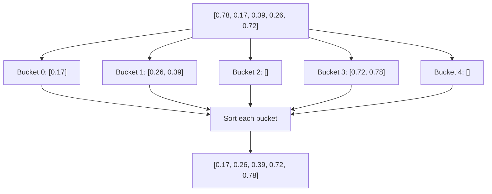

**Bucket Sort** is a distribution sorting algorithm that works by dividing elements into a finite number of buckets, sorting these buckets (typically with another algorithm), and then concatenating them to produce the final sorted array. It is particularly efficient when input is uniformly distributed over a range, achieving an average case time complexity of $O(n + k)$ where $k$ is the number of buckets.

## Algorithm

$$
\begin{aligned}
&\textbf{BUCKETSORT}(A) \\
&\quad 1. \quad n = A.length \\
&\quad 2. \quad \text{buckets } B[0 \dots n - 1] \\
&\quad 3. \quad \textbf{for } i = 1 \text{ to } n \textbf{ do} \\
&\quad 4. \quad\quad \text{insert } A[i] \text{ into bucket } B[ \ \lfloor \ n \times A[i] \ \rfloor \ ] \\
&\quad 5. \quad \text{sort each bucket} \\
&\quad 6. \quad \text{concatenate sorted buckets}
\end{aligned}
$$

## Code

```python
import numpy as np

def bucket_sort(arr, num_buckets=5):
    buckets = [[] for _ in range(num_buckets)]

    for num in arr:
        index = int(num_buckets * num)
        buckets[index].append(num)

    for bucket in buckets:
        bucket.sort()

    sorted_arr = [num for bucket in buckets for num in bucket]
    return sorted_arr
```

## Simple step-by-step example

Given array: $[0.78, 0.17, 0.39, 0.26, 0.72]$, using 5 buckets.

1. Create 5 empty buckets
2. Place each number in appropriate bucket based on value range:
   * Bucket 0 [0.0-0.2]: 0.17
   * Bucket 1 [0.2-0.4]: 0.26, 0.39
   * Bucket 2 [0.4-0.6]: empty
   * Bucket 3 [0.6-0.8]: 0.72, 0.78
   * Bucket 4 [0.8-1.0]: empty
3. Sort each bucket individually
4. Concatenate buckets: $[0.17, 0.26, 0.39, 0.72, 0.78]$

## Visualisation



## Runtime Analysis

The time complexity of bucket sort varies depending on several factors:

1. **Average Case: $O(n + k)$**
   * Distribution of input into buckets: $O(n)$
   * Sorting each bucket: When input is uniformly distributed, each bucket contains approximately $n/k$ elements
   * With insertion sort for each bucket: $O(k * (n/k)^2) = O(n^2/k)$
   * When $k \approx n$, this reduces to $O(n)$

2. **Worst Case: $O(n^2)$**
   * Occurs when all elements are placed in a single bucket
   * The single bucket must then be sorted using insertion sort: $O(n^2)$
   * Additional $O(n)$ overhead for bucket creation and concatenation

3. **Best Case: $O(n + k)$**
   * When elements are uniformly distributed across buckets
   * Each bucket contains approximately $n/k$ elements
   * Bucket creation and distribution: $O(n)$
   * Sorting small buckets: $O(1)$ per bucket
   * Final concatenation: $O(n)$

4. **Space Complexity: $O(n + k)$**
   * Storage for $n$ elements across $k$ buckets
   * Additional space for bucket array itself

The efficiency of bucket sort heavily depends on:
* The uniformity of input distribution
* The number of buckets chosen
* The algorithm used for sorting individual buckets

When the input is known to be uniformly distributed and the number of buckets is chosen appropriately (typically $k \approx n$), bucket sort can achieve linear time complexity, making it more efficient than comparison-based sorting algorithms which have a lower bound of $O(n \log n)$.
