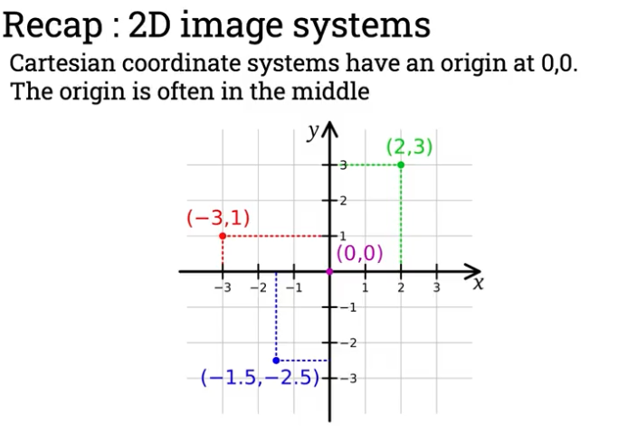

Cartesian coordinates are a system for pinpointing the position of a point in a plane using two numbers, represented as (x, y). Uses horizontal and vertical axes to define the location of points in 2d space. Developed by René Descartes.

