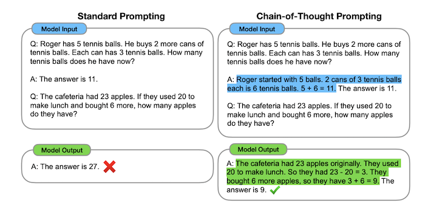

**Chain-of-Thought Prompting** is a technique for prompting which encourages the model to think through a problem before returning an answer. Within an [[Reflection](reflection.md)](agentic-reasoning.md) frameworks, it's considered part of [Planning](planning.md).

Described in paper [Chain-of-Thought Prompting Elicits Reasoning in Large Language Models](../../../reference/chain-of-thought-prompting-elicits-reasoning-in-large-language-models.md).

