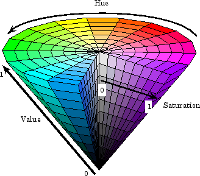

**HSV** or **Hue Saturation Value** is a [Colour Space](colour-space.md) alternate to [RGB](rgb.md).

The HSV colour space corresponds better to how people experience colour than the RGB colour space does. For example, this colour space is often used by people who select colours, such as paint or ink, from a colour wheel or palette.

The Hue (H) corresponds to the colour's position on a colour wheel and is $[0, 1]$. As H increases, the colours transition from red to orange, yellow, green, cyan, blue, magenta, and finally back to red. Both 0 and 1 indicate red.

Saturation (S) is the amount of hue or departure from neutral. S is in the range $[0, 1]$. As S increases, colours vary from unsaturated (shades of grey) to fully saturated (no white component).

Value (V) is the maximum value among a specific colour's red, green, and blue components. V is in the range $[0, 1]$. As V increases, the corresponding colours become increasingly brighter.

The HSV colour space is an inverted cone, where hue relates to the angle, saturation to the radius, and value to the height from the origin. White is at the origin, and white is at the furthest point along the value axis.



Image from [Understanding Color Spaces and Color Space Conversion](https://au.mathworks.com/help/images/understanding-color-spaces-and-color-space-conversion.html) by [Mathworks](https://au.mathworks.com/).

Implementation:

```js
class RGB2HSV extends Transform {
    getLabel() {
        return "RGB to HSV";
    }

    processPixel(img, imgOut, x, y, index) {
        // Normalise r, g, b between 0 and 1
        let r = img.pixels[index] / 255;
        let g = img.pixels[index + 1] / 255;
        let b = img.pixels[index + 2] / 255;

        // Get max and min values
        let max = Math.max(r, g, b);
        let min = Math.min(r, g, b);

        // Calculate Value (V)
        let v = max;

        // Calculate Saturation (S) and prevent division by 0.
        let s = (max === 0) ? 0 : (max - min) / max;

        // Calculate Hue (H)
        let h;

        // Hue is undefined for monochrome
        if (s === 0) {
            h = 0;
        } else {
            // Calculate R', G' and B'.
            let delta = max - min;
            let r_prime = (max - r) / delta;
            let g_prime = (max - g) / delta;
            let b_prime = (max - b) / delta;

            if (r === max && g === min) h = 5 + b_prime;
            else if (r === max && g !== min) h = 1 - g_prime;
            else if (g === max && b === min) h = r_prime + 1;
            else if (g === max && b !== min) h = 3 - b_prime;
            else if (r === max) h = 3 + g_prime;
            else h = 5 - r_prime;

            // Convert to degrees
            h *= 60;

            // Convert degrees to 0-255 range for display.
            h = (h / 360) * 255;
        }

        // Set pixels to HSV values
        imgOut.pixels[index] = h;
        imgOut.pixels[index + 1] = s * 255;
        imgOut.pixels[index + 2] = v * 255;

        // Keep original alpha value
        imgOut.pixels[index + 3] = img.pixels[index + 3];
    }
}
```
