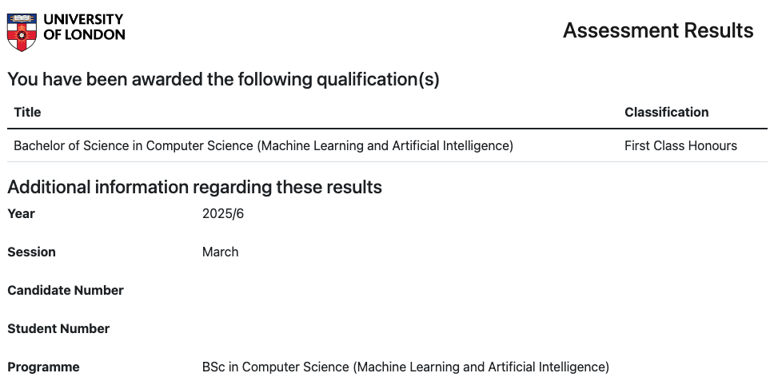
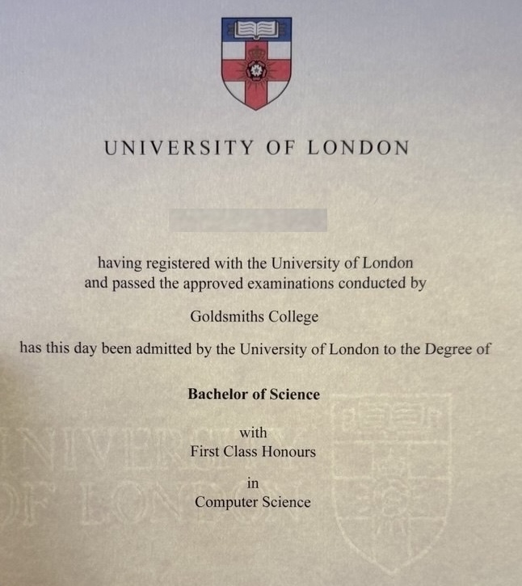
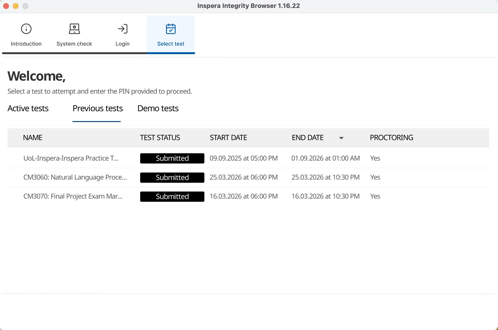

In September 2022, I impulsively signed up for a [Bachelor's Degree in Computer Science](https://www.coursera.org/degrees/bachelor-of-science-computer-science-london) after seeing an ad for it on Coursera. Getting a degree had been on my mind for quite some time, after a long career without one, but I wasn't sure how to go about it. And now, about 3 years and 9 months later (with the last 3 of those months spent waiting for my results), I've finally completed my degree - entirely after hours whilst working full-time.

This article is a brief write-up of my experience.

## My Background

My degree-less tech career spans nearly 21 years, with about 14 of those as a software developer and MLE. I left high school early as a teenager; I was ready to enter the workforce and become independent as early as possible. I got into tech through certifications like MCP, MCSA, and A+ (they were all the rage back then), which was enough to land a helpdesk job at 18. From there, I followed my interests, which eventually led to software engineering and, later, a focus on machine learning.

So far, my lack of a degree hasn't been a barrier to my career. I've heard from colleagues that Australia tends to value experience and attitude over formal education, whereas the opposite can be true overseas, so maybe I got lucky in that respect. I'd go as far as to say that being "self-taught" is typically seen as a positive by employers, provided you appear to have actually taught yourself the skills needed to do the job. That said, I'm not really "self-taught" - I think "self-educated" is a better term. I've collected the skills I've needed for the jobs I wanted via MOOCs (shouts to David J. Malan's [CS50](https://pll.harvard.edu/course/cs50-introduction-computer-science), Andrew Ng's [ML courses](https://www.deeplearning.ai/) and Jeremy Howard's [fastai](https://www.fast.ai/)), certificates, books, and Kaggle. I've always had something to put in the Education section of my resume. I've written before about my opinion that [Software Development is a Trade](software-development-is-a-trade.md), and that education makes sense interspersed with work experience. Of course, I acknowledge that my journey makes me quite biased here.

However, a lack of a degree has impacted my ability to work overseas. In my younger years, I made it to the final rounds of an interview with a US company I was interested in, only to learn that the E-3 visa, an Australia-US-specific agreement, requires at least a Bachelor's Degree. Though I have no intention of working overseas at the moment, it's nice to have the option.

I also genuinely love learning, and I was interested in identifying my knowledge gaps. And it's also an excuse to test out the [Zettelkasten Method](zettelkasten.md) on a real study problem.

Finally, I'm not getting any younger. I sometimes wonder if I should have got my degree in my 20s. Now, as I approach my 40s, I don't want to be saying the same thing about my 30s.

## About The Degree

The degree is done 100% remotely.

It's hosted on Coursera - that's where you watch the lectures, and where they host the class resources, such as lab notebooks and quizzes. Coursera also provides forums to chat with teaching staff (which are rarely used), and this is how you upload your assignments.

The program is run by the University of London Worldwide, its distance-learning arm. And Goldsmiths, University of London, marks the assignments and exams.

The exams themselves are done remotely using [Inspera proctoring software](https://inspera.com/inspera-proctoring/). I've heard from other students that before COVID, people actually went to local teaching centres for their exams. There was also a short window between COVID and early 2023, when the exams were unproctored - you just had 4 hours to complete them once started, open web/book. But I guess the success of LLMs forced their hand to add proctoring.

I'm sure there are similar degrees out there. I didn't shop around for alternatives, I'll be honest. But I was already familiar with the Coursera platform, and the offering suited my lifestyle nicely.

## Prerequisites and Performance-Based Admission

The [course prerequisites](https://www.london.ac.uk/study/how-apply/am-qualified) stipulate a high school diploma. However, they offer an alternate route called Performance-Based Admission (PBA). Basically, you sit two modules (Introduction to Programming I and one of the math modules), and if you pass both, you're allowed to enter the full degree. The modules count towards your final grades, so it's not wasted time, and you get a good sense of whether the program is for you.

## Cost

Another thing that worked for me was paying for the modules as you go. For me in Australia, a module currently costs £823 (about A$1,600), and the final project counts as a double module, with some small extras.

The University publishes the total programme cost as ranging from £14,666 to £21,829, depending on your country of residence and pace of study. My total comes to roughly £17,000, or around A$33,000, spread over 3.5 years. I was able to replace 3 modules with Coursera courses that require only a subscription, further saving money (see the Recognition of Prior Learning section below).

Since this is education that's directly applicable to my career, it's also tax-deductible in my country. The ATO allows you to claim [self-education expenses](https://www.ato.gov.au/individuals-and-families/income-deductions-offsets-and-records/deductions-you-can-claim/education-training-and-seminars/self-education-expenses) when the study "maintains or improves the specific skills or knowledge you require for your current work activities". A Computer Science degree while working as a software engineer clears that bar, at least according to my accountant.

## Workload

Just because it's online doesn't mean it's easy. Even if you're a software veteran, like myself and many of the other students, familiarity with the corpus helps, but you still have to do the work.

Each module has mandatory midterm assignments, followed by either a final exam or a final assignment. The assignments are often long and challenging, and the exams are pretty tough too.

They allow you to take up to 4 modules per session (or 2 plus the final project), plus a retake, and you have to complete them in 6 years, which requires a minimum of about 2 modules per session. After completing the PBA, I took an average of about 3 modules per session, getting the RPL certificates (see below) in between sessions. In one of my final sessions, I took on 4 modules - some of the hardest ones in the course - which was very tough, but doable.

Many ambitious students opt to complete 4 modules straight through, and I think the fastest possible time to complete the course is 3 years flat.

Generally, I found that during the weeks leading up to midterms and exams, the degree would consume most of my free time. The workload ramped up significantly from the earlier to the later modules, with the last 2 sessions easily the hardest. There were some really intense periods in my life when I would wake up at 4am, complete a four-hour exam, work through the day, and then work on assignments at night.

## Recognition of Prior Learning

The university does offer [Recognition of Prior Learning](https://www.london.ac.uk/study/how-apply/recognition-prior-learning/recognition-accreditation-prior-learning-bsc-computer-science) substitutes if you've studied equivalent modules elsewhere. They also have a few Coursera certificates that can replace entire modules, which only require a Coursera subscription. I replaced three modules this way:

* How Computers Work, with the [Google IT Support Professional Certificate](https://www.coursera.org/professional-certificates/google-it-support)
* Data Science, with the [IBM Data Science Professional Certificate](https://www.coursera.org/professional-certificates/ibm-data-science)
* Machine Learning and Neural Networks, with the [IBM AI Engineering Professional Certificate](https://www.coursera.org/professional-certificates/ai-engineer)

I interspersed these with my regular modules. I finished the Google certificate (about 3 months at 10 hours a week) in April 2023, just as my first session wrapped up. The two IBM certificates I completed back-to-back in July 2024, in the lull after midterms, while also taking three regular modules. Together, they shaved a whole session off my degree. Note that the list of recognised qualifications has changed since I did it, so check the current page.

## Course Breakdown

The topics are pretty typical of a Bachelor's Degree in Computer Science, no surprises. Some math, although less than an engineering degree, and most things are quite hands-on.

There were quite a few interesting projects as coursework. Some highlights include some audio visualisers; a couple of JavaScript games (including a pool game simulation, which you were encouraged to put a twist on); a DJ simulator built with JUCE; an evolutionary algorithms project inspired by Karl Sims' 1994 [*Evolving Virtual Creatures*](https://youtu.be/JBgG_VSP7f8); an interesting collection of signal processing exercises; a few different research projects based around scraping and analysing web data; and, finally, the open-ended final project, where I built a breast-cancer detection mammography classifier that trains and runs end-to-end on Apple Silicon (see [cm3070-final-project](https://github.com/lextoumbourou/cm3070-final-project)).

Here's my vinyl DJ simulator in action:

<video controls loop><source src="/_media/bachelors-after-hours/vinyl-dj-simulator.mp4" type="video/mp4"></video>

And the pool table game with rodents that could be killed for bonus points (not something I endorse in the real world):

<video controls loop><source src="/_media/bachelors-after-hours/pool-table-mouse.mp4" type="video/mp4"></video>

Here's the full path I took:

| Session  | Modules                                                                                                                                       | RPL certificates (on the side)                                                                 |
| -------- | --------------------------------------------------------------------------------------------------------------------------------------------- | ---------------------------------------------------------------------------------------------- |
| Oct 2022 | Introduction to Programming I, Discrete Mathematics                                                                                           | Google IT Support (replaced How Computers Work)                                                |
| Apr 2023 | Introduction to Programming II, Computational Mathematics, Web Development                                                                    |                                                                                                  |
| Oct 2023 | Fundamentals of Computer Science, Algorithms and Data Structures I, Software Design and Development                                           |                                                                                                  |
| Apr 2024 | Object-Oriented Programming, Programming with Data, Graphics Programming                                                                      | IBM Data Science (replaced Data Science), IBM AI Engineering (replaced Machine Learning and Neural Networks) |
| Oct 2024 | Computer Security, Algorithms and Data Structures II, Databases, Networks and the Web                                                         |                                                                                                  |
| Apr 2025 | Professional Practice for Computer Scientists, Databases and Advanced Data Techniques, Artificial Intelligence, Intelligent Signal Processing |                                                                                                  |
| Oct 2025 | Natural Language Processing, Final Project                                                                                                    |                                                                                                  |

If you want to look at some of the module content, the student community maintains a couple of great resources: [world-class/notes](https://github.com/world-class/notes), a student-run repo where people post their course notes, and [world-class/REPL](https://github.com/world-class/REPL), a collection of course material and resources.

There's also a [spreadsheet](https://docs.google.com/spreadsheets/d/1vyRqV4BVxZx9nVJvLJtUYI19aAgChu-4aPunoVS7uAg/edit#gid=507585853) someone made that breaks down each module's difficulty and other metrics, as ranked by former students.

## The Best Parts

One of my favourite parts of the course was working with the other students. Coursera invites you into a student Slack workspace, which is basically a Lord of the Flies-style free-for-all, with no apparent official representation of any kind.

Some students took it upon themselves to run the Slack with an iron fist, reprimanding people for posting in the wrong channel. Some alumni hang out on Slack, helping students and answering questions. Other former students haunt the Slack channels, posting intermittent trolls. It's all pretty chaotic and hilarious.

On top of that, there's a culture of high-achieving students sharing videos and screenshots of their assignments, some of which were really impressive, which would motivate me to do my best work.

There are really fascinating people from all over the world, with interesting, roundabout career stories like mine. One fellow student completed her degree during the war in Ukraine. Another student taught herself web development and ran her own studio to self-fund her education. Another student gave birth twice during the degree, managed to complete the BSc while working a full-time job as a teacher, and somehow also completed a master's. And there's my friend Django, who's been completing his degree from a refugee camp in Uganda, powering his laptop off a solar panel and studying on mobile data. His story turned into a saga of its own: [Shipping a Laptop to a Refugee Camp in Uganda](shipping-a-laptop-to-a-refugee-camp-in-uganda.md).

Whenever I felt like I was doing it tough, there were many people in much, much tougher circumstances to bring me down to earth.

## The Worst Parts

My #1 complaint is how long it takes to get grades: about 3 months. So you're usually getting your midterm grades right around the time you're about to submit the finals. Way too long to incorporate the feedback usefully.

If you fail a module, you can resit just the part you failed. But because final grades are released well after the next session has started, you might end up waiting an entire year before you can resit. This has proved to be the biggest frustration for course participants.

Group projects were also a common source of complaints. You were randomly assigned a group, but it was often unclear if the participants were even doing the course - many people were in completely ghost groups. I had a decent group for the one group project subject I took. However, we did have the unpleasant experience of one of the members showing up in the last week, and we basically had no choice but to cut him in without him doing any work. Although they've since changed the syllabus, only one subject has a mandatory group project now, and it's just the midterms - not too bad.

The Coursera platform could also use many quality-of-life improvements. It's often out of sync with the actual program and unaware that exams are completed outside Coursera. Submitting everything requires uploading multiple files, including videos, and there's no way to edit your submission without reuploading everything. So if you spend 30 minutes uploading a video and then find a typo in the report, you have to start again.

Inspera is also quite difficult software, with many false positives causing it to suddenly shut down midway through the exam. With only 4 hours to complete the exam and the threat of a one-year wait to try again, it's a very anxiety-inducing experience.

They do have extra support people on during exam times, for live assistance. But outside of that, getting in touch with real people can be slow. I had a result that didn't come through when everyone else's did, and it took a few weeks to get resolved. Not a terrible turnaround, just one extra thing to be anxious about.

## Tips

A few things that worked for me:

1. **Start early on your assignments, and submit often.** I like to get a version of my assignment done end-to-end that could conceivably be a pass, then just keep iterating from there. As soon as I knew what the assignment was, I'd start making progress and submit drafts as I went, which took a lot of the stress off the deadline.
2. **Check and triple-check your submissions.** A very common mistake people make is not to check that they submitted everything correctly. I would create a checklist for my project submissions, take a screenshot of the submission screen, and even log the S3 URLs for all uploaded assets, just in case.
3. **Find a study time that works for you and be consistent.** For me, it's the early morning. I usually had to work late, so I rarely found time to study after work; instead, I'd go to bed early and get a few hours in before the workday started.
4. **Do the blocker subjects first.** Some subjects must be passed before you can progress to the next level (at Level 5, the key ones are Object-Oriented Programming and Software Design and Development). You really want to de-risk your studies by getting these done early. If you're forced to resit, it can really block your progress and add wasted sessions to your degree.
5. **Read the regulations closely.** Especially the Admission Notice, which only comes via email and includes updated rules, exam dates and other important information for each exam.
6. **Read the pins in Slack.** People have taken great care to share useful information, including a lot of guidance on what to do when something goes wrong.

## AI Policy and The Evolution of LLMs

I started my degree one month before ChatGPT was launched, so it's been quite interesting to watch the degree evolve as LLM capabilities have changed. At the start of my degree, I wrote a little article about [Disputing a Parking Fine with ChatGPT](disputing-a-parking-fine-with-chatgpt.md), a few weeks into ChatGPT's launch, which I thought was kind of cool at the time, but now it seems so pathetically trivial that it makes me laugh.

Firstly, they introduced exam proctoring and have progressively locked it down, recently removing cheatsheets, presumably to prevent people from generating them with an LLM or smuggling in a second screen. They used to allow people to complete the exam at their convenience within a 24-hour window, but recently changed that so that people in each hemisphere take the exam at the same time.

LLMs also had a noticeable effect on the amount of conversation in the course channels. When I started, there was a lot of chatter, with people asking questions about the material and checking their understanding of topics, but that has noticeably declined. It seems people prefer to ask their questions to an LLM.

In Feb 2025, about 2.5 years into my degree, the uni launched an official AI policy. Basically, submitting LLM-generated work without acknowledgement is treated as contract cheating, the same category as paying someone to write your essay:

> "Submitting work which has been produced by software, or as the result of providing prompts or queries to any third-party service, either in full or in part and without acknowledgement, is a form of contract cheating. This includes the use of Large Language Model/AI chatbots." - General Regulation 7.9

They also introduced a three-level framework for AI in assessment: Level Zero means no AI at all; Level One allows supportive use like brainstorming and structuring, as long as you declare it; and Level Two actually *requires* you to use AI, for example, generating an output with it and then critiquing the result.

I can only imagine the difficulty of being an educator in the age of AI - trying to strike a balance between preventing students from outsourcing their whole education to an LLM, and the reality that AI is almost certainly going to be part of their professional life.

## Summary

While it's been a hard 3 and a half years, particularly on my wife, family and friends, who were definitely neglected, it's really nice to finally have a degree. Some of the topics, especially the math subjects, I would never have studied on my own. I'm glad I did. My other fellow students were some of the most interesting people I've ever met, and I hope I've made some friends for life. Aside from a few minor grievances (things that will hopefully improve over time), I loved the experience.