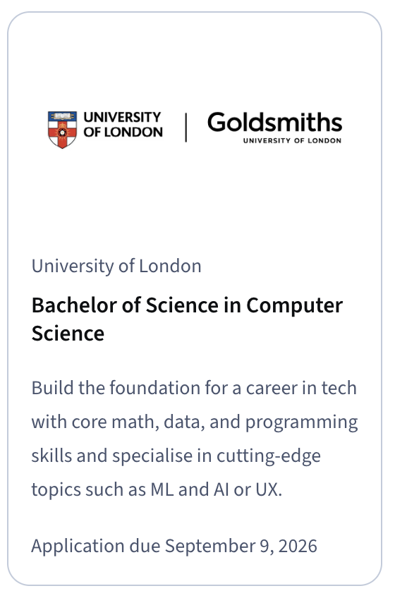

In September 2022, I impulsively signed up for a [Bachelor's Degree in Computer Science](https://www.coursera.org/degrees/bachelor-of-science-computer-science-london) after seeing an ad for it on Coursera. Getting a degree had been on my mind for quite some time, after a long career without one, but I wasn't sure how to go about it. And now, about 3 years and 9 months later (with the last 3 of those months spent waiting for my results), I've finally completed my degree - with First Class Honours.

This article is a brief write-up of my experience.

## My Background

My degree-less tech career spans nearly 21 years, with about 14 of those as a software developer. I left high school early as a teenager; it's a story for another day, but basically, I was ready to enter the workforce and become independent as early as possible. I did have a desire to work in tech (it seemed like a better option than the jobs I had at KFC and a mattress factory), completed a series of certifications like MCP, MCSA, and A+ (they were all the rage back then), which was enough to get my first helpdesk job at the age of 18. I followed my interests throughout my career, which eventually led to software engineering and, later, a focus on machine learning.

So far, my lack of a degree hasn't been a barrier to my career. I've heard from colleagues that Australia tends to value experience and attitude over formal education, whereas the opposite can be true overseas, so I like to think I got lucky in that respect. I'd go as far as to say that being "self-taught" is typically seen as a positive by employers, provided you appear to have actually taught yourself the skills needed to do the job. That said, I'm not really "self-taught" per se. My education has been a bit more piecemeal, learning the things I thought I needed via MOOCs (big shout-outs to David J. Malan's CS50 and Jeremy Howard's fastai), certificates, books, and Kaggle. I've always had something to put in the Education section of my resume. I also believe software is a career that should be treated like a trade, with work interspersed with education (see [Software Development is a Trade](software-development-is-a-trade.md)). Of course, I acknowledge my own journey biases me here.

However, a lack of a degree has impacted my ability to work overseas. In my younger years, I made it to the final rounds of an interview with a US company I was interested in, only to learn that the E-3 visa, an Australia-US-specific agreement, requires at least a Bachelor's Degree. Though I have no intention of working overseas at the moment, it's nice to have the option.

I also genuinely love learning, and I was interested in identifying my knowledge gaps. And it's also an excuse to test out the [Zettelkasten Method](zettelkasten.md) on a real study problem.

Finally, I'm not getting any younger. I sometimes wonder if I should have got my degree in my 20s. Now, as I approach my 40s, I don't want to be saying the same thing about my 30s.

## About The Degree

The degree is done 100% remotely.

It's hosted on Coursera - that's where you watch the lectures, and where they host the class resources, such as lab notebooks and quizzes. Coursera also provides forums to chat with teaching staff (which are rarely used), and this is how you upload your assignments.

The program is run by the University of London Worldwide, its distance-learning arm. And Goldsmiths, University of London, marks the assignments and exams.

The exams themselves are done remotely using Inspera proctoring software. I've heard from other students that before COVID, people actually went to local teaching centres for their exams. There was also a short window in 2022, where the exams were unproctored - you just had 4 hours to complete them, open book. But I guess LLMs forced their hand to add proctoring.

I didn't shop around for alternatives, I'll be honest. There might be better choices. But I was already familiar with the Coursera platform, and the offering suited my lifestyle nicely.

## Prerequisites and Performance-Based Admission

The course prerequisites stipulate a [high school diploma](https://www.london.ac.uk/study/how-apply/am-qualified). However, they offer an alternate route called Performance-Based Admission. Basically, you sit two modules (Introduction to Programming I, plus one of the math modules), and if you pass them both, you're allowed to enter the full degree. The modules are counted towards your final grades, so it's not wasted time, but you get a good sense of whether the program is for you.

## Cost

Another thing that worked for me is that you pay for the modules as you go. For me in Australia, a module currently costs £823 (about A$1,600), and the final project counts as a double module, with some small extras, like a £31 proctoring fee and an £11 admin fee per exam.

The University publishes the total programme cost as between £14,666 and £21,829, depending on your country of residence and pace of study. My total comes to roughly £17,000, or around A$33,000, spread over 3.5 years. I was able to replace 3 modules with Coursera courses that require only a subscription, further saving money (see the Recognition of Prior Learning section below).

Since this is education that's directly applicable to my career, it's also tax-deductible in my country. The ATO allows you to claim [self-education expenses](https://www.ato.gov.au/individuals-and-families/income-deductions-offsets-and-records/deductions-you-can-claim/education-training-and-seminars/self-education-expenses) when the study "maintains or improves the specific skills or knowledge you require for your current work activities". A Computer Science degree while working as a software engineer clears that bar, at least according to my accountant.

## Workload

Just because it's remote doesn't mean it's easy. Even if you're a software veteran, like some of us (alumni working at FAANG companies and tech leads at large companies), familiarity with the corpus helps, but you still have to do the work.

Each module has mandatory midterm assignments, followed by either a final exam or a final assignment. The assignments are often long and challenging. The exams are no picnic either.

They allow you to take up to 4 modules per session (or 2 plus the final project), plus a retake, and you have to complete them in 6 years, which requires about 2 modules per session.

Generally, I found that during the weeks surrounding midterms and exams, the degree would consume most of my free time, especially when I was taking 3 or more modules. The workload ramped up significantly from the earlier to the later modules, with the last 2 sessions easily the hardest. There were some really intense periods of my life where I would wake up at 4am, complete a four-hour exam, work through the day, then work on an assignment at night.

## Recognition of Prior Learning

The university does offer [Recognition of Prior Learning](https://www.london.ac.uk/study/how-apply/recognition-prior-learning/recognition-accreditation-prior-learning-bsc-computer-science) substitutes if you've studied equivalent modules elsewhere. They also have a few Coursera certificates that can replace entire modules, which only require a Coursera subscription. I replaced three modules this way:

* How Computers Work, with the [Google IT Support Professional Certificate](https://www.coursera.org/professional-certificates/google-it-support)
* Data Science, with the [IBM Data Science Professional Certificate](https://www.coursera.org/professional-certificates/ibm-data-science)
* Machine Learning and Neural Networks, with the [IBM AI Engineering Professional Certificate](https://www.coursera.org/professional-certificates/ai-engineer)

I managed to complete these in between my midterms, which shaved a whole session off my degree. Note that the list of recognised qualifications has changed since I did it, so check the current page.

## Course Breakdown

The topics are pretty typical of a Bachelor's Degree in Computer Science, no surprises. Some math, although less than an engineering degree, and most things are quite hands-on.

I worked on a few interesting projects, including a vinyl record simulation for Object-Oriented Programming, a pool table for Graphics Programming, an evolutionary algorithms project (inspired by Karl Sims' 1994 [*Evolving Virtual Creatures*](https://youtu.be/JBgG_VSP7f8)), and [my final project](https://github.com/lextoumbourou/cm3070-final-project): a breast-cancer detection mammography classifier that trains and runs end-to-end on Apple Silicon.

Here's the vinyl DJ simulator in action:

<video controls loop><source src="/_media/bachelors-after-hours/vinyl-dj-simulator.mp4" type="video/mp4"></video>

Here's the full path I took:

| Session   | Modules                                                                                                                                       |
| --------- | --------------------------------------------------------------------------------------------------------------------------------------------- |
| Oct 2022  | Introduction to Programming I, Discrete Mathematics                                                                                           |
| Apr 2023  | Introduction to Programming II, Computational Mathematics, Web Development                                                                    |
| Oct 2023  | Fundamentals of Computer Science, Algorithms and Data Structures I, Software Design and Development                                           |
| Apr 2024  | Object-Oriented Programming, Programming with Data, Graphics Programming                                                                      |
| Oct 2024  | Computer Security, Algorithms and Data Structures II, Databases, Networks and the Web                                                          |
| Apr 2025  | Professional Practice for Computer Scientists, Databases and Advanced Data Techniques, Artificial Intelligence, Intelligent Signal Processing |
| Oct 2025  | Natural Language Processing, Final Project                                                                                                    |
| RPL       | How Computers Work, Data Science, Machine Learning and Neural Networks                                                                        |

If you want to dig deeper into the modules, the student community maintains a couple of great resources: [world-class/notes](https://github.com/world-class/notes), a student-run repo where people post their course notes, and [world-class/REPL](https://github.com/world-class/REPL), a collection of course material and resources. There's also a [spreadsheet](https://docs.google.com/spreadsheets/d/1vyRqV4BVxZx9nVJvLJtUYI19aAgChu-4aPunoVS7uAg/edit#gid=507585853) someone made that breaks down each module's difficulty and other metrics, as ranked by former students.

## The Best Parts

One of my favourite parts of the course was working with the other students. Coursera invites you into a student Slack workspace, which is basically a Lord of the Flies-style free-for-all, with no apparent official representation of any kind.

Some students took it upon themselves to run the Slack with an iron fist, reprimanding people for posting in the wrong channel.

In fact, for many people, their first experience meeting fellow students was a rude message in `#general` for their introduction, when it clearly should have been posted in `#intros`.

And yet, there are really fascinating people from all over the world, and many in the industry, like me. Some worked through the war in Ukraine. One of my friends was funding her education while running her own web development studio. And there's my friend Django, who's been completing his degree from a refugee camp in Uganda, powering his laptop off a solar panel and studying on mobile data. His story turned into a saga of its own: [Shipping a Laptop to a Refugee Camp in Uganda](shipping-a-laptop-to-a-refugee-camp-in-uganda.md).

One of my fellow students took 4 modules every semester and, in her words, "gave birth twice in this degree, lost both my grandparents along the way, and I'm still doing the same 4, working a full-time job as a teacher and have already completed my master's in Jan 2025 (I started it 4 months into this degree)."

People would share their assignments, and some of them were really impressive. We would motivate and push each other to do our best work.

## The Worst Parts

My #1 complaint is how long it takes to get grades: about 3 months. So you're usually getting your midterm grades right around the time you're about to submit the finals. Way too long to incorporate the feedback usefully.

The Coursera platform could also use many quality-of-life improvements. It's often out of sync with the actual program and unaware that exams are completed outside Coursera. Submitting everything requires uploading multiple files, including videos, and there's no way to edit your submission without reuploading everything. So if you spend 30 minutes uploading a video and then find a typo in the report, you have to start again.

Getting in touch with support is also really hard. I had a result that didn't come through when everyone else's did, and it took a few weeks to get resolved.

## Tips

A few things that worked for me:

1. **Start early on your assignments, and submit often.** I like to get a version of my assignment done end-to-end that could conceivably be a pass, then just keep iterating from there. As soon as I knew what the assignment was, I'd start making progress and submit drafts as I went, which took a lot of the deadline stress away.
2. **Find a study time that works for you.** For me, it's the early morning. I usually had to work late, so I rarely found time to study after work; instead, I'd go to bed early and get a few hours in before the workday started.
3. **Read the regulations closely.** Especially the Admission Notice, which only comes via email: it has your exam dates and your candidate number, which changes every session.
4. **Read the pins in the Slack.** People have taken great care to share useful information, including a lot about what to do when something goes wrong.

## AI Policy and The Evolution of LLMs

I started my degree one month before ChatGPT was launched, so it's been quite interesting to watch the degree evolve as LLM capabilities have changed.

Funnily enough, I wrote a little article about [Disputing a Parking Fine with ChatGPT](disputing-a-parking-fine-with-chatgpt.md) a few weeks into ChatGPT's launch, which I thought was kind of cute at the time, but now it seems so pathetically trivial it makes me laugh.

Firstly, they introduced proctoring and have progressively locked it down, recently removing cheatsheets, presumably to prevent people from generating them with an LLM or smuggling in a second screen. They used to allow people to complete the exam at their convenience within a 24-hour window, but recently changed that so that people in each hemisphere take the exam at the same time.

LLMs also had a noticeable effect on the amount of conversation in the course channels. When I started, there was a lot of chatter, with people asking questions about the material and a conversation ensuing, but that has noticeably declined. More people prefer to ask their questions to an LLM.

In Feb 2025, about 2.5 years into my degree, the uni launched an official AI policy. Basically, submitting LLM-generated work without acknowledgement is treated as contract cheating, the same category as paying someone to write your essay:

> "Submitting work which has been produced by software, or as the result of providing prompts or queries to any third-party service, either in full or in part and without acknowledgement, is a form of contract cheating. This includes the use of Large Language Model/AI chatbots." - General Regulation 7.9

After that, they introduced a three-level framework for AI in assessment. Level Zero means no AI at all (think locked-down browser exams). Level One means you can use it for brainstorming and structuring, as long as you declare it. And Level Two means the assessment actually *requires* you to use AI, for example, generating an output with it and then critiquing the result.

I can only imagine the difficulty of being an educator trying to strike a balance between preventing people from totally phoning in submissions with AI and the reality that AI is almost certainly going to be part of someone's professional life.

## Summary

While it's been a hard 3 and a half years, particularly on my wife and friends, who were definitely neglected, it's really nice to finally have a degree. Some of the topics, especially the math subjects, I would never have studied on my own. I'm definitely better for it. My other fellow students were some of the most interesting people I've ever met, and I hope I've made some friends for life. Aside from a few annoyances (things that will hopefully improve over time), I loved every minute of my experience.

Thanks, team UoL.