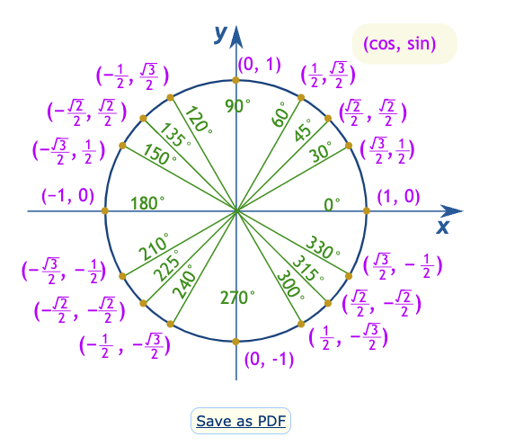
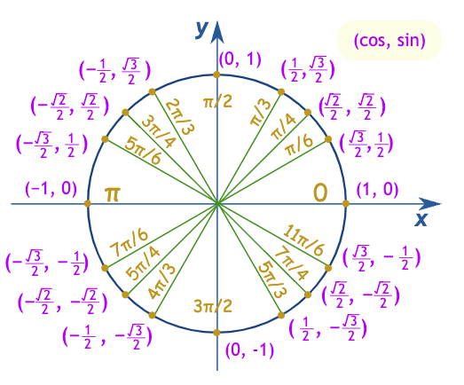

## 1. Number bases

### Decomposing number basis

#### Base 10

$327_{10} = (3 \times 10^2) + (2 \times 10^1) + (7 \times 10^0)$

| $10^2$ | $10^1$ | $10^0$ |
| -----| ----- | ----|
| 3   | 2   | 7   |

#### Base 2

$101_{2} = 1 \times 2^2 + 0 \times 2^1 + 1 \times 2^0$

| $2^2$ | $2^1$ | $2^0$ |
| ----- | ----- | ----- |
| 1     | 0     | 1     |

### Powers of 2

| power of 2      |     |
| ----- | --- |
| $2^0$   | 1   |
| $2^1$ | 2   |
| $2^2$ | 4   |
| $2^3$ | 8   |
| $2^4$ | 16   |
| $2^5$ | 32   |
| $2^6$ | 64   |
| $2^7$ | 128   |
| $2^8$ | 256   |
| $2^9$ | 512   |
| $2^{10}$ | 1024   |

### Converting from Binary to Decimal

$1101_2 = 1(2^3) + 1(2^2) + 0 + 1(2^0) = 8 + 3 + 1 = 12$

### Converting from Decimal to Binary

Convert 102 to binary.

|     | Remainer |
| --- | -------- |
| $102 \div 2 = 51 \ r \ 0$    | 0         |
| $51 \div 2 = 25 \ r \ 1$    | 1         |
| $25 \div 2 = 12 \ r \ 1$    | 1         |
| $12 \div 2 = 6 \ r \ 0$    | 0         |
| $6 \div 2 = 3 \ r \ 0$    | 0         |
| $3 \div 2 = 1 \ r \ 1$    | 1         |
| $1 \div 2 = 0 \ r \ 1$    | 1         |

From bottom up:

$1100110_2$

### Power of 8

| power of 8 |     |
| ---------- | --- |
| $8^0$        |  1   |
| $8^1$        |  8   |
| $8^2$        |  64   |
| $8^3$        |  512   |
| $8^4$        |  4096   |
| $8^5$        |  32768   |

### Repeated division in base 8

1001_10 in base 8:

|                       | Remainder |
| --------------------- | --------- |
| $1001 \div 8 = 125 \ r \ 1$ | 1          |
| $125 \div 8 = 15 \ r \ 5$ | 5          |
| $15 \div 8 = 1 \ r \ 7$ | 7          |
| $1 \div 8 = 0 \ r \ 1$ | 1          |

Working backwards: $1751_8$

### Any base

#### Convert to decimal

$325_n = 3(n^2) + 2(n^1) + 5(n^0)$

### Hexadecimal

| Decimal | Hexadeciaml |
| ------- | ----------- |
| 0       | 0           |
| 1       | 1           |
| 2       | 2           |
| 3       | 3           |
| 4       | 4           |
| 5       | 5           |
| 6        |     6        |
| 7        |     7        |
| 8        |     8        |
| 9        |     9        |
| 10        |     A        |
| 11        |     B        |
| 12        |     C        |
| 13        |     D        |
| 14        |     E        |
| 15        |     F        |

### Non-integer decomposition

$$
\begin{align}
17.375_{10} =& (1 \times 10^1) + (7 \times 10^{0}) + (3 \times 10^{-1}) + (7 \times 10^{-2}) + (5 \times 10^{-3}) \\
=& 10 + 7 + 3/10 + 7/100 + 5/1000 \\
\end{align}
$$

### Convert decimal to binary

17.375

Separate integer and decimal.

$17_{10} = 10001_{2}$

Fractional part:

0.375 x 2 = 0.75 = 0 + 0.75 -- take integral and fractional remainer
0.75 x 2 = 1.5 = 1 + 0.5
0.5 x 2 = 1.0 = 1 + 0 -- stop at 0 remainer.

Read integer part from top to bottom.

0.375 = .011

### Binary to decimal

$1101.101_2 = (1 \times 2^3) + (1 \times 2^2) + 0 + (1 \times 2^0) + (1 \times 2^{-1}) + (0 \times 2^{-2}) + (1 \times 2^{-3})$

### General bases

$a_n a_{n-1} a{n-2} ... a_0 . c_{-1} c_{-2} ... c_{-k}$

### Operations

Addition

101_2 + 111_2 = ?

Similar to decimal sum in column divide by two carry over quotient and take the remainder

101
111

## 2. Sequences and series

Sequence = a set of numbers written in a particular order.
Series = the sum of all values in the sequence.

### Arithmetic progression

* Add a fixed amount to previous term: 1, 4, 7, 10
    * Fixed amount = common difference.

### Geometric sequence

* Multiply by fixed amount of 5, starting from 2 : 2, 10, 50, 250, 1250
    * Fixed amount = common ratio

### Partial series

$S_n = \sum\limits_{n}^{i=1} a_n$

The sum of the values of the sequence up to $n$.

### Divergent/convergent series

Take the limit of the partial series $S_n$ as $n \rightarrow n$

## 3. Modular arithmetic

## 4. Angles, triangles and trigonometry

### Triangles

All angles must add to $180°$ ($\pi$ radians).

180° = A + B + C

### [Law Of Cosines](law-of-cosines.md)

$c^2 = a^2 + b^2 + 2ab \times \cos(\theta)$

### [Law of Sines](law-of-sines.md)

$\frac{\sin A}{a} = \frac{\sin B}{b} = \frac{\sin C}{c}$

[Law of Sines](law-of-sines.md)

* [Similar triangles](similar-triangles.md)

### Trig Functions

$\sin = \text{y coordinate where angle intercepts unit circle}$
$\cos = \text{x coordinate where angle intercepts unit circle}$

$\tan = \frac{\sin}{\cos}$

### Properties

$\sin(180°, -\alpha) = \sin(\alpha)$
$\cos(180°, -\alpha) = -\cos(\alpha)$

$\sin(180°, +\alpha) = -\sin(\alpha)$
$\cos(180°, +\alpha) = -\cos(\alpha)$

$\sin(360°, -\alpha) = -\sin(\alpha)$
$\cos(360°, -\alpha) = \cos(\alpha)$

### [Trig Angle Identities](trig-angle-identities.md)

$\sin^2a + \cos^2a = 1$

Therefore:

$\cos^2a = 1 - \sin^2a$

$\sin^2a = 1 - \cos^2a$

The [Sine](../journal/permanent/sine.md) of two angles added together identity is as follows:

$\sin(a + b) = \sin(a)\cos(b) + \sin(b)\cos(a)$

And subtraction:

$\sin(a - b) = \sin(a)\cos(b) - \sin(b)\cos(a)$

The [Cosine](permanent/cosine.md) of two angles:

$\cos(a + b) = \cos(a)\cos(b) - \sin(a)\sin(b)$

And subtraction:

$\cos(a - b) = \cos(a)\cos(b) + \sin(a)\sin(b)$

### Cosine Properties

[Cosine](permanent/cosine.md) is an [Even Function](../journal/permanent/even-function). Meaning, any negative inputs are equal to the equivalent positive input.

$\cos(-c) = \cos(c)$

We can use the angle sum definition of $a + a$ to defined $\cos(2a)$:

$\cos(2a) = \cos(a + a) = \cos(a)\cos(a) - \sin(a)\sin(a) = \cos^2(a) - \sin^2(a)$

Or simply:

$\cos(2a) = \cos^2(a) - \sin^2(a)$

We can express entirely in terms of $\cos$ Using the Fundemantla Identity:

Since we know

$\sin^2(a) = 1 - \cos^2(a)$

Then

$= \cos^2(a) - (1 - \cos^2(a))$
$= \cos^2(a) - 1 + cos^2(a))$
$= 2\cos^2(a) - 1$
$= \cos(2a)$ (need to understand this part)

#### Cosine Reduction Identity

$2\cos^2a = \cos 2a + 1$

$\cos^2a = \frac{1}{2} (1 + \cos 2a)$

### Sine Properties

[Sine](../journal/permanent/sine.md) is an [Odd Function](../journal/permanent/odd-function). Meaning, any negative inputs are equal to the negative value of the function.

$\sin(-c) = -\sin(c)$

Domain of $\sin^{-1}(x)$: $−1 \le x \le 1$ because sin only returns between -1 and 1.

#### Sine Reduction Identity

$2\sin^2a + \cos 2a = 1$
$2\sin^2a = 1 - \cos 2a$
$\sin^2a = \frac{1}{2} (1 - \cos 2a)$

#### Pythagorean theory

When it's a right-triangle, the angle $\theta = 90°$. From the unit circle above, we can see $\cos(90°) = 0$, so the $2ab \times cos(\theta)$ is simply 0. Therefore:

When $\theta = 90°$:
    $c^2 = a^2 + b^2$

## 5. Graph sketching and kinematics

[SUVAT Equations](../journal/permanent/suvat-equations.md)

$s$ = displacement in metres m
$u$ = initial velocity in meters per seconds
$v$ = final velocity in meters per second
$a$ = acceleration in meters per second per second
$t$ = time in seconds s

1\. $s = \frac{u+v}{2} t$

Displacement is average of initial velocity and final velcocity over time (assumes constant acceleration).

2. $v = u + at$

Final velocity is initial velocity plus acceleration times time.

3. $s = ut + \frac{1}{2}at^2$

Displacement refers to amount it would have travelled based on initial velocity + the area under the curve (to check).

4. $v^2 = u^2 + 2as$

---

## 6. Trigonometric functions

## 7. Exponential and Logarithmic functions

Log: if $\log_a y = x$ then $y = a^x$

Remember: the exponent base is the same value as the log base.

Laws:

$\log A + \log B = \log AB$ (given they are all the same base)
$\log A  - \log B = \log (\frac{A}{B})$
    Note this means that $\log A - \log A = \log (\frac{A}{A}) = \log 1$
Power rule: $\log A^n = n \ \log A$

## 8. Limits and differentiation

* [Function](function.md#Continuity) Continuity

A function is continuous at a point x = c under the following conditions:

* f(c) is defined.
* The limit of f(x) as x approaches c exists.
* The limit of f(x) as x approaches c is equal to f(c).

That is, $\lim_{x \rightarrow c} f(x) = f(c)$

A function is discontinuous at a point x = c if any of the above conditions are not met.

A function might only have discontinuatities specific internals

Some special cases apply:

* Polynomials are always continuous.
* Rational functions: Continuous when the denominator is not zeo.
* Trig functions: continuous on their domain.
* Exponential and log functions: continuous when defined.

---

[Chain Rule](Chain%20Rule)

$\frac{d}{dx}[f(g(x))] = f^{\prime}(g(x)) \cdot g^{\prime}(x)$

Example:
Differential $e^{-x}$

1. Outer function with respect to inner function:

$\frac{d}{du} [e^{u}] = e^{u}$

Since a fundamental property of the exponential function $e^{u}$ is that its derivate to itself.

2. Inner function $u = -x$ with respect to $x$:

$\frac{du}{dx} = -x^{1} = 1 \cdot -x^{0} = -1$

3. Multiply results together

$\frac{d}{dx} [e^{-x}] = e^{-x} \cdot (-1) = -e^{-x}$

Result:

Derivate of $e^{-x}$ with respect to $x$ is $-e^{-x}$

[product-rule](product-rule.md)

$(fg)' = f'g + fg'$
Example:
$f(x) = x^2e^{-x}$
$f(x) = (x^2)'e^{-x} + x^2(e^{-x})'$

## 9. Algebra, Vectors and Matrices

Quadratic formula:
Given: $ax^2 + bx + c = 0$, $x = \frac{-b \pm \sqrt{b^2 - 4ac}}{2a}$

Calculating the [Matrix Determinate](matrix-determinate.md) of a 2d matrix.

$A = \begin{bmatrix}a & b \\ c & d\end{bmatrix}$

$\det(A) = ad - cb$

Calculating the [Matrix Inverse](matrix-inverse.md) of a 2d matrix.

$A^{-1} = \frac{1}{\det(A)} \begin{bmatrix}d & -b \\ -c & a\end{bmatrix}$

"swap a and b", "negate -b and -c"

[Solving Systems of Equations using Inverse Matrix](Solving%20Systems%20of%20Equations%20using%20Inverse%20Matrix)

3x + 8y = 5
4x + 11y = 7

$\begin{bmatrix}3 & 8 \\ 4 & 11\end{bmatrix} \begin{bmatrix}x \\ y\end{bmatrix} = \begin{bmatrix}5 \\ 7\end{bmatrix}$

$A\vec{x} = \vec{v}$
$A^{-1}A\vec{x} = A^{-1}\vec{v}$
$\vec{x} = A^{-1}\vec{v}$

$A^{-1} = \frac{1}{det(A)} \begin{bmatrix}11 & -8 \\ -4 & 3\end{bmatrix}$
$A^{-1} = \frac{1}{ad-bc} \begin{bmatrix}11 & -8 \\ -4 & 3\end{bmatrix}$
$A^{-1} = \frac{1}{33-32} \begin{bmatrix}11 & -8 \\ -4 & 3\end{bmatrix}$
$A^{-1} = \frac{1}{1} \begin{bmatrix}11 & -8 \\ -4 & 3\end{bmatrix}$
$A^{-1} = \begin{bmatrix}11 & -8 \\ -4 & 3\end{bmatrix}$

$\vec{v} = \begin{bmatrix}11 & -8 \\ -4 & 3\end{bmatrix} \begin{bmatrix}5 \\ 7\end{bmatrix} = \begin{bmatrix}(11 \times 5) + (-8 \times 7) \\ (-4 \times 5) + (3 \times 7)\end{bmatrix} = \begin{bmatrix}55 - 56 \\ -20 + 21 \end{bmatrix} = \begin{bmatrix}-1 \\ 1\end{bmatrix}$

**Answer**

$\begin{bmatrix}-1 \\ 1\end{bmatrix}$

## 10. Combinatorics and Probability

Permutations = Position matters

$P(n, r) = \frac{n!}{(n - r)!}$

Combinations = Choose without concern for order

$C(n, r) = \frac{n!}{(n-r)!r!} = \frac{P(n, r)}{r!}$

### Compound Probability of independent events

The product of the individual events.

Example: What is the probability that the die shows an odd number and the coin shows a head.

$P(\text{odd dice}) = \frac{3}{6} = \frac{1}{2}$
$P(\text{head coin}) = \frac{1}{2}$
$P(\text{odd and head}) = \frac{1}{2} \times \frac{1}{2} = \frac{1}{4}$
