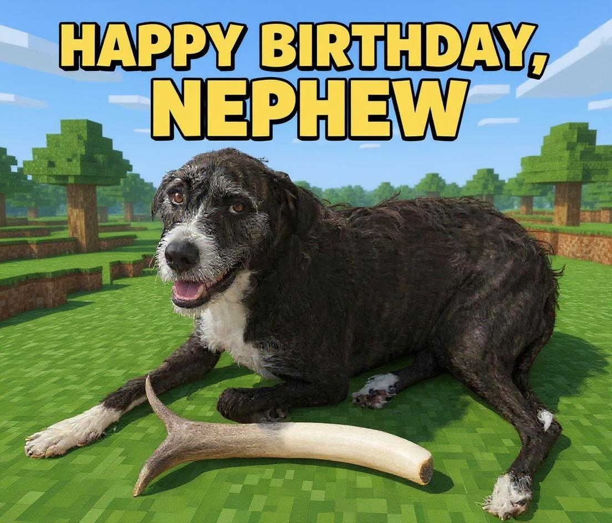
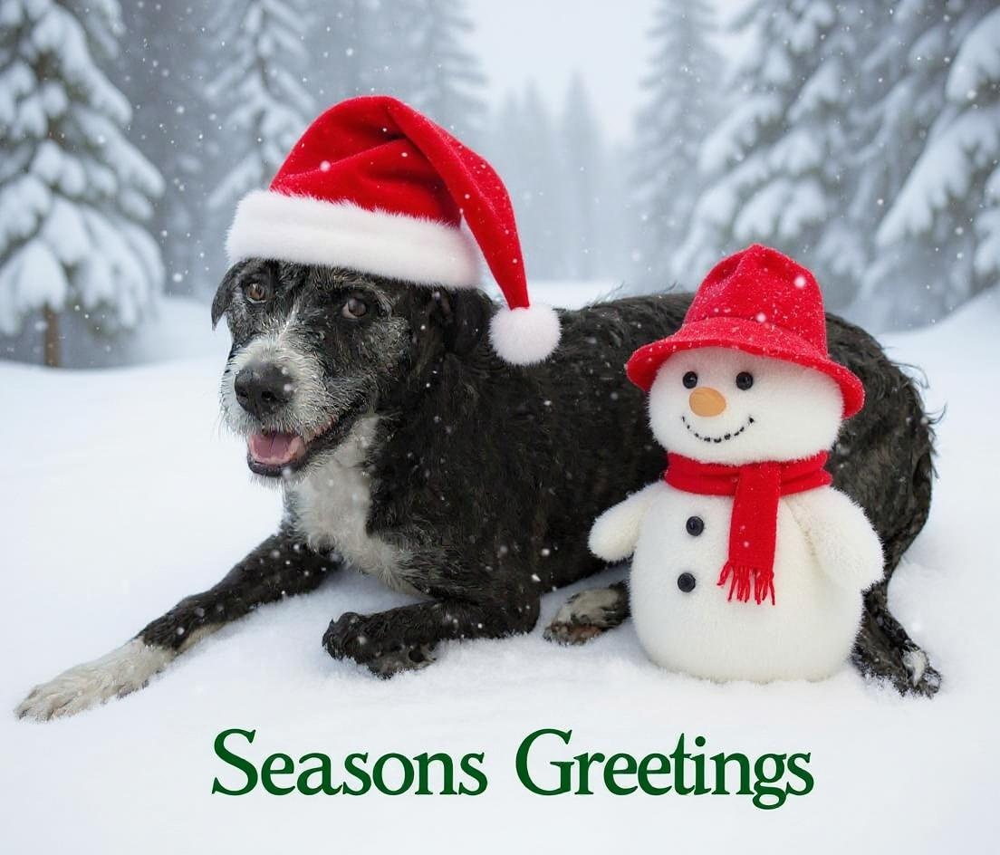
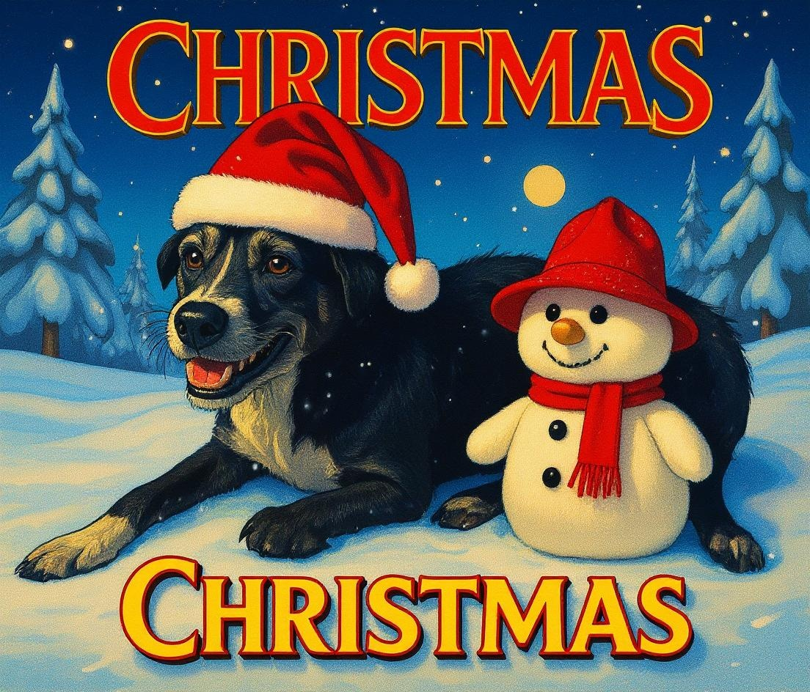
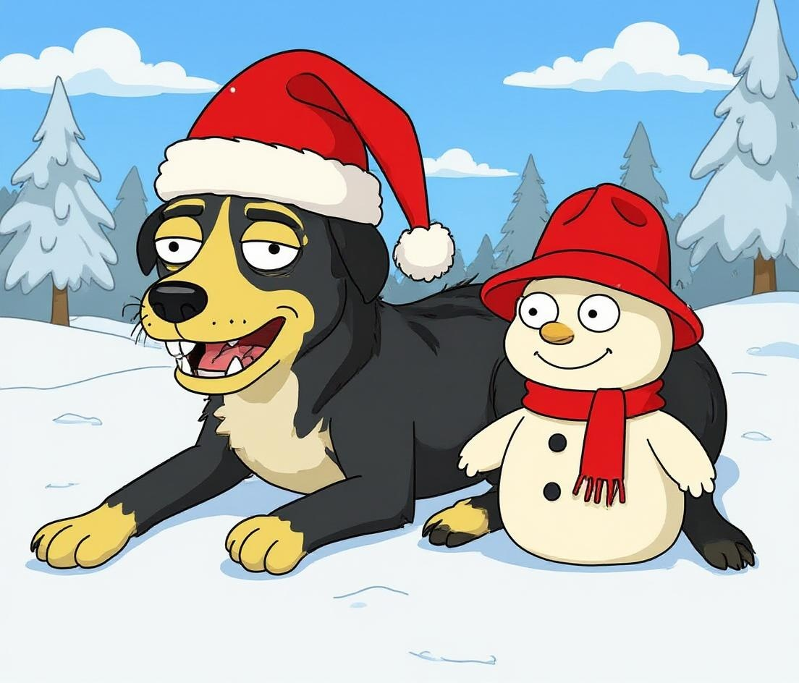
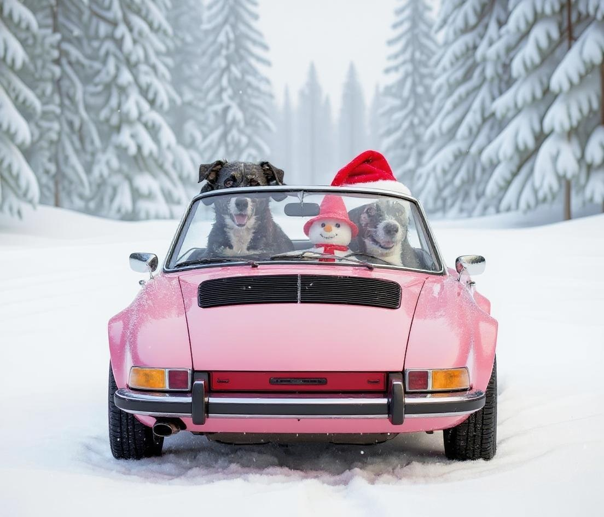

This new editing model from Black Forest Labs, FLUX.1: Kontext is really good.

You can read my paper summary here: [FLUX.1 Kontext: Flow Matching for In‑Context Image Generation and Editing in Latent Space](../reference/papers/flux1-kontext-flow-matching-for-in-context-image-generation-and-editing-in-latent-space.md)

Although GPT Image is still one of the <a href="https://notesbylex.com/imagen-4-is-faster-but-gpt-is-still-the-goat">best image models out there</a>, it is pretty limited in its ability to edit, characters get lost, and there's usually unrelated changes returned in the images, at least in my experience.

On the other hand, FLUX.1: Kontext maintains a high-quality level of text-to-image quality but with an absurdly good ability to edit photos.

One remarkable thing about it is how it can maintain character consistency through many edits. It does not need the context of the chain of images, and it does not have any in-painting, but the character consistency is really astounding; even after many rounds of editing, I found that the source character remained.

To test out the character consistently, I found the most recently taken photo of my dog, Doggo.

She recently had TPLO surgery on each of her legs in two separate staggered surgeries due to some painful arthritis. She is fully recovered now and doing much better.

However, for the first two weeks after surgery, our poor puppy had to wear a giant cone, which she hated.

Let's see if Flux.1: Kontext can remove the cone from poor Doggo's head

> "remove the cone from my dog's head"

That works remarkably well. If you look close enough, you can see the artifact where the cone was, but that's my dog, alright.

One amazing thing about the Kontext model is its ability to do multi-turn editing. Using the most recent output as input, let's see if we can make my poor Dog look like her usual happy self:

> "make my dog look happy"

Admittedly, I had to try this a few times before I got something that looked convincing like this. One of them made her head too big, and the other did some weird stuff with her ears.

Anyway, that's pretty happy! I don't think she's ever quite smiled like that, but it's close.

Now, to maximise her happiness, I move her to one of her favourite places in the world: 

> "change the background to a sunny beach scene."

Finally, to achieve peak happiness, I put her favourite toy next to her:

> "add an antler bone in front of her"

Even after four rounds of editing, it still looks exactly like Doggo - really impressive stuff.

She looks so happy; I think this could be a birthday card.

My nephew's birthday is coming up, and he loves Minecraft. So I'll try turning it into a Minecraft-themed bday.

> Change background to minecraft. Write "Happy Birthday, Nephew" in bright, colorful text on top of the image.

Looking pretty good, albeit a little distorted.

It's June, but still, it's never too early to be thinking about Christmas. It is coming into winter in the Southern Hemisphere, after all.

> change text to "Seasons Greetings" with a Christmas font. Convert into a snowy background. Remove antler. Add a snowman next to her. Add a Christmas hat on top.

Amazing. Now we're seven edits deep, and it still looks like my Doggo. Granted, we've started to see some artifacts, and there's some roughness around the edges, but this is looking good.

Now, to try a few different styles.

<table style="width:100%; table-layout: fixed;">
  <tr>
    <td style="text-align:center; vertical-align:top;">
       
      90s Christmas Movie poster
    </td>
    <td style="text-align:center; vertical-align:top;">
       
      Watercolour illustration
    </td>
    <td style="text-align:center; vertical-align:top;">
       
      Simpsons style
    </td>
  </tr>
</table>

Back to the original Christmas Card, the paper demonsates even more incredible global edits, like adding multiple characters, and rotating camera angles.

Let's experiment with some of that.

> Remove text. There are now two dogs driving in a pink convertible.

I mean, that kind of works. I think it's still my dog in the driver's seat. I assume, in this example, the snowman is driving the car.

I tried the prompt "Watch them from behind.", which is actually given as an example in the paper. Apparently, that's NSFW.

I tried a similar prompt:

> "turn the camera to watch them from the back"

Not sure exactly what's going on here, but it has turned the car around, but all the faces have followed the camera. I'm also getting bad [Loab](https://en.wikipedia.org/wiki/Loab)-like vibes from the images now.

Now, the showcase of all the edits:

<table style="width:100%; table-layout: fixed;">
  <tr>
    <td style="text-align:center; vertical-align:top;">
       
      Source image
    </td>
    <td style="text-align:center; vertical-align:top;">
       
      1. "remove the cone from my dog's head"
    </td>
    <td style="text-align:center; vertical-align:top;">
       
      2. "make my dog look happy"
    </td>
    <td style="text-align:center; vertical-align:top;">
       
      3. "change the background to a sunny beach scene"
    </td>
  </tr>
  <tr>
    <td style="text-align:center; vertical-align:top;">
       
      4. "add an antler bone in front of her"
    </td>
    <td style="text-align:center; vertical-align:top;">
       
      5. "Change background to minecraft. Write 'Happy Birthday, Nephew' in bright, colorful text on top of the image."
    </td>
    <td style="text-align:center; vertical-align:top;">
       
      6. "change text to 'Seasons Greetings'. Convert into a snowy background. Remove antler. Add a snowman next to her. Add a Christmas hat on top."
    </td>
    <td style="text-align:center; vertical-align:top;">
       
      7. "Remove text. There are now two dogs driving in a pink convertible."
    </td>
  </tr>
</table>

It's a very impressive model indeed. One might even say they cooked.