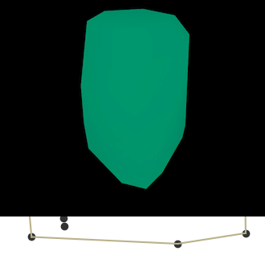
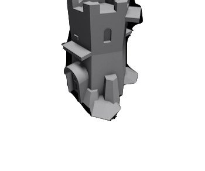
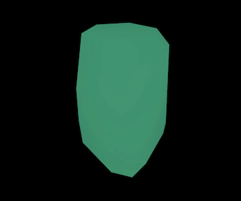
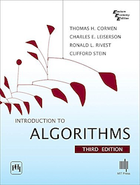

The **Convex Hull** is the smallest polygon that contains a set of points.

Think of some nails poking out of a board. If you place a rubber band around all nails, the polygon shape the rubber band makes is the convex hull.

One real-world application in game programming is **Collision Detection**. Since computing collisions can be expensive, a convex hull is calculated around the 3d model of an object to provide an approximate collision region, reducing the number of computations required.

This example from the Roblox docs shows the collision region for a 3d model with the `Hull` collision option.

| Original Mesh                       | **Hull Collision Region**                                        |
| ----------------------------------- | --------------------------------------- |
|  |  |

*This example of a 3d model to its hull collision model comes from the [Roblox docs](https://create.roblox.com/docs/workspace/collisions#mesh-and-solid-model-collisions).*

---

## Recommended Reading

[Introduction to Algorithms, Third Edition](https://amzn.to/3HyDauB)

**Chapter 1** has an introduction to Convex Hull. **Chapter 33** details some algorithms for computing Convex Hulls
