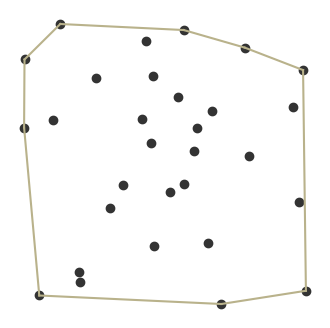
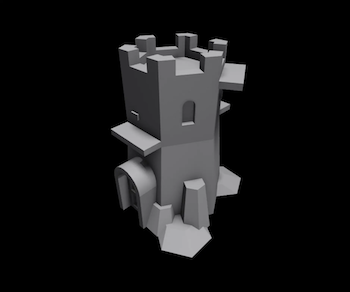

The **Convex Hull** is the smallest polygon that contains a set of points.

Think of some nails on a board. If you were to place a rubber band around them all, the **Convex Hull** would be the polygon shape the rubber band makes.

One real-world application in game programming is [[Collision Detection]]. Since computing collisions can be expensive, a convex hull is calculated around the 3d model of an object to provide an approximate box for detecting character collisions, reducing the number of computations required.

This example from the Roblox docs shows the collision region for a 3d model with the `Hull` collision option.

| Original Mesh                       | **Hull**                                        | 
| ----------------------------------- | --------------------------------------- |
|  |  |
*This example of a 3d model to its hull collision model comes from the [Roblox docs](https://create.roblox.com/docs/workspace/collisions#mesh-and-solid-model-collisions).*

## References

For more about Convex Hulls and algorithms for computing them, see Chapter 33 of [Introduction to Algorithms, Third Edition](https://amzn.to/3HyDauB).

