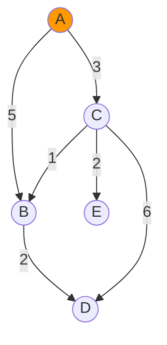
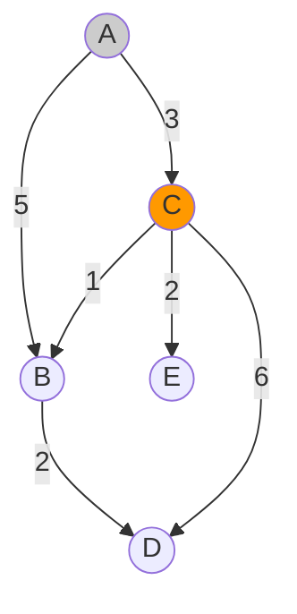
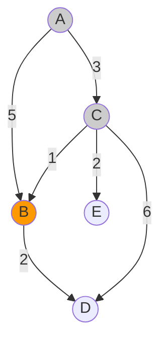
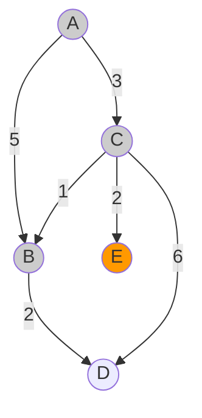
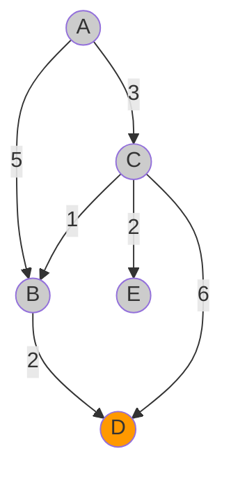
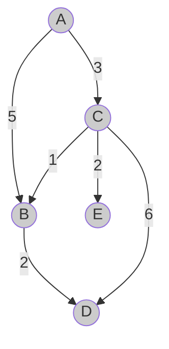

**Dijkstra's Shortest Path Algorithm** provides an efficient way to find the shortest path between nodes in a [Graph Theory](graph-theory.md) with non-negative edge weights. It's widely used in routing protocols, GPS navigation systems, and network optimisation.
## Algorithm Intuition

Imagine a robot navigating through a maze. The robot has no map of the maze but knows that at each intersection (corner) there are checkpoints, which we'll call **nodes**. There are paths between checkpoints, which we'll call **edges**. Each edge has a cost to traverse (like distance or time). Importantly, none of the edges have negative costs.

The robot aims to find the path through the maze with the lowest total cost.

The robot tracks information in two lists:

- **Frontier**: Nodes it plans to visit next
- **Explored**: Nodes it has already visited and processed

Our robot begins at `Node A`.



It first adds node A to the **Explored** list, as it never needs to visit it again. Since we're at the starting point, the current path cost is 0.

**Explored list:**

| Node | Cost | Path |
|------|------|------|
| A    | 0    | A    |

The robot then gathers information about A's neighbors:
- **B** with a cost of 5
- **C** with a cost of 3

Since neither of these nodes is on the **Explored** list, the robot puts both on the **Frontier**. It adds the current cost (0) to the price to reach these nodes.

**Frontier list:**

| Node | Cost | Path |
|------|------|------|
| B    | 5    | A → B |
| C    | 3    | A → C |

The robot decides where to go next by finding the cheapest path in the **Frontier**. It selects C.



Now at C, the robot moves it from the **Frontier** to the **Explored** list. It's impossible to find a cheaper path to C than what we already have because if such a path existed, we would have found it already (a key insight of Dijkstra's algorithm).

**Explored list:**

| Node | Cost | Path |
|------|------|------|
| A    | 0    | A    |
| C    | 3    | A → C |

**Frontier list:**

| Node | Cost | Path |
|------|------|------|
| B    | 5    | A → B |

The robot asks node C for its neighbors:
- **A** with a cost of 3
- **E** with a cost of 2
- **B** with a cost of 1

The robot ignores A since it's already on the **Explored** list. It adds E to the **Frontier** with the new path cost. The robot notices B is already on the **Frontier**, but the path through C is cheaper (A → C → B costs 4, which is less than A → B at 5), so it updates the path to B.

**Frontier list:**

| Node | Cost | Path |
|------|------|------|
| B    | 4    | A → C → B |
| E    | 5    | A → C → E |

The robot scans the **Frontier** for the next destination. B has the cheapest path, so it goes there.



At B, the robot moves it from **Frontier** to **Explored**.

**Explored list:**

| Node | Cost | Path |
|------|------|------|
| A    | 0    | A    |
| C    | 3    | A → C |
| B    | 4    | A → C → B |

**Frontier list:**

| Node | Cost | Path |
|------|------|------|
| E    | 5    | A → C → E |

It examines B's neighbors:
- **A** with a cost of 5 (already explored, so ignored)
- **D** with a cost of 2

The robot adds D to the **Frontier** with a total cost of 6 (4 + 2).

**Frontier list:**

| Node | Cost | Path |
|------|------|------|
| E    | 5    | A → C → E |
| D    | 6    | A → C → B → D |

E now has the lowest cost on the **Frontier**, so the robot visits it next.



The robot adds E to the **Explored** list.

**Explored list:**

| Node | Cost | Path |
|------|------|------|
| A    | 0    | A    |
| C    | 3    | A → C |
| B    | 4    | A → C → B |
| E    | 5    | A → C → E |

**Frontier list:**

| Node | Cost | Path |
|------|------|------|
| D    | 6    | A → C → B → D |

Finally, the robot visits D.



The robot adds D to the **Explored** list.

**Explored list:**

| Node | Cost | Path |
|------|------|------|
| A    | 0    | A    |
| C    | 3    | A → C |
| B    | 4    | A → C → B |
| E    | 5    | A → C → E |
| D    | 6    | A → C → B → D |

All nodes have been visited, and the **Frontier** is empty. The robot has found the shortest path to all nodes from the starting point.



## Code

Let's see how we can implement Dijkstra's algorithm in Python code.

First, we'll represent our graph. A graph can be represented as a dictionary where keys are nodes and values are dictionaries of connected nodes with their edge weights:

```python
maze_graph = {
    'A': {'B': 5, 'C': 3},
    'B': {'A': 5, 'D': 2},
    'C': {'A': 3, 'B': 1, 'D': 6, 'E': 2},
    'D': {'B': 2, 'C': 6},
    'E': {'C': 2}
}
```

We'll create the `frontier` as a dictionary where each node maps to a tuple containing its cost and path:

```python
frontier = {node: (cost, path)}
```

Since we're starting at A, we'll add it to the frontier with a cost of 0:

```python
frontier = {
    'A': (0, ['A'])
}
```

The `explored` dictionary will have the same format.

A key function in our implementation is `get_smallest_node()`, which finds the node with the lowest cost in the frontier:

```python
def get_smallest_node(frontier):
    """Find the node with the lowest cost in the frontier."""
    # Start with infinity as the smallest value
    smallest_node, smallest_value = None, float('inf')

    # Check each node in the frontier
    for node in frontier:
        cost = frontier[node][0]
        if cost < smallest_value:
            smallest_value = cost
            smallest_node = node

    return smallest_node
```

Here's the complete implementation of Dijkstra's algorithm:

```python
def dijkstra_shortest_path(graph, start):
    """
    Find shortest paths from start node to all other nodes using Dijkstra's algorithm.
    
    Args:
        graph: Dictionary of dictionaries representing the graph
        start: Starting node
        
    Returns:
        Dictionary with shortest paths to all nodes
    """
    # Initialize frontier with starting node
    frontier = {
        start: (0, [start])
    }
    
    # Initialize empty explored set
    explored = {}
    
    # Continue until frontier is empty
    while frontier:
        # Get node with smallest cost from frontier
        current = get_smallest_node(frontier)
        
        # Move node from frontier to explored
        current_cost, current_path = frontier.pop(current)
        explored[current] = (current_cost, current_path)
        
        # Check all neighbors of current node
        for neighbor, edge_cost in graph[current].items():
            # Skip if already explored
            if neighbor in explored:
                continue
                
            # Calculate total path cost
            total_cost = current_cost + edge_cost
            
            # Update frontier if neighbor is not in frontier or new path is cheaper
            if (neighbor not in frontier) or (total_cost < frontier[neighbor][0]):
                new_path = current_path + [neighbor]
                frontier[neighbor] = (total_cost, new_path)
    
    return explored

# Function to find smallest node in frontier
def get_smallest_node(frontier):
    """Find the node with the lowest cost in the frontier."""
    smallest_node, smallest_value = None, float('inf')
    
    for node in frontier:
        cost = frontier[node][0]
        if cost < smallest_value:
            smallest_value = cost
            smallest_node = node
            
    return smallest_node
```

### Example Usage

```python
# Define our graph
maze_graph = {
    'A': {'B': 5, 'C': 3},
    'B': {'A': 5, 'D': 2},
    'C': {'A': 3, 'B': 1, 'D': 6, 'E': 2},
    'D': {'B': 2, 'C': 6},
    'E': {'C': 2}
}

# Find shortest paths from node A
shortest_paths = dijkstra_shortest_path(maze_graph, 'A')

# Print results
for node, (cost, path) in shortest_paths.items():
    print(f"Shortest path to {node}: {' → '.join(path)} with cost {cost}")
```

## Optimisations

The implementation above has a time complexity of $O(V^{2})$ where $V$ is the number of vertices (nodes). For larger graphs, this can be improved to $O((V+E) \log V)$ by using a priority queue (like a min-heap) instead of repeatedly scanning the entire frontier for the smallest cost.