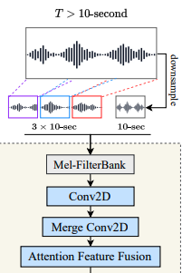

A technique described in paper [Large-scale Contrastive Language-Audio Pre-training with Feature Fusion and Keyword-to-Caption Augmentation](../reference/papers/large-scale-contrastive-language-audio-pre-training-with-feature-fusion-and-keyword-to-caption-augmentation.md), which is a technique for feeding large, variable-length audio into a neural network.

