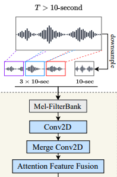

A technique described in paper [Large-scale Contrastive Language-Audio Pre-training with Feature Fusion and Keyword-to-Caption Augmentation](../reference/papers/paper-large-scale-contrastive-language-audio-retraining-with-feature-fusion.md), which is a technique for feeding large, variable-length audio into a neural network.

