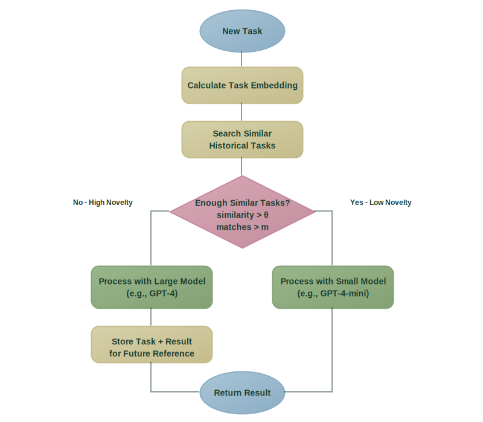

Good idea from this [blog post by Steve Krenzel](https://bits.logic.inc/p/getting-gpt-4o-mini-to-perform-like): **Few-Shot Knowledge Distillation (FSKD)**

A retrieval LLM routing idea where we:

1. Store input/output task embeddings from a high-quality model.
2. For new examples, compute a novelty score: measure how similar the new example is to other examples.
3. Send novel examples to `gpt4o` (or some big, expensive model).
4. Send other examples to `gpt4o-mini` (or some cheaper, lower performance model), but include similar `gpt4o` examples in the prompt (few-shot knowledge distillation).

The novelty score is determined by:

* And the task embedding (T).
- The similarity threshold (θ) - which defines how similar an entry needs to be to be considered a match
- The matches threshold (m) specifies the number of matches that need to be considered "low novelty."

$$
\text{noveltyScore}(T, \theta, m) = \begin{cases}
\text{LOW} & \text{if } |\text{search}(T,\theta)| \geq m \\
\text{HIGH} & \text{otherwise}
\end{cases}
$$

The defaults of $\theta = 0.8$ and m = 3 can be tuned for cost/performance trade-offs.

It's cool because it's self-adapting - if there's [Domain Shift](domain-shift.md) new examples are sent to the larger model until it builds up new examples.

Results on real inventory moderation task:

- 63.4% cost reduction
- Slight improvement over a large model: 90.9% accuracy (vs 87.6% for the large model alone)
- ~69% of tasks handled by a smaller model

