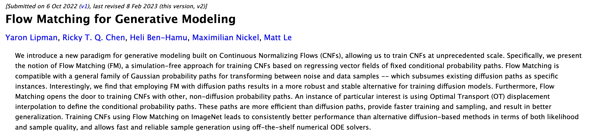
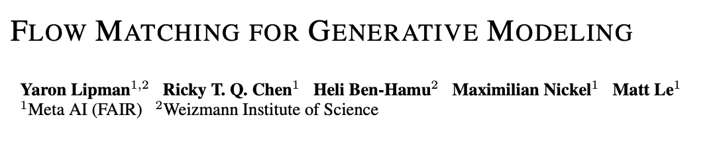
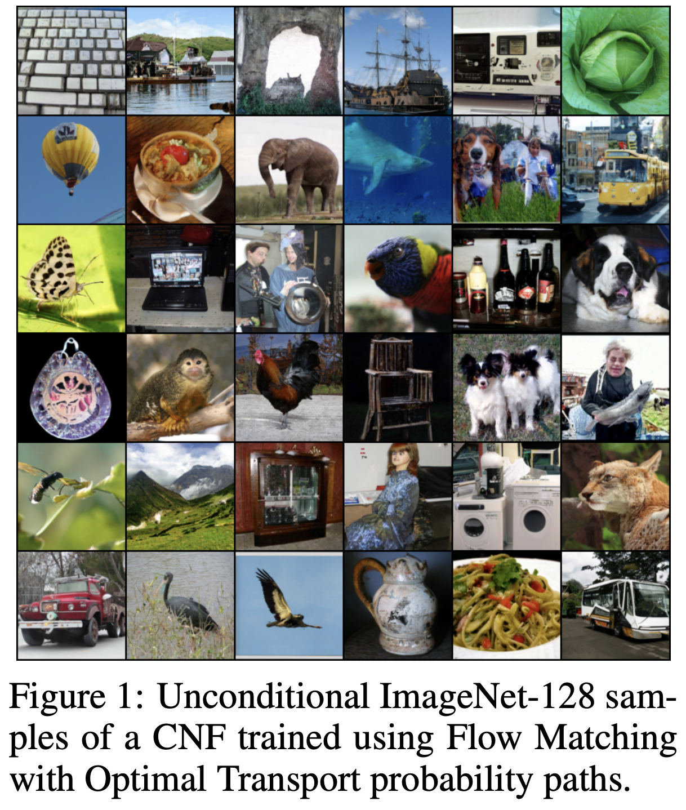
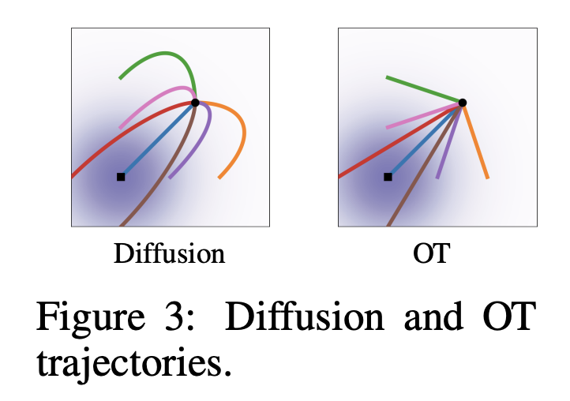
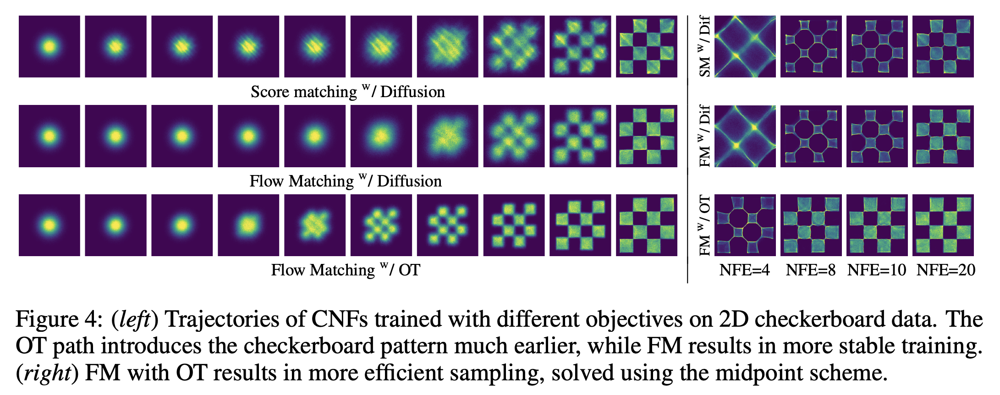

**Flow Matching for Generative Modeling** is a 2022 paper by Yaron Lipman, Ricky T. Q. Chen, Heli Ben-Hamu, Maximilian Nickel and Matt Le ([arXiv](https://arxiv.org/abs/2210.02747)). It introduces Flow Matching, a simulation-free way to train Continuous Normalizing Flows.

Instead of training the flow by simulating an ODE, Flow Matching trains a neural network to regress a vector field that moves samples along a chosen probability path from noise to data. The paths used by [Diffusion Models](diffusion-models.md) are one special case. The paper also proposes optimal transport paths, which are straighter, and found they train faster and need fewer steps to sample.

Flow matching is now used in large image models such as [FLUX.1](flux1.md).

