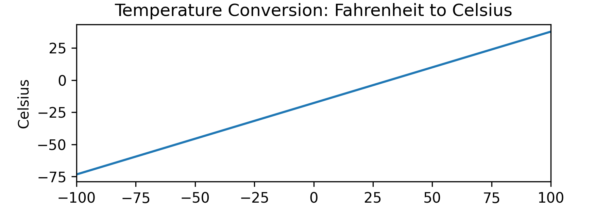

A function is a rule that associates inputs with outputs.

They form the core of many aspects of mathematics and numerous programming languages.

The fundamental explanation of functions comes from [Set Theory](permanent/set-theory.md), in which a function is regarded as the mapping from one set, $A$, to another set, $B$, expressed as:

$f : A \rightarrow B$

Functions are commonly denoted using the letters $f$, $g$, $i$, or $j$.

Consider a function, $f$, that maps a set of people's names to their ages:

* $A = \{\text{Sarah}, \text{Geoff}, \text{Clyde}, \text{Betty}\}$
* $B = \{0, 1, 2, \cdots, 120 \}$
* $f : A \rightarrow B$


The set of possible inputs is called the [Domain of a Function](function-domain.md) or $D_f$:

$\color{lightblue}D_f = A = \{Clyde, Sarah, Geoff, Betty\}$

The set of possible outputs is the <font color="orange"><b> co-domain </b></font> or $co-D_f$ of the function.

$\color{orange}coD_f = B = \{0, 1 ... 120\}$

In this case, the co-domain includes all plausible human ages.

Given the input set $A$, the set of possible outputs is $\{11, 34, 98\}$. This set is known as the <font style="color: darkred"><b>range</b></font> of the function ( $R$ ).

$\color{darkred}R = \{11, 34, 98\}$

To show a single input-output relationship, we could write:

$f(Sarah) = 34$

The output 34 is the function's **image**, and the corresponding input, $Sarah$, is the **pre-image**.

Functions are considered a "well-behaved relation". That means that for each input, there must be exactly one output. This example qualifies as a function because each person has a unique, valid age.

---

We can express functions as the relationship between an input variable and its output. For example, the function to convert temperature in Fahrenheit to Celsius is as follows:

${f(\text{x}) = (x - 32) \times \frac{5}{9}}$

The complete definition of a function should include its **domain** and **co-domain**. Since Fahrenheit and Celsius are real numbers, so we would define the function using the [Special Infinite Set](special-infinite-sets.md) $\mathbb{R}$.

$f : \mathbb{R} \rightarrow \mathbb{R}$

The two parts combined give the complete definition of the function:

Let $f: \mathbb{R} \to \mathbb{R}$, $f(x) = (x - 32) \times \frac{5}{9}$

In programming languages, mixing the type declaration with the implementation is common. Below is an example of the function $f$ in Python. It takes an input $x$ as a `float` and returns a `float`, described using the notation `-> float`.

```python
def f(x: float) -> float:
    return (x -  32) * (5/9)
```

## Plotting Functions

We can create a set of input values and their corresponding outputs, then visualise them geometrically by drawing the inputs and outputs on the x-axis and y-axis, respectively. This visualisation is called a **graph of a function**.

Here is a plot of the Fahrenheit to Celsius function earlier, plotted across a range of inputs: from -100 to 100.



When the graph is a straight line like this, it's called a [Linear Function](linear-function.md). There are other names for common function types:

* [Linear Function](linear-function.md): A function where the output is proportional to the input.
* [Quadratic Function](quadratic-function.md): A function where the output is proportional to the square of the input.
* Exponential Function: A function where the output is proportional to a fixed base raised to the power of the input.
* Polynomial Function: A function that we represent as a sum of terms, each consisting of a constant multiplied by a variable raised to a non-negative integer power. Linear and quadratic functions are specific types of polynomial functions.

---

There are some other important properties of functions:

## One-to-one / Injective

We consider a function "one-to-one" or "injective" if each output is associated with exactly one input and no two different inputs have the same image.

## Onto / Surjective

A function is "onto" or "surjective" if every element in the **co-domain** is output for at least one input in the **domain**.

## Bijective

We call a function Bijective if it is both injective and surjective.

## Continuity

A function is continuous at a point x = c under the following conditions:

* f(c) is defined.
* The limit of f(x) as x approaches c exists.
* The limit of f(x) as x approaches c is equal to f(c).

That is, $\lim_{x \rightarrow c} f(x) = f(c)$

A function is discontinuous at a point x = c if any of the above conditions are not met.

A function might only have discontinuatities specific internals

Some special cases apply:

* Polynomials are always continuous.
* Rational functions: Continuous when the denominator is not zeo.
* Trig functions: continuous on their domain.
* Exponential and log functions: continuous when defined.
