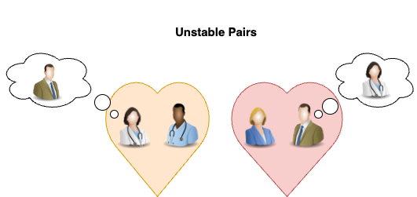

The Gale-Shapley algorithm (also known as **Deferred Acceptance**) solves the **stable matching problem**, where the goal is to match members of two equally sized groups based on their preferences. Gale-Shapley guarantees that all pairs are *stable*; no two pairs would prefer another compared to their assigned match.

Consider a speed dating event; for simplicity of explanation, I'll assume all participants are heterosexual.

At the end of a series of conversations, each man and woman writes their preferences in order.

We want an algorithm that ensures no woman is paired with a man but prefers another man who also prefers her. This pairing is considered **unstable**.



**Gale-Shapely guarantees no unstable pairs.**

The algorithms orchestrate a series of *proposals*. Each woman proposes to their top-choice man. If a man receives multiple proposals, they accept the ones highest on their preference list and reject others. If a woman is rejected, she proposes to her next choice.

The process continues iteratively until all women are matched with partners. It's worst case [Time Complexity](time-complexity.md) is $O(n^2)$

Here, the algorithm is written in Python code. It's commonly executed with a while loop that continues to find proposals until no unmatched pairs exist.

```python
men_preferences = {
    "John": ["Sally", "Jill", "Doris"],
    "Jacob": ["Sally", "Jill", "Doris"],
    "Bob": ["Sally", "Doris", "Jill"]
}

womens_preferences = {
    "Sally": ["John", "Jacob", "Bob"],
    "Jill": ["Jacob", "John", "Bob"],
    "Doris": ["John", "Bob", "Jacob"]
}

def woman_prefers(new_man, current_man, woman_prefs):
    return woman_prefs.index(new_man) < woman_prefs.index(current_man)

def gale_shapley(men_preferences, women_preferences):
    # Initial setup
    n = len(men_preferences)
    free_men = list(men_preferences.keys())
    engaged = {}
    proposed = {man: [] for man in men_preferences}

    while free_men:
        man = free_men[0]
        man_prefs = men_preferences[man]
        woman = next(w for w in man_prefs if w not in proposed[man])
        proposed[man].append(woman)

        if woman not in engaged:
            # Woman is free
            engaged[woman] = man
            free_men.remove(man)
        else:
            # Woman is engaged, check if she prefers this new man
            current_man = engaged[woman]
            if woman_prefers(man, current_man, women_preferences[woman]):
                # Woman prefers new man
                engaged[woman] = man
                free_men.remove(man)
                free_men.append(current_man)
            # Otherwise, do nothing

    return engaged
```

In the real world, the algorithm is used in dating to match medical graduates to residency problems, job/employer matching, and many other places.
