A [Graph Theory](graph-theory.md) is a visual representation of interconnected systems using circles and lines. Circles represent nodes or vertices. Lines represent links or edges. Graphs are used to analyze and solve problems in various interconnected systems.

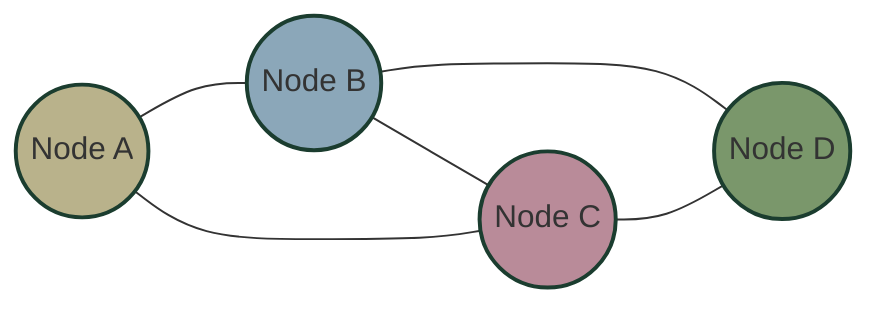

## Historical Origin: The [Seven Bridges of Königsberg](seven-bridges-of-knigsberg.md)

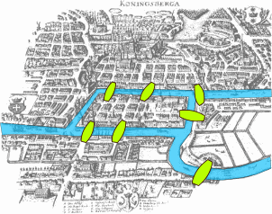

Graph theory originated from a famous mathematical problem in the 18th century in Königsberg (now Kaliningrad, Russia). The city had seven bridges connecting four land areas separated by the Pregel River. The puzzle asked whether it was possible to walk through the city crossing each bridge exactly once.

In 1735, mathematician Leonhard Euler proved this was impossible by abstracting the problem. He represented land masses as points (A, B, C, D) and bridges as lines connecting them, creating what would become the foundation of graph theory.

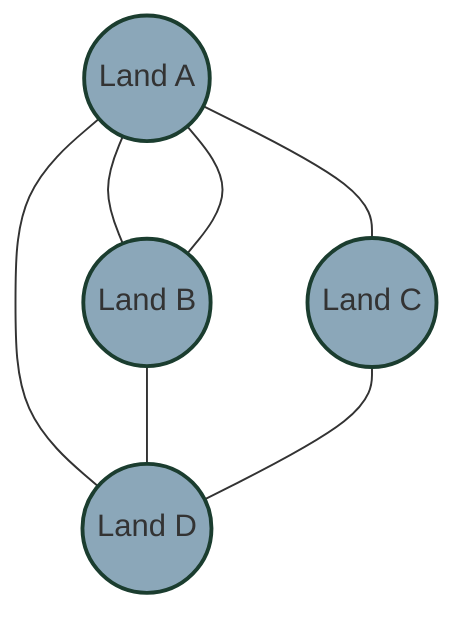

Euler's insight was that for a complete path to exist (crossing each bridge exactly once), each land mass except for the starting and ending points must have an even number of bridges connected to it. Since all four land areas in Königsberg had an odd number of bridges, such a path was impossible.

## Graph Classifications

Graphs can be classified in several ways based on their properties:

### Directed vs. Undirected

#### [Directed Graphs](directed-graphs.md)

In directed graphs, edges have a specific direction indicated by arrows. These represent one-way relationships.

**Examples**: Twitter following relationships, one-way streets in a city map, workflow diagrams

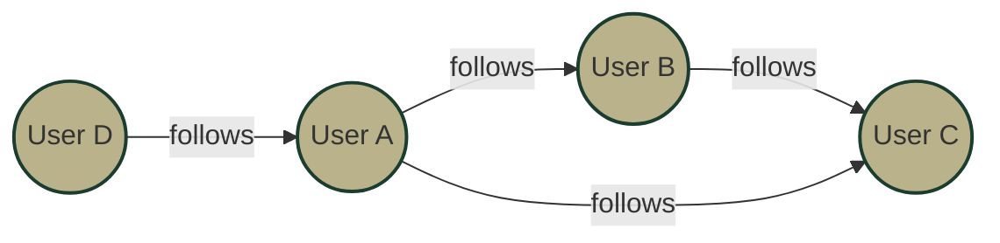

#### [Undirected Graphs](undirected-graphs.md)

In undirected graphs, edges have no direction and represent symmetrical relationships.

**Examples**: Facebook friendships, telecommunication networks, chemical bonds

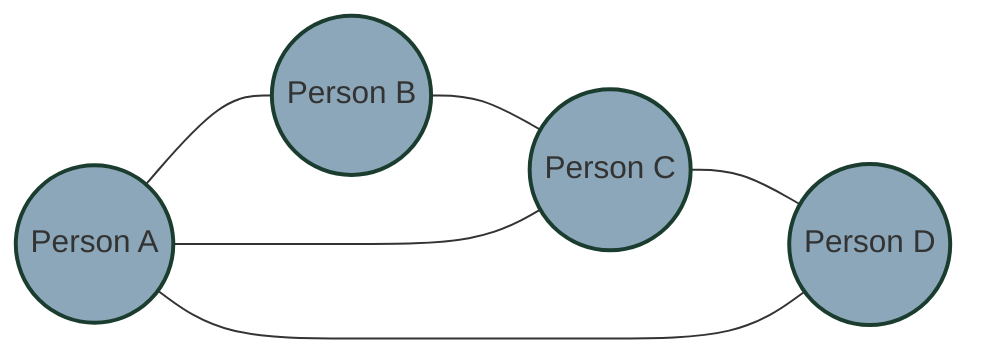

### Weighted vs. Unweighted

#### [Weighted Graphs](weighted-graphs.md)

In weighted graphs, edges have different values or importance attached to them.

**Examples**: Road networks where weights represent distances, communication networks where weights represent bandwidth

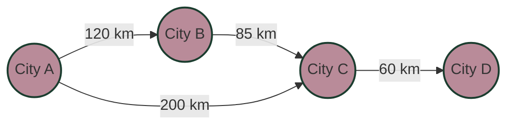

#### Unweighted Graphs
In unweighted graphs, all edges have equal importance.

**Examples**: Simple connection diagrams, logical relationships

## Common Graph Topologies

Graphs come in various standard topologies, each with specific use cases:

### Bus Topology

Nodes are arranged in a line, with each node connected to adjacent nodes.

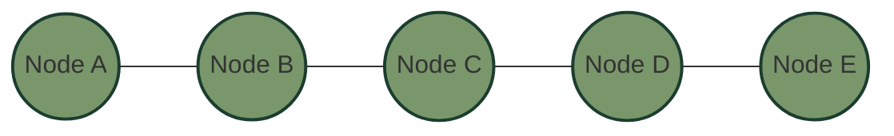

### Ring Topology

Similar to a bus, but the last node connects back to the first, forming a circle.

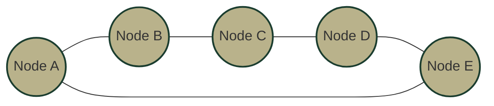

### Tree Topology

Follows a hierarchical tree data structure, with a root node and branches.

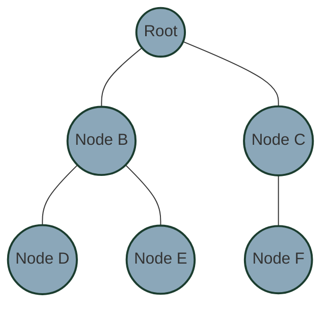

### Regular Manhattan Topology

A grid-like structure resembling city blocks.

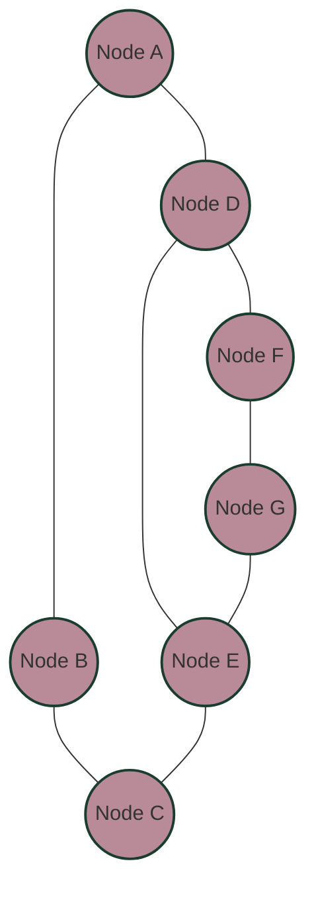

### Arbitrary Mesh Topology

Random interconnected pattern with no specific structure.

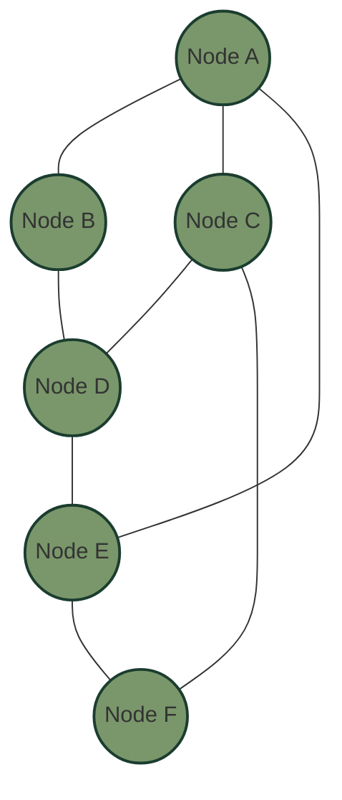

## Real-World Applications

Graphs have countless real-world applications across different domains:

### Literature Analysis

In literature analysis, graphs can represent character interactions. For example, in "Les Misérables," nodes represent characters and edges show interactions between them, revealing the structure of relationships within the novel.

### Movie Plot Mapping

Similar to books, graphs can be used to visualize character interactions in films. For instance, in "The Imitation Game," a graph could show relationships between Alan Turing and other characters, highlighting the central role of certain individuals.

### Computer Networks

In computer networks, nodes represent routers or computers, while edges represent communication links. The 1991 NSFNET (National Science Foundation Network) backbone can be visualized as a graph showing the early structure of what would become the internet.

### Social Networks

Social media platforms use graph theory extensively. Nodes represent people, and edges indicate friendships or following relationships. This helps identify communities, influential users, and information flow patterns.

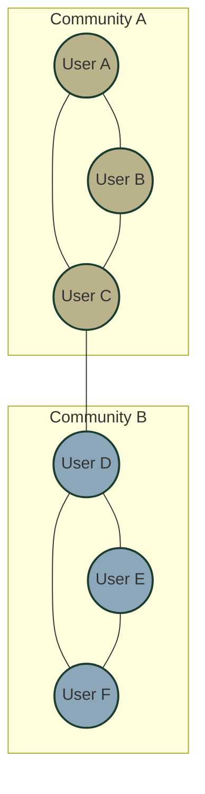

Graph theory provides a powerful framework for understanding complex systems across disciplines, from mathematics and computer science to sociology and literature.