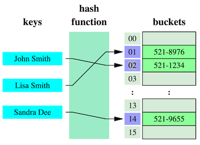

A **hash table** is a key-value pair data structure that provides constant time data access, using a [Hash Function](hash-function.md) to convert a key into a numeric array index.

*Diagram by [Jorge Stolfi via Wikipedia](https://en.wikipedia.org/wiki/Hash_table#/media/File:Hash_table_3_1_1_0_1_0_0_SP.svg)*

It's considered a [Linear Data Structure](../../../permanent/linear-data-structure.md) as elements in the array are stored sequentially.

Two keys can produce the same index, called a collision, depending on the implementation. There are multiple common techniques to resolve hash collisions:

### [Rehashing](rehashing.md)

* Enlarge the hash table (e.g., double its size)
* Update the hash function's reduction function (modulus part)
* Re-hash all existing numbers into the new table
* Can be implemented reactively (after collision) or proactively (based on load factor threshold)

### [Linear Probing](linear-probing.md)

* When a collision occurs, check the next available bucket
* Store the colliding number in the first empty bucket found
* Continue this process until an empty spot is found

### [Separate Chaining](separate-chaining.md)

* Create a chain (linked list) at each position in the hash table
* When collisions occur, add the new number to the chain at that position
* Chains can grow and shrink as needed

Hash tables typically have these core operations:

* **Insert**: add a new key-value pair.
* **Search**: look up a value by its key
* **Delete**: remove a key-value pair.

Under good conditions, these operations take an average $O(1)$ time, making hash tables extremely efficient for storing and retrieving data.

## [Load Factor](../../../permanent/load-factor.md)

The load factor of a hash table is calculated by storing the number of stored key by the number of buckets.