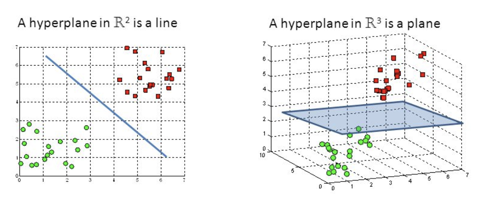

A hyperplane is a subspace where the dimension is one less than the ambient space. In 2-dimensional space, a hyperplane is a line; in 3-dimensional space, it's a plane.

*Image from <a href="https://deepai.org">https://deepai.org/machine-learning-glossary-and-terms/hyperplane</a>*

In machine learning, hyperplanes can be used as decision boundaries for classification tasks. For example, a [Support Vector Machine](../../../permanent/support-vector-machine.md) is optimised to find the hyperplane that maximises the distance between the nearest points of each class.
